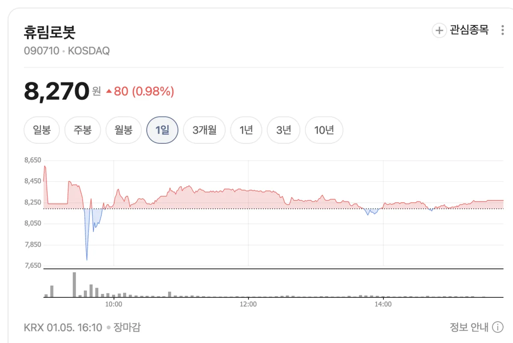

# 휴림로봇 주가 급등! 자율주행 휠체어 상용화 기대감에 8천원대 돌파

2026년 1월 5일 오후 현재, 휴림로봇(090710) 주가는 8,190원을 기록하며 전일 종가 대비 보합세를 유지하고 있습니다. 시가 8,340원으로 출발한 후 7,680원에서 8,620원 사이를 오가며 940원의 큰 변동폭을 보였는데요. 장 마감 시점에는 8,270원으로 0.98% 상승 마감했습니다. 최근 일주일간 휴림로봇 주가는 가파른 상승세를 나타내며 투자자들의 관심을 집중시키고 있습니다.

## 최근 일주일 급등세, 40% 상승

휴림로봇 주가는 최근 일주일간 폭발적인 상승세를 보였습니다. 지난 12월 22일 5,820원이었던 주가는 일곱 거래일 만에 무려 **40.7% 상승**하며 8,000원 선을 돌파했습니다. 금요일(1월 3일) 장에서는 9.93% 급등하며 8,190원에 마감했고, 오늘(1월 5일)도 강세를 이어가고 있습니다.

특히 주목할 점은 이러한 급등세가 **투자경고종목 지정** 상황에서도 지속되고 있다는 것입니다. 일반적으로 투자경고종목 지정은 주가에 부정적 영향을 미치지만, 휴림로봇은 오히려 상승세를 이어가며 시장의 강한 관심을 입증하고 있습니다.

### 거래량도 급증

오늘 하루 거래량은 활발했으며, 5일 오전에는 거래대금이 190억원을 돌파하며 코스닥 거래량 1위를 기록하기도 했습니다. 이는 개인 투자자들의 적극적인 매수세가 유입되고 있음을 보여줍니다.

## 투자경고종목 지정과 매매거래정지 예고

휴림로봇은 현재 **투자경고종목**으로 지정된 상태입니다. 한국거래소는 지난 12월 29일 휴림로봇을 투자경고종목으로 지정했으며, 이에 따른 매매거래정지 요건도 함께 공지했습니다.

### 매매거래정지 조건

공시에 따르면, 휴림로봇은 **2026년 1월 5일(오늘) 종가가 12월 30일 종가 대비 40% 이상 상승하고, 투자경고종목 지정 전일 종가보다 높은 경우** 1월 6일(내일) 1일간 매매거래가 정지됩니다.

- **기준일**: 2025년 12월 30일 종가 (투자경고 지정 전일)
- **조건**: 2026년 1월 5일 종가가 12월 30일 종가 대비 40% 이상 상승
- **정지일**: 2026년 1월 6일 (1일간)

오늘 종가 8,270원은 12월 30일 종가 대비 상승률을 계산했을 때 정지 조건을 충족하지 않은 것으로 보이며, 따라서 내일 거래는 정상적으로 진행될 것으로 예상됩니다. 다만 주가 추이를 주의 깊게 관찰할 필요가 있습니다.

### 투자경고종목이란?

투자경고종목은 주가가 단기간에 급등하여 투자 위험이 커진 종목에 대해 한국거래소가 투자자 보호 차원에서 지정하는 제도입니다. 투자경고종목으로 지정되면:

- **2일 동안 40% 이상 상승**하고 투자경고종목 지정 전일 종가보다 높을 경우
- **1회에 한하여 매매거래 정지**

투자자들은 이러한 제도를 인지하고 신중한 투자 판단이 필요합니다.

## 자율주행 휠체어, 상용화 눈앞

휴림로봇 주가 상승의 가장 큰 배경은 **자율주행 전동휠체어의 사용성 평가 완료** 소식입니다. 휴림로봇은 정부 국책과제로 개발한 자율주행 전동휠체어가 국내 상급종합병원에서 실제 환자를 대상으로 한 사용성 시험을 성공적으로 완료했습니다.

### 병원 환경에 특화된 자율주행 기술

휴림로봇이 개발한 자율주행 휠체어는 병원 환경에 특화된 기술이 적용되었습니다. 병원은 복잡한 복도, 엘리베이터, 다양한 장애물이 있는 공간으로, 일반적인 자율주행 기술로는 안전성을 확보하기 어렵습니다.

휴림로봇은 물류 로봇 '테트라(TETRA)' 시리즈 개발 과정에서 축적한 **ROS 2(Robot Operating System 2) 기반의 실내 자율주행 소프트웨어**를 휠체어에 적용했습니다. 이를 통해 병원 내 자율주행의 안전성과 정확성을 크게 향상시켰습니다.

### 3자 MOU 체결로 상용화 가속

휴림로봇은 2025년 11월 17일 **하이코어, 에이치티엔씨와 3자 MOU**를 체결하며 자율주행 휠체어 상용화에 박차를 가하고 있습니다.

- **휴림로봇**: ROS 2 기반 실내 자율주행 소프트웨어 제공
- **하이코어**: 의료용 전동 휠체어 플랫폼 제공
- **에이치티엔씨**: IT 시스템 통합 및 병원 인프라 연동

이 협력은 제품 공동 개발, 의료기관 실증, 국내외 인증 획득, 공공·민간 시장 확대로 이어질 계획입니다.

### 2020년부터 시작된 장기 프로젝트

휴림로봇은 2020년 9월부터 범부처 의료기기 연구개발 사업으로 AI 자율주행 휠체어 기술 개발에 참여해왔습니다. 현재 2025년 종료 예정인 2차 개발 단계를 성공적으로 마무리하며, 상용화를 위한 마지막 단계에 접어들었습니다.

자율주행 휠체어 2종이 실제 의료 현장에서 사용성을 입증했다는 것은, **연구개발 단계를 넘어 실제 상용화가 가능**하다는 신호로 해석됩니다.

## 휴림로봇은 어떤 회사인가?

휴림로봇은 1999년 2월 26일 설립된 산업용 로봇 및 자동화 장비 전문 기업입니다. 2006년 로봇 업계 최초로 코스닥 시장에 상장했으며, 현재 시가총액은 약 9,879억원 규모입니다.

### 주요 사업 분야

휴림로봇의 사업은 크게 **제조업용 로봇**과 **서비스용 로봇**으로 나뉩니다.

**제조업용 로봇**
- 직각좌표로봇
- 수평다관절로봇(스카라)
- 데스크탑로봇
- 반도체용 로봇
- 리니어 스테이지
- 트랜스퍼 로봇

이들 제품은 자동차, 전자, 기계 산업의 자동화 공정에 적용되며, 특히 반도체와 디스플레이 제조 라인에서 웨이퍼 및 글래스 이송 로봇으로 활용됩니다.

**서비스용 로봇**
- 물류 자동화 로봇 (테트라 시리즈)
- 자율주행 휠체어
- AI 휴머노이드 로봇 (개발 중)

### '올해의 대한민국 로봇기업' 선정

휴림로봇은 2025년 12월 24일 **'올해의 대한민국 로봇기업'**으로 선정되었습니다. 이는 제조 자동화 설비와 로봇 플랫폼 기반 역량을 바탕으로 제조·물류·설비 산업 전반을 아우르는 로봇 솔루션 공급 확대가 인정받은 결과입니다.

최근 휴림로봇은 산업용·서비스용 로봇 시장을 기반으로 **AI 자율제조 솔루션**과 **물류 자동화** 분야로 사업을 확대하며 투자자들의 관심을 끌고 있습니다.

## 로봇 산업의 미래 전망

휴림로봇의 주가 상승은 개별 기업의 호재뿐만 아니라, **로봇 산업 전체에 대한 기대감** 반영이기도 합니다.

### 글로벌 로봇 시장 성장

최신 보고서에 따르면, 글로벌 산업용 로봇 시장은 2024년 약 23억 달러에서 2033년 약 235억 달러로 성장할 것으로 예상됩니다. 연평균 성장률(CAGR)은 약 **29.5%**에 달할 것으로 전망됩니다.

특히 AI 기술과 결합한 지능형 로봇 수요가 폭발적으로 증가하고 있으며, 제조업뿐만 아니라 물류, 의료, 서비스 분야로 적용 범위가 확대되고 있습니다.

### 한국 로봇 시장의 성장

국내에서도 로봇 산업이 빠르게 성장하고 있습니다. 레인보우로보틱스, 두산로보틱스, 로보티즈 등이 '로봇 빅3'를 형성하며 시장을 선도하고 있으며, 휴림로봇도 오랜 역사와 기술력을 바탕으로 재평가받고 있습니다.

정부도 **AI 자율제조 플랜**을 발표하며 로봇 산업 육성에 나서고 있습니다. 제조업 효율화를 위한 스마트 팩토리 구축, 로봇 자동화센터 신설 등 정책적 지원이 확대되면서 관련 기업들의 성장이 가속화될 전망입니다.

## 투자 시 주의사항

휴림로봇에 대한 투자를 고려할 때는 다음 사항들을 유념해야 합니다.

### 1. 투자경고종목 지정

현재 투자경고종목으로 지정되어 있으며, 일정 조건 충족 시 매매거래가 정지될 수 있습니다. 단기 급등 후 급락 위험이 있으므로 신중한 접근이 필요합니다.

### 2. 높은 변동성

오늘 하루에만 7,680원에서 8,620원까지 940원(약 12%)의 변동폭을 보였습니다. 이러한 높은 변동성은 단기 투자자에게는 기회일 수 있지만, 리스크도 크다는 의미입니다.

### 3. 상용화 불확실성

자율주행 휠체어가 사용성 평가를 완료했지만, 실제 상용화와 매출로 이어지기까지는 시간이 필요합니다. 인증 획득, 대량 생산, 시장 진입 등의 과정이 순조롭게 진행될지 지켜봐야 합니다.

### 4. 테마주 특성

로봇주는 테마주 성격이 강해 단기 수급에 따라 주가 변동이 클 수 있습니다. 펀더멘털보다는 뉴스와 테마에 반응하는 경향이 있으므로, 장기 투자 관점에서 접근하는 것이 바람직합니다.

## 투자 전략

### 단기 투자자

투자경고종목 상황과 높은 변동성을 고려하여 **손절/익절 기준을 명확히** 설정하고 접근해야 합니다. 매매거래정지 조건을 체크하며, 단기 차익 실현 기회를 노리는 전략이 적합합니다.

### 중장기 투자자

자율주행 휠체어 상용화, AI 로봇 사업 확장 등 중장기 성장 스토리에 주목하되, **조정 시 분할 매수** 전략을 통해 평균 단가를 관리하는 것을 권장합니다. 실적 개선 여부와 신규 수주 소식을 모니터링하며 포지션을 관리해야 합니다.

## 마치며

휴림로봇은 자율주행 휠체어 사용성 평가 완료라는 호재로 최근 일주일간 40% 이상 급등하며 8,000원대를 회복했습니다. '올해의 대한민국 로봇기업' 선정과 AI 자율제조 솔루션 사업 확대 등 긍정적인 뉴스가 이어지고 있습니다.

다만 투자경고종목 지정과 매매거래정지 가능성, 높은 변동성 등 리스크 요인도 존재합니다. 2026년 1월 6일 매매거래정지 여부를 확인하고, 자율주행 휠체어의 실제 상용화 진행 상황을 주시하며 신중한 투자 판단이 필요합니다.

로봇 산업이 성장하는 추세 속에서 휴림로봇이 과연 재도약에 성공할 수 있을지, 그리고 자율주행 휠체어 사업이 새로운 성장 동력이 될 수 있을지 귀추가 주목됩니다.

---

*※ 본 글은 투자 권유가 아니며, 투자의 최종 책임은 투자자 본인에게 있습니다.*  
*※ 주가 및 데이터는 2026년 1월 5일 기준입니다.*  
*※ 투자경고종목 및 매매거래정지 조건을 반드시 확인하시기 바랍니다.*