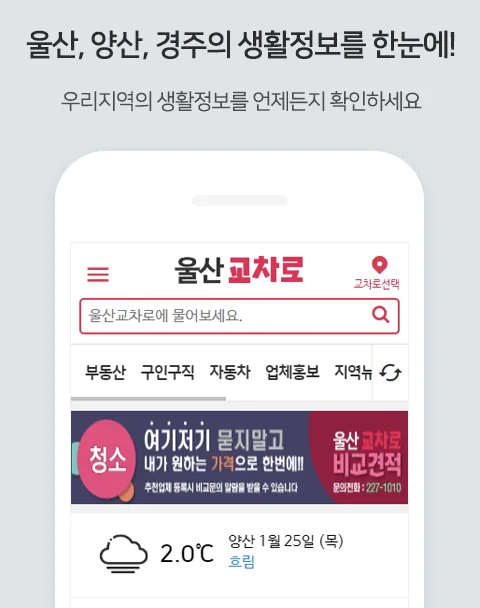

# 울산 교차로 구인구직 완벽 가이드 - 지역별 일자리 찾는 방법 총정리

울산에서 일자리를 찾고 계신가요? 울산은 현대자동차, HD현대중공업, 석유화학단지 등 대한민국 대표 산업시설이 밀집한 도시인 만큼 다양한 일자리가 있는데요. 오늘은 울산 지역 대표 구인구직 플랫폼인 '울산 교차로'를 활용해 효과적으로 일자리를 찾는 방법과 지역별 취업 전략을 상세히 알려드리겠습니다.

## 울산 교차로란?

울산 교차로는 울산 지역에 특화된 생활정보지이자 온라인 구인구직 플랫폼입니다. 1980년대부터 종이 신문으로 시작해 현재는 웹사이트와 모바일에서도 서비스를 제공하고 있는데요. 전국 단위 취업 사이트에서는 찾기 어려운 울산 지역 소규모 업체, 공장, 식당, 서비스업 등의 채용 정보가 풍부하다는 것이 가장 큰 장점입니다.

특히 대기업 협력업체나 공단 내 현장직, 지역 상권의 서비스직 등 로컬 일자리를 찾는다면 울산 교차로만큼 효과적인 채널이 없습니다. 사이트 주소는 ulsankyocharo.com이며, 구인구직 전용 페이지는 mwork.ulsankyocharo.com에서 이용할 수 있습니다.

## 울산 교차로 구인구직 사이트 이용 방법

울산 교차로 구인구직 사이트는 직관적인 구조로 되어 있어 누구나 쉽게 이용할 수 있습니다. PC와 모바일 모두 동일한 방식으로 접속이 가능한데요.

먼저 포털 사이트에서 '울산교차로'를 검색하거나 직접 주소를 입력해 접속합니다. 메인 페이지에서 '일자리' 또는 '구인정보' 메뉴를 클릭하면 구인구직 전용 페이지로 이동합니다. 상단에 보이는 검색창에서 원하는 키워드를 입력하거나, 직종별·지역별 카테고리를 선택해 일자리를 탐색할 수 있습니다.

직종 카테고리는 사무/경리, 상담/영업, 매장관리, 생산/기술/건설, 운전/배달, 요리/서빙, 간호/의료, 교사/강사, 일반서비스/기타 등으로 세분화되어 있습니다. 울산의 5개 구·군(남구, 동구, 북구, 중구, 울주군) 단위로 지역을 선택할 수도 있어서 거주지 근처의 일자리를 빠르게 찾을 수 있습니다.

상세검색 기능을 활용하면 급여 조건, 경력 유무, 근무 형태(정규직/계약직/아르바이트) 등 세부 조건을 설정해 맞춤형 검색이 가능합니다. 마음에 드는 공고를 발견하면 상세 페이지에서 연락처를 확인하고 직접 지원하시면 됩니다.

## 울산 교차로에서 제공하는 주요 서비스

울산 교차로 구인구직 플랫폼에서는 단순한 채용 공고 열람 외에도 다양한 서비스를 제공합니다.

구인정보 메뉴에서는 업체에서 등록한 채용 공고를 확인할 수 있습니다. 알바GO 섹션에서는 단기 아르바이트나 파트타임 일자리를 집중적으로 볼 수 있고, 스마트구인에서는 프리미엄 채용 정보를 제공합니다. 구직정보 메뉴에서는 반대로 구직자들이 등록한 이력서를 열람할 수 있어서 인력을 찾는 사업주분들도 활용이 가능합니다.

종이 신문 형태의 정보를 선호하시는 분들은 '신문그대로보기' 기능을 통해 실제 발행된 교차로 신문을 PDF 형태로 열람할 수도 있습니다.

## 안전한 근로 계약을 위한 필수 체크리스트

적합한 일자리를 찾아 지원하기 전, 근무 조건과 처우에 대한 면밀한 검토는 필수입니다. 울산 교차로를 통해 연결된 업체라 할지라도 급여, 근로 시간, 휴무일 등 핵심 내용은 구두 약속이 아닌 서면으로 명확히 남겨두어야 추후 발생할 수 있는 분쟁을 예방할 수 있습니다. 단기 아르바이트나 현장직이라도 다음의 사항들은 반드시 짚고 넘어가야 합니다.

임금 및 수당 확인이 가장 중요합니다. 2026년 기준 최저임금은 시간당 10,320원으로, 반드시 이 금액 이상의 임금이 책정되었는지 확인해야 합니다. 공단 2교대/3교대 근무 시에는 야간수당, 특근수당, 위험수당 지급 기준도 꼼꼼히 살펴보세요.

근로계약서 작성은 법적 의무사항입니다. 임금의 구성 항목, 지급 시기, 소정 근로 시간 등이 명시된 계약서를 작성하고 반드시 한 부를 교부받아 보관해야 합니다. 5인 이상 사업장은 물론 5인 미만 소규모 사업장에서도 근로계약서 작성은 필수입니다.

4대 보험 및 안전 문제도 확인하세요. 중화학 공업이 많은 울산 지역 특성상 산재보험 가입은 필수이며, 안전화 지급 및 안전 수칙 교육 이수 여부를 확인해야 합니다.

통근 및 식사 조건도 실질 소득에 큰 영향을 미칩니다. 온산공단, 용연공단, 미포지구 등은 대중교통 접근성이 낮으므로 통근 버스 운행 노선과 식사 제공 여부를 미리 확인하는 것이 좋습니다.

## 울산시 5개 구·군별 산업 특성에 맞춘 취업 공략법

울산시는 지역별로 발달한 산업군이 뚜렷하여 거주지와 본인의 강점을 고려한 맞춤형 접근이 필요합니다. 각 지역의 특성을 파악하면 취업 성공률을 높일 수 있습니다.

남구(삼산, 달동, 야음)는 울산의 상업 및 금융 중심지입니다. 백화점, 병원, 호텔, 음식점 등 서비스업 일자리가 가장 풍부한 지역인데요. 롯데백화점 울산점, 대형 프랜차이즈 매장 등에서 판매직이나 서빙직 채용이 활발합니다. 또한 석유화학단지(여천/매암)와 인접해 있어 관련 현장직 출퇴근도 용이합니다.

동구(방어, 전하, 남목)는 HD현대중공업 및 미포조선이 위치해 있어 조선업 관련 일자리가 압도적입니다. 용접, 도장, 배관, 족장 등 기술직 및 보조 인력 수요가 많으며, 기술을 익히면 높은 일당을 받을 수 있습니다. 조선업 경기에 따라 채용 규모가 변동되니 시기를 잘 살펴보세요.

북구(효문, 매곡, 농소)는 현대자동차 울산공장과 관련 1·2차 부품 협력업체들이 밀집한 지역입니다. 자동차 부품 조립, 품질 검사, 물류 하역 등의 제조업 일자리가 주를 이루는데요. 현대자동차 정규직 외에도 협력업체 채용이 꾸준히 이루어지고 있습니다.

울주군(온산, 범서, 언양)은 온산국가산업단지(비철금속, 정유)의 현장 인력 수요가 많습니다. 동시에 KTX울산역세권 및 범서읍(천상/구영) 주거지의 생활 밀착형 서비스직 채용도 활발합니다. 공단과 주거지가 혼재되어 있어 다양한 일자리를 찾을 수 있는 지역입니다.

중구(성남, 우정혁신)는 구도심 상권의 요식업 알바와 우정혁신도시 내 공공기관의 시설 관리, 보안, 미화, 사무 보조 인력 수요가 꾸준합니다. 상대적으로 안정적인 근무 환경을 원하시는 분들에게 적합한 지역입니다.

## 울산 교차로 활용 팁

울산 교차로를 더 효과적으로 활용하기 위한 몇 가지 팁을 알려드립니다.

첫째, 신규 공고를 자주 확인하세요. 좋은 일자리는 빠르게 마감되는 경우가 많으므로 하루에 한두 번씩 새로운 공고를 체크하는 것이 좋습니다. 둘째, 직접 연락 시 예의를 갖추세요. 교차로를 통한 구인은 대부분 전화 연락으로 이루어지므로 첫인상이 중요합니다. 셋째, 여러 채널을 병행 활용하세요. 울산 교차로와 함께 워크넷, 사람인, 잡코리아 등을 함께 이용하면 더 많은 기회를 찾을 수 있습니다.

## 마무리

울산은 제조업 강세 도시답게 기술직과 현장직 일자리가 풍부하며, 동시에 성장하는 서비스업 분야에서도 다양한 기회가 있습니다. 울산 교차로는 이러한 지역 특성에 맞는 일자리를 찾는 데 매우 유용한 플랫폼인데요.

본인의 거주지, 경력, 희망 직종을 고려해 전략적으로 접근하시고, 근로계약 시에는 반드시 2026년 최저임금(시급 10,320원) 이상인지, 근로계약서 작성이 제대로 이루어지는지 확인하시기 바랍니다. 울산에서 좋은 일자리 찾으시길 응원합니다!

---

**면책조항**

본 글은 일반적인 정보 제공을 목적으로 작성되었으며, 특정 업체나 채용 공고에 대한 보증이 아닙니다. 실제 취업 및 근로계약 시에는 해당 업체와 직접 확인하시고, 근로기준법에 따른 권리를 숙지하시기 바랍니다. 최저임금 등 제도는 변경될 수 있으므로 고용노동부 공식 자료를 참고하세요.

---

**관련 태그 추천**

#울산교차로 #울산구인구직 #울산일자리 #울산취업 #울산아르바이트 #현대자동차채용 #조선소일자리 #울산공단 #2026최저임금 #근로계약서
