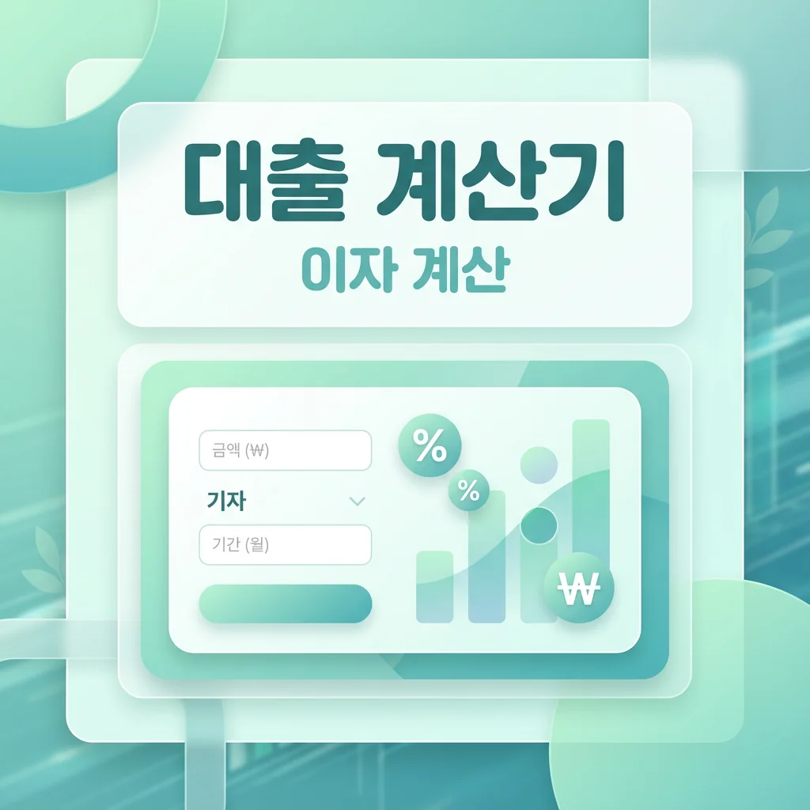

# 주택담보대출, 신용대출 이자 얼마나 낼까? 대출이자 계산기 활용 완전정복

"대출 받으면 이자를 얼마나 내야 하지?" 집을 사거나, 전세 자금이 필요하거나, 갑자기 목돈이 필요할 때 가장 먼저 드는 궁금증이죠. 대출 금액이 크면 클수록, 기간이 길면 길수록 이자 부담도 눈덩이처럼 불어나기 때문에 대출 전 정확한 계산은 필수입니다.

오늘은 KB국민은행의 대출이자 계산기를 활용해서 주택담보대출과 신용대출의 이자를 직접 계산해보는 방법을 알려드리겠습니다. 원리금균등상환, 원금균등상환, 만기일시상환이 뭔지 헷갈리셨던 분들도 이 글을 읽고 나면 깔끔하게 이해하실 수 있을 거예요.

## 대출이자 계산기란?

대출이자 계산기는 대출금액, 금리, 대출기간, 상환방식 등을 입력하면 매월 납입해야 할 금액과 총 이자를 자동으로 계산해주는 도구입니다. 은행 창구에 가지 않아도 집에서 간편하게 대출 시뮬레이션을 해볼 수 있어서 매우 유용하죠.

대출이자 계산기를 활용하면 여러 시나리오를 비교해볼 수 있습니다. 예를 들어 "금리가 0.5% 낮아지면 이자가 얼마나 줄어들까?", "20년 상환과 30년 상환 중 어떤 게 유리할까?", "거치기간을 두면 초반 부담이 얼마나 줄어들까?" 같은 질문에 대한 답을 바로 확인할 수 있습니다.

## KB국민은행 대출이자 계산기 소개

KB국민은행은 온라인에서 무료로 사용할 수 있는 대출이자 계산기를 제공하고 있습니다. KB국민은행 홈페이지(https://omoney.kbstar.com/quics?page=C042003)에 접속하면 별도의 로그인 없이 바로 이용할 수 있어요.

KB국민은행 대출이자 계산기에서는 대출금액, 대출기간, 대출금리, 거치기간, 상환방법 등 5가지 정보를 입력할 수 있습니다. 대출금액은 1만원 이상 100,000만원(10억원) 이하로 설정 가능하고, 대출기간은 12개월 이상 420개월(35년) 이하까지 선택할 수 있습니다. 대출금리는 최대 25.0%까지 입력 가능하며, 거치기간은 0개월부터 36개월까지 설정할 수 있습니다. 상환방법은 원리금균등상환, 원금균등상환, 원금만기일시상환 중 선택하면 됩니다.

계산 결과로는 대출금액, 총이자, 총비용(원금+이자), 월평균 상환원금, 월평균 이자액, 월평균 납입금 등이 표시됩니다. 또한 상환일 기준 잔금확인 기능도 제공되어 특정 시점의 대출 잔액도 확인할 수 있어요.

## 상환방식 3가지, 제대로 이해하기

대출이자 계산기를 제대로 활용하려면 먼저 상환방식의 차이를 이해해야 합니다. 같은 금액을 빌려도 상환방식에 따라 총 이자가 수백만 원에서 수천만 원까지 차이날 수 있거든요.

### 원리금균등상환이란?

원리금균등상환은 대출 기간 동안 매월 같은 금액을 납부하는 방식입니다. '원리금'이란 원금과 이자를 합친 말인데요, 매달 내는 총액(원금+이자)이 동일하다는 의미입니다. 초반에는 이자 비중이 높고 원금 비중이 낮지만, 시간이 지날수록 이자는 줄어들고 원금 비중이 늘어나는 구조입니다.

이 방식의 가장 큰 장점은 매월 납입금이 일정해서 가계 예산을 세우기 쉽다는 것입니다. "매달 150만원씩 내면 된다"처럼 명확하게 계획을 세울 수 있죠. 다만, 총 이자 부담은 원금균등상환보다 많습니다.

### 원금균등상환이란?

원금균등상환은 대출 원금을 대출 기간으로 똑같이 나눠서 매월 갚고, 이자는 남은 원금에 대해서만 계산하는 방식입니다. 매달 갚는 원금은 동일하지만, 이자는 점점 줄어들기 때문에 월 납입금도 점점 줄어듭니다.

이 방식은 총 이자 부담이 세 가지 방식 중 가장 적습니다. 하지만 초반에 납입금 부담이 크다는 단점이 있어요. 소득이 안정적이고 초반 부담을 감당할 수 있는 분들에게 유리한 방식입니다.

### 원금만기일시상환이란?

원금만기일시상환은 대출 기간 동안 이자만 내다가 만기에 원금을 한꺼번에 갚는 방식입니다. 월 납입 부담이 가장 적지만, 총 이자는 가장 많이 내게 됩니다. 또한 만기에 원금 전액을 준비해야 하는 부담이 있습니다.

보통 전세대출이나 단기 자금 운용 목적의 대출에서 많이 사용됩니다. 주택담보대출처럼 장기 대출에는 권장되지 않는 방식이에요.

## KB국민은행 대출이자 계산기 사용법

이제 실제로 KB국민은행 대출이자 계산기를 사용하는 방법을 단계별로 알아보겠습니다.

첫 번째 단계로 KB국민은행 대출이자 계산기 페이지(https://omoney.kbstar.com/quics?page=C042003)에 접속합니다. 별도 로그인이나 회원가입 없이 바로 이용 가능합니다.

두 번째 단계로 대출금액을 입력합니다. 예를 들어 3억원을 대출받으려면 '30000'을 입력하면 됩니다. 단위가 만원이니 헷갈리지 않도록 주의하세요.

세 번째 단계로 대출기간을 개월 수로 입력합니다. 30년 대출이라면 360개월, 20년이라면 240개월을 입력합니다. 주택담보대출은 보통 20~35년, 신용대출은 1~5년 정도가 일반적입니다.

네 번째 단계로 대출금리를 입력합니다. 현재 주택담보대출 금리는 대략 3.5%~5% 수준이고, 신용대출 금리는 4%~10% 수준입니다. 본인이 받을 수 있는 예상 금리를 입력하면 됩니다.

다섯 번째 단계로 거치기간을 설정합니다. 거치기간이란 원금 상환 없이 이자만 내는 기간을 말합니다. 거치기간을 두면 초반 납입 부담이 줄어들지만, 총 이자는 늘어납니다. 거치기간을 원하지 않으면 0개월로 설정하면 됩니다.

여섯 번째 단계로 상환방법을 선택합니다. 원리금균등상환, 원금균등상환, 원금만기일시상환 중 하나를 클릭합니다.

마지막으로 '계산하기' 버튼을 누르면 결과가 바로 나옵니다. 총이자, 총비용, 월평균 납입금 등을 확인할 수 있고, '상환일 기준 잔금확인' 버튼을 누르면 월별 상환 스케줄도 볼 수 있습니다.

## 주택담보대출 이자 계산 예시

실제 예시를 통해 주택담보대출 이자가 얼마나 나오는지 계산해보겠습니다. 주택담보대출은 금리가 상대적으로 낮고, 대출 기간이 긴 것이 특징입니다. 현재 시중 주택담보대출 금리는 대략 3.5%~5% 수준인데요, 중간값인 4.5%로 계산해보겠습니다.

### 3억원 대출, 30년 상환 시

3억원을 연 4.5% 금리로 30년(360개월) 동안 갚는다고 가정해보겠습니다. 거치기간은 없고, 원리금균등상환 방식을 선택한 경우입니다.

원리금균등상환 방식으로 계산하면 월 납입금은 약 152만원이고, 총 이자는 약 2억 4,700만원, 총 상환금액은 약 5억 4,700만원이 됩니다. 원금 3억원에 대해 이자만 약 2억 5천만원 가까이 내는 셈이죠.

같은 조건에서 원금균등상환 방식을 선택하면 어떨까요? 첫 달 납입금은 약 196만원으로 더 높지만, 매달 조금씩 줄어들어 마지막 달에는 약 84만원만 내면 됩니다. 총 이자는 약 2억 300만원으로, 원리금균등상환보다 약 4,400만원 적게 내게 됩니다.

### 5억원 대출, 30년 상환 시

5억원을 같은 조건(연 4.5%, 30년)으로 빌린다면 어떨까요?

원리금균등상환의 경우 월 납입금은 약 253만원이고, 총 이자는 약 4억 1,200만원에 달합니다. 총 상환금액은 무려 9억 1,200만원입니다.

원금균등상환의 경우 첫 달 납입금은 약 326만원이지만, 총 이자는 약 3억 3,800만원으로 원리금균등상환보다 약 7,400만원을 아낄 수 있습니다.

이처럼 대출 금액이 커지면 상환방식에 따른 이자 차이도 크게 벌어집니다. 가능하다면 원금균등상환을 선택하는 것이 총 비용 면에서 유리합니다.

## 신용대출 이자 계산 예시

신용대출은 담보 없이 신용만으로 받는 대출이기 때문에 금리가 주택담보대출보다 높습니다. 현재 시중 신용대출 금리는 대략 5%~10% 수준인데요, 신용등급과 소득에 따라 편차가 큽니다. 중간값인 7%로 계산해보겠습니다.

### 3천만원 대출, 5년 상환 시

3천만원을 연 7% 금리로 5년(60개월) 동안 원리금균등상환 방식으로 갚는다고 가정하면, 월 납입금은 약 59만원이고, 총 이자는 약 564만원, 총 상환금액은 약 3,564만원이 됩니다.

원금균등상환 방식을 선택하면 첫 달 납입금은 약 68만원이지만, 총 이자는 약 534만원으로 약 30만원 정도 절약됩니다.

### 5천만원 대출, 5년 상환 시

5천만원을 같은 조건(연 7%, 5년)으로 빌리면, 원리금균등상환 시 월 납입금은 약 99만원이고, 총 이자는 약 940만원입니다. 원금균등상환 시에는 총 이자가 약 889만원으로, 약 51만원을 아낄 수 있습니다.

신용대출은 대출 기간이 상대적으로 짧기 때문에 상환방식에 따른 이자 차이가 주담대만큼 크지는 않습니다. 하지만 금리 자체가 높기 때문에, 가능하다면 빠르게 상환하는 것이 유리합니다.

## 거치기간, 설정하면 뭐가 달라질까?

거치기간이란 원금 상환 없이 이자만 내는 기간을 말합니다. 주택담보대출의 경우 최대 36개월(3년)까지 거치기간을 설정할 수 있는 경우가 많습니다.

거치기간을 두면 초반 납입 부담이 크게 줄어듭니다. 예를 들어 3억원을 30년 동안 갚는 경우, 거치기간이 없으면 첫 달부터 약 152만원을 내야 하지만, 3년 거치기간을 두면 처음 3년간은 이자만 약 113만원 정도만 내면 됩니다.

하지만 거치기간 동안에는 원금이 전혀 줄지 않기 때문에, 총 이자 부담은 늘어납니다. 같은 예시에서 3년 거치 후 27년 상환으로 계산하면, 총 이자가 약 3억원을 넘어갑니다. 거치기간이 없을 때(약 2억 4,700만원)보다 약 5,300만원 이상 더 내게 되는 셈이죠.

따라서 거치기간은 정말 필요한 경우에만 최소한으로 설정하는 것이 좋습니다. 당장 월 납입금이 부담되더라도 장기적으로는 거치기간 없이 바로 상환을 시작하는 것이 유리합니다.

## 금리 0.5% 차이가 만드는 엄청난 차이

"금리 0.5% 차이가 얼마나 크겠어?"라고 생각하실 수 있지만, 장기 대출에서는 이 작은 차이가 수천만 원의 차이를 만들어냅니다.

3억원을 30년 동안 원리금균등상환으로 갚는다고 가정해보겠습니다. 금리가 4.0%일 때 총 이자는 약 2억 1,500만원이고, 4.5%일 때는 약 2억 4,700만원, 5.0%일 때는 약 2억 8,000만원입니다.

금리 4.0%와 5.0%의 차이는 단 1%p이지만, 총 이자 차이는 무려 6,500만원에 달합니다. 0.5%p 차이만 해도 약 3,200만원의 차이가 나는 것이죠.

이것이 바로 대출을 받기 전에 여러 금융기관의 금리를 꼼꼼히 비교해야 하는 이유입니다. 금리 0.1%라도 낮은 곳을 찾으면 장기적으로 큰 돈을 아낄 수 있습니다.

## 대출이자를 줄이는 실전 팁

대출이자 계산기를 활용하면서 알게 된 내용을 바탕으로, 이자 부담을 줄이는 방법을 정리해드릴게요.

첫째, 가능하면 원금균등상환을 선택하세요. 초반 부담이 크지만 총 이자를 크게 줄일 수 있습니다. 소득이 안정적이라면 원금균등상환이 장기적으로 유리합니다.

둘째, 거치기간은 최소화하세요. 거치기간 동안에는 원금이 줄지 않아 이자 부담만 늘어납니다. 정말 필요한 경우가 아니라면 거치기간 없이 바로 상환을 시작하는 것이 좋습니다.

셋째, 금리 비교는 필수입니다. 같은 조건이라도 금융기관마다 금리가 다릅니다. 전국은행연합회 소비자포털(https://portal.kfb.or.kr)에서 금리 비교를 해보시고, 가장 유리한 조건을 찾아보세요.

넷째, 여유자금이 생기면 중도상환을 고려하세요. 원금을 미리 갚으면 그만큼 이자 부담이 줄어듭니다. 다만, 중도상환수수료가 있는지 확인하고 결정하세요. 보통 대출 후 3년 이내에는 중도상환수수료가 부과되는 경우가 많습니다.

다섯째, 대출 기간을 너무 길게 잡지 마세요. 대출 기간이 길수록 월 납입금은 적어지지만, 총 이자는 크게 늘어납니다. 무리하지 않는 선에서 가능한 짧은 기간을 선택하는 것이 좋습니다.

## 주택담보대출 vs 신용대출, 무엇이 유리할까?

같은 금액이 필요하다면 주택담보대출이 유리한 경우가 많습니다. 담보가 있기 때문에 금리가 낮고, 대출 한도도 높으며, 상환 기간도 길게 설정할 수 있기 때문입니다.

예를 들어 1억원이 필요한 상황에서, 주택담보대출(금리 4.5%, 20년)로 받으면 월 납입금 약 63만원에 총 이자 약 5,200만원입니다. 같은 금액을 신용대출(금리 7%, 5년)로 받으면 월 납입금 약 198만원에 총 이자 약 1,880만원입니다.

언뜻 보면 신용대출의 총 이자가 적어 보이지만, 월 납입 부담이 3배 이상 차이납니다. 또한 신용대출은 5년 내에 갚아야 하지만, 주담대는 20년에 걸쳐 여유롭게 갚을 수 있습니다.

물론 주택담보대출은 집이 있어야 받을 수 있고, 담보로 설정한 집의 처분 제한 등 제약이 따릅니다. 자신의 상황에 맞게 선택하시되, 가능하다면 낮은 금리의 담보대출을 활용하는 것이 이자 부담 측면에서는 유리합니다.

## 마무리하며

대출은 현대 사회에서 피할 수 없는 금융 도구입니다. 하지만 무분별하게 받으면 이자 부담에 허덕이게 되고, 현명하게 활용하면 자산 형성의 도구가 될 수 있습니다.

KB국민은행 대출이자 계산기처럼 무료로 제공되는 도구를 적극 활용해서, 대출 전에 반드시 시뮬레이션을 해보세요. 다양한 시나리오를 비교해보고, 본인의 상환 능력에 맞는 최적의 조건을 찾는 것이 중요합니다.

오늘 알려드린 내용이 대출을 앞두고 고민하시는 분들께 도움이 되었으면 좋겠습니다. 현명한 대출 결정으로 이자 부담은 줄이고, 재무 건전성은 높이시길 바랍니다.

---

**면책조항**

본 글은 대출 이자 계산에 대한 일반적인 정보 제공을 목적으로 작성되었습니다. 실제 대출 조건(금리, 한도, 상환방식 등)은 개인의 신용상태, 소득, 담보가치 등에 따라 달라질 수 있습니다. 본 글에서 제시한 계산 예시는 이해를 돕기 위한 참고 자료이며, 실제 대출 상담 시 정확한 내용을 확인하시기 바랍니다. 대출 결정은 본인의 상환 능력을 충분히 고려한 후 신중하게 내리시기 바라며, 필요시 금융 전문가와 상담하시기를 권장합니다.
