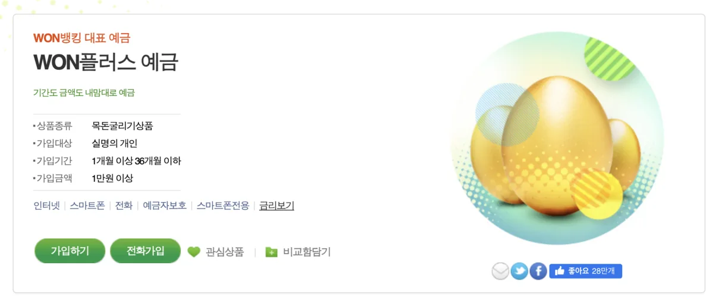

# 2026년 1월 정기예금 금리비교 TOP 10: 5% 넘는 은행 찾기

2026년 새해가 밝았지만 여전히 많은 분들이 안전한 재테크 수단으로 정기예금을 선호하고 계십니다. 특히 요즘처럼 경제 불확실성이 큰 시기에는 원금 보장이 되는 예금이 더욱 매력적으로 느껴지는데요. 하지만 은행마다 금리가 천차만별이라 어디에 가입해야 할지 고민되시죠? 오늘은 2026년 1월 기준으로 정기예금 금리가 높은 곳을 TOP 10으로 정리해드리고, 5% 이상 고금리 상품은 어디서 찾을 수 있는지 상세히 알려드리겠습니다.

## 2026년 1월 정기예금 시장 동향

본격적인 금리 비교에 앞서 현재 예금 시장의 전반적인 흐름을 짚고 넘어가볼까요? 2026년 1월 현재 한국의 기준금리는 점진적인 하락 기조를 보이고 있습니다. 장기적으로는 2026년에 약 2.25%, 2027년에는 2.50% 수준으로 예상되고 있는데요. 이러한 금리 하락 전망 속에서도 금융기관들은 자금 유치를 위해 다양한 특판 상품과 우대금리 조건을 제시하고 있습니다.

시중은행의 1년 만기 정기예금 기본 금리는 대체로 **2%대 중후반에서 3%대 초반** 수준을 유지하고 있습니다. 하지만 저축은행과 새마을금고, 신협 등 제2금융권으로 눈을 돌리면 **3%대 중후반에서 5%가 넘는 고금리 상품**도 어렵지 않게 찾을 수 있습니다.

특히 주목할 점은 비대면 가입, 첫 거래 고객, 자동이체 설정 등 다양한 우대조건을 충족하면 기본 금리에서 최대 1%포인트 이상 추가로 받을 수 있다는 것입니다. 똑똑하게 우대조건을 활용하면 시중은행에서도 3%대 중후반의 금리를 받을 수 있습니다.

## 정기예금 금리 TOP 10 (2026년 1월 기준)

그렇다면 구체적으로 어느 금융기관의 금리가 높을까요? 2026년 1월 기준으로 1년 만기 정기예금 금리가 높은 곳을 순위별로 정리해드리겠습니다.

**1위는 MG 태안새마을금고의 'Block 예금'**으로 12개월 기준 최고 연 **5.40%**의 금리를 제공합니다. 이는 2026년 1월 현재 확인된 금융상품 중 최상위 수준인데요, 충남 태안 지역에 위치한 새마을금고로 해당 지역에 거주하거나 직장이 있는 분들이 이용 가능합니다.
[새마을금고 위치 확인하기](https://www.kfcc.co.kr/map/main.do)

**2위는 [애큐온저축은행](https://www.acuonsb.co.kr/)**으로 일부 상품에서 최고 연 **6.50%**까지 제공하는 것으로 확인됩니다. 다만 이는 특정 조건을 충족하거나 단기 특판 상품일 가능성이 높으니 가입 전 상세 조건을 반드시 확인하셔야 합니다.

**3위권에는 여러 새마을금고와 신협**이 포진해 있습니다. 광명동부새마을금고는 최고 연 5.00%, 화양동새마을금고는 4.90%, 종로중앙새마을금고는 4.80% 수준의 금리를 제공하고 있습니다. 지역별로 다양한 새마을금고가 4%대 후반에서 5%대 초반의 금리를 제시하고 있어 본인이 거주하는 지역의 새마을금고를 확인해보시는 것이 좋습니다.

**4위부터 7위까지는 저축은행권**이 차지하고 있습니다. KB저축은행 4.50%, DB저축은행 4.20%, HB저축은행은 e-정기예금 상품에서 최대 연 4.00%의 금리를 제공합니다. SBI저축은행의 회전정기예금도 36개월 기준 4.00%를 제공하고 있습니다.

**8위부터 10위는 시중은행과 지방은행의 우대금리 적용 상품**입니다. 우리은행의 '[WON플러스예금](https://spot.wooribank.com/pot/Dream?withyou=PODEP0001&cc=c011240:c009166;c012263:c012399&PRD_CD=P010002491&PRD_YN=Y)'은 우대조건 충족 시 최고 4.02%, 전북은행의 'JB 다이렉트예금통장'은 3.90%, BNK경남은행의 '2026 플러스 정기예금'은 우대금리 포함 최고 3.00%를 제공합니다.

시중 5대 은행(KB국민, 신한, 하나, 우리, NH농협)의 경우 기본 금리는 2%대 중후반이지만 우대조건을 충족하면 3%대 초중반까지 받을 수 있습니다. 신한은행의 '쏠편한 정기예금'은 기본 2.75%이지만 우대조건에 따라 추가 금리를 받을 수 있습니다.

## 5% 이상 고금리, 어디서 찾을 수 있을까?

많은 분들이 궁금해하시는 것이 바로 "5% 이상 금리는 정말 받을 수 있나?"일 텐데요. 결론부터 말씀드리면 **가능합니다**. 다만 몇 가지 조건을 이해하고 전략적으로 접근해야 합니다.

**첫 번째, 새마을금고와 신협을 적극 활용하세요.** 2026년 1월 현재 가장 높은 금리를 제공하는 곳은 새마을금고와 신협입니다. 전국에 수천 개의 새마을금고와 신협이 있고, 각 지점마다 금리가 다르기 때문에 본인이 거주하거나 직장이 있는 지역의 금융기관을 꼼꼼히 비교해보는 것이 중요합니다.
[신협 홈페이지 바로가기](https://www.cu.co.kr/cu/main.do)

새마을금고와 신협의 가장 큰 장점은 **세제 혜택**입니다. 예탁금 3,000만 원까지는 이자소득세 14%가 면제되고, 출자금 1,000만 원까지는 배당소득도 비과세됩니다. 시중은행 예금은 이자의 15.4%를 세금으로 내야 하는데, 새마을금고와 신협은 이 세금이 면제되는 것이죠. 실질 수익률로 따지면 훨씬 유리합니다.

**두 번째, 저축은행의 특판 상품을 노려보세요.** 저축은행들은 정기적으로 자금 유치를 위한 특판 상품을 출시합니다. 기본 금리에 추가로 0.3%~0.5%포인트를 더해주는 경우가 많아 4%대 중후반의 금리를 받을 수 있습니다. 다만 저축은행은 예금자보호법에 따라 원금과 이자를 합쳐 **1인당 5천만 원까지만 보호**된다는 점을 꼭 기억하세요. 5천만 원 이내로 분산해서 가입하는 것이 안전합니다.

**세 번째, 짧은 만기를 활용하세요.** 의외로 6개월이나 3개월 같은 단기 예금이 1년 예금보다 금리가 높은 경우가 있습니다. 금리 하락기에는 금융기관들이 단기 자금을 확보하려는 경향이 있기 때문인데요, 단기로 여러 번 갈아타는 전략도 고려해볼 만합니다.

**네 번째, 우대조건을 최대한 활용하세요.** 비대면 가입, 첫 거래 고객, 급여 이체, 자동이체 설정, 모바일 뱅킹 이용 등 다양한 우대조건이 있습니다. 이런 조건들을 충족하면 기본 금리에서 0.1%~1.0%포인트를 추가로 받을 수 있어 5%에 가까워질 수 있습니다.

## 시중은행 vs 저축은행 vs 새마을금고, 어디가 좋을까?

금리만 놓고 보면 당연히 새마을금고나 저축은행이 유리합니다. 하지만 금융기관을 선택할 때는 금리 외에도 고려해야 할 요소들이 있습니다.

**시중은행의 장점**은 무엇보다 **안정성과 편리성**입니다. 전국 어디서나 입출금이 자유롭고, 인터넷뱅킹과 모바일뱅킹이 잘 구축되어 있어 이용이 편리합니다. 또한 여러 금융 서비스를 한 곳에서 이용할 수 있다는 장점도 있죠. 금리는 다소 낮지만 5억 원까지 예금자보호를 받을 수 있어 대금액을 예치하기에 안전합니다.

**저축은행의 장점**은 **높은 금리**입니다. 시중은행보다 1%포인트 이상 높은 금리를 제공하는 경우가 많습니다. 최근에는 인터넷뱅킹도 잘 되어 있어 비대면으로 가입하고 관리하는 데 큰 불편이 없습니다. 다만 예금자보호 한도가 5천만 원이라는 점과 일부 저축은행의 경영 건전성을 확인해야 한다는 점이 주의사항입니다.

**새마을금고와 신협의 장점**은 **높은 금리와 세제 혜택**입니다. 5% 이상의 금리를 제공하면서 이자소득세까지 면제받을 수 있으니 실질 수익률이 가장 높습니다. 또한 지역 커뮤니티 기반의 금융기관이라 친근하고 상담이 자세한 편입니다. 단점은 지점이 제한적이고, 온라인 서비스가 시중은행만큼 편리하지 않을 수 있다는 점입니다.

개인적으로 추천하는 방법은 **목적에 따라 분산하는 것**입니다. 생활비나 비상금 같은 급하게 필요할 수 있는 돈은 시중은행에, 1~2년 정도 묵혀둘 여유 자금은 저축은행이나 새마을금고에 분산해서 예치하는 것이죠. 이렇게 하면 안정성과 수익성을 모두 잡을 수 있습니다.

## 우대금리 조건, 이것만은 꼭 확인하세요

정기예금 상품을 볼 때 '최고 금리'에 혹해서 가입했다가 실제로는 기본 금리만 받게 되는 경우가 많습니다. 광고에 나오는 높은 금리는 대부분 **우대조건을 모두 충족했을 때**의 금리이기 때문인데요, 어떤 우대조건들이 있는지 살펴보겠습니다.

**가장 흔한 우대조건은 비대면 가입**입니다. 지점 방문 없이 인터넷이나 모바일 앱으로 가입하면 0.1%~0.3%포인트를 추가로 주는 경우가 많습니다. 요즘은 대부분 비대면 가입이 가능하니 이 조건은 쉽게 충족할 수 있습니다.

**첫 거래 고객 우대**도 많이 볼 수 있습니다. 해당 은행에서 처음 예금을 가입하는 고객에게 0.2%~0.5%포인트를 추가로 주는 것인데요, 여러 은행을 돌아다니며 첫 거래 우대를 받는 전략도 가능합니다.

**급여 이체나 자동이체 설정**도 흔한 우대조건입니다. 급여 통장을 해당 은행으로 옮기거나, 공과금이나 카드 대금 자동이체를 설정하면 추가 금리를 받을 수 있습니다. 다만 이 경우 주 거래 은행을 바꿔야 하는 번거로움이 있으니 신중히 결정하세요.

**신규 자금 우대**는 기존에 해당 은행에 있던 돈을 그대로 정기예금으로 전환하는 것이 아니라, 외부에서 새로운 돈을 가져와야 우대금리를 받을 수 있다는 조건입니다. 예를 들어 다른 은행에서 돈을 이체해와야 한다는 것이죠.

**가입 금액 조건**도 확인하세요. "1천만 원 이상 가입 시" 같은 최소 가입 금액이 있거나, 반대로 "5천만 원 이하 가입 시"처럼 최대 금액 제한이 있는 경우도 있습니다.

가장 중요한 것은 **본인이 실제로 충족할 수 있는 조건이 무엇인지 파악하는 것**입니다. 광고에 나오는 최고 금리가 아니라, 본인이 받을 수 있는 실제 금리를 계산해서 비교하시는 것이 현명합니다.

## 정기예금 이자 계산과 세금, 제대로 알고 받자

정기예금에 가입할 때 예상 이자를 계산하는 것은 매우 중요합니다. 광고에 나오는 금리는 세전 금리이기 때문에 실제로 받는 금액은 이보다 적습니다.

**기본적인 이자 계산 공식**은 간단합니다. 예를 들어 1,000만 원을 연 3.0% 금리로 1년간 예치한다면 세전 이자는 다음과 같이 계산됩니다.

$$\text{세전 이자} = 1,000만원 \times 3.0\% = 30만원$$

하지만 여기서 끝이 아닙니다. 일반 과세 예금의 경우 **이자소득세 15.4%**(소득세 14% + 지방소득세 1.4%)가 원천징수됩니다. 따라서 실제로 받는 세후 이자는 다음과 같습니다.

$$\text{세후 이자} = 30만원 - (30만원 \times 15.4\%) = 30만원 - 4만6,200원 = 25만3,800원$$

실제 수익률로 따지면 2.54% 정도인 셈입니다. 광고에서 3.0%라고 했지만 실제로는 2.54%밖에 안 되는 것이죠.

**새마을금고나 신협의 저율과세 혜택**을 받으면 어떻게 달라질까요? 3,000만 원까지는 이자소득세 14%가 면제되므로 지방소득세 1.4%만 내면 됩니다. 하지만 일부 새마을금고는 지방소득세도 면제해주는 경우가 있어 세금 없이 온전히 3.0%를 받을 수 있습니다.

만약 연간 이자소득(예금, 적금, 채권 등의 이자를 모두 합친 금액)이 **2,000만 원을 초과**하면 어떻게 될까요? 이 경우 금융소득종합과세 대상이 되어 다른 소득과 합산하여 최고 49.5%까지 누진세율이 적용될 수 있습니다. 고액 자산가의 경우 이 점을 반드시 고려해야 합니다.

예금 이자를 정확히 계산하고 싶다면 **각 은행 홈페이지의 금융계산기**를 이용하시면 편리합니다. 예치 금액, 금리, 기간, 과세 방법 등을 입력하면 만기 시 받을 이자를 자동으로 계산해줍니다.

## 정기예금 가입 전 체크리스트

마지막으로 정기예금에 가입하기 전에 꼭 확인해야 할 사항들을 정리해드리겠습니다.

**첫째, 중도해지 시 이자는 어떻게 되는지 확인하세요.** 대부분의 정기예금은 만기 전에 해지하면 약정 금리보다 훨씬 낮은 중도해지 이율이 적용됩니다. 예상치 못한 상황에 돈이 필요할 수 있으니 일부는 입출금이 자유로운 상품에 두는 것이 좋습니다.

**둘째, 자동 재예치 조건을 확인하세요.** 만기 시 별도 조치를 하지 않으면 자동으로 같은 조건으로 재예치되는 경우가 많습니다. 하지만 재예치 시에는 처음 가입 시의 우대금리가 적용되지 않아 금리가 크게 낮아질 수 있습니다.

**셋째, 예금자보호 한도를 확인하세요.** 시중은행은 5억 원, 저축은행과 새마을금고, 신협은 5천만 원까지 보호됩니다. 큰 금액을 예치할 경우 여러 금융기관에 분산하는 것이 안전합니다.

**넷째, 복리와 단리를 구분하세요.** 이자를 매월 또는 매분기마다 원금에 더해서 다시 이자를 계산하는 복리 상품이 단리보다 유리합니다. 같은 금리라도 복리 적용 시 최종 수령액이 더 많습니다.

**다섯째, 만기를 전략적으로 선택하세요.** 금리가 오를 것으로 예상되면 단기로, 떨어질 것으로 예상되면 장기로 가입하는 것이 유리합니다. 2026년 현재는 금리 하락 기조이므로 상대적으로 긴 만기가 유리할 수 있습니다.

## 마치며

2026년 1월 현재 정기예금 금리는 시중은행 3%대 초반, 저축은행 4%대 초중반, 새마을금고와 신협은 5%대까지 다양하게 분포되어 있습니다. 단순히 금리만 보고 선택하기보다는 안정성, 편리성, 세제 혜택 등을 종합적으로 고려해서 본인에게 맞는 상품을 선택하시는 것이 중요합니다.

특히 새마을금고와 신협의 세제 혜택은 실질 수익률을 크게 높여주므로 3,000만 원 이하의 여유 자금이 있다면 적극 활용해보시기 바랍니다. 저축은행도 5천만 원 이내에서는 예금자보호를 받으므로 안전하게 고금리를 누릴 수 있습니다.

금리는 수시로 변동되고 특판 상품은 한정된 기간 동안만 판매되므로, 좋은 조건의 상품을 발견하면 빠르게 결정하는 것도 중요합니다. 오늘 소개해드린 정보를 바탕으로 2026년 한 해 똑똑한 예금 재테크 하시길 바랍니다!

---

## 투자 유의사항

본 글은 정보 제공을 목적으로 작성되었으며, 특정 금융상품 가입을 권유하는 것이 아닙니다. 예금 금리는 금융기관과 시기에 따라 수시로 변동되므로 가입 전 반드시 해당 금융기관에 직접 확인하시기 바랍니다. 저축은행, 새마을금고, 신협의 경우 예금자보호 한도(5천만 원)를 초과하는 금액은 보호받지 못할 수 있으니 유의하시기 바랍니다. 금융상품 가입 시 약관과 상품설명서를 반드시 확인하시고, 본인의 재무 상황과 투자 목적에 맞는 상품을 선택하시기 바랍니다.

---

## 관련 태그 추천

`#정기예금금리` `#고금리예금` `#예금금리비교` `#저축은행예금` `#새마을금고` `#신협예금` `#예금추천2026` `#재테크` `#이자계산` `#예금자보호`