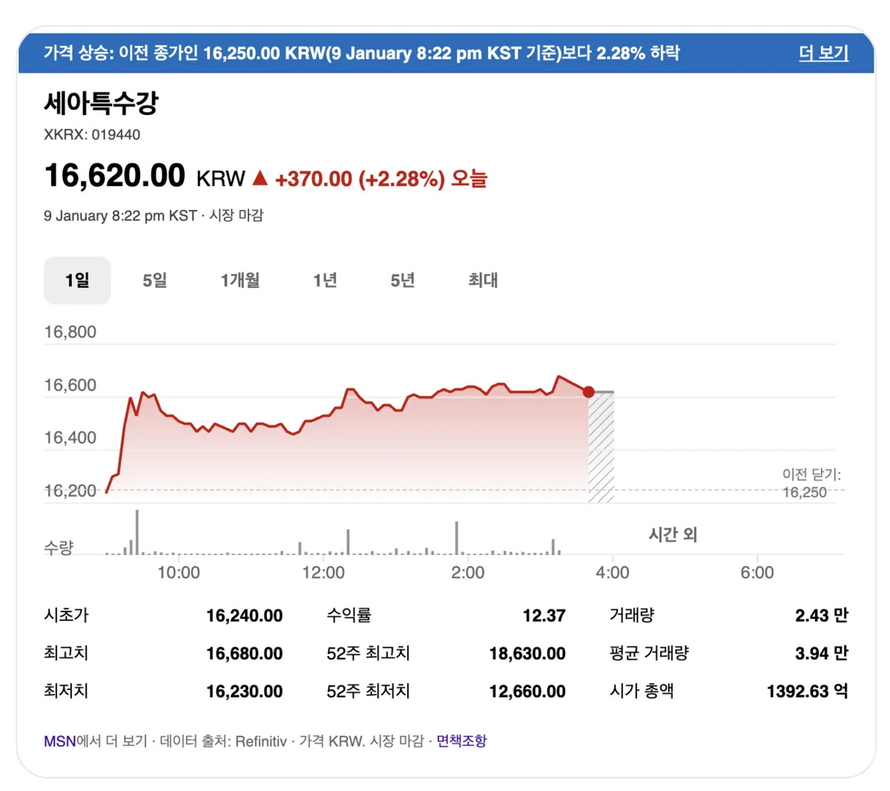
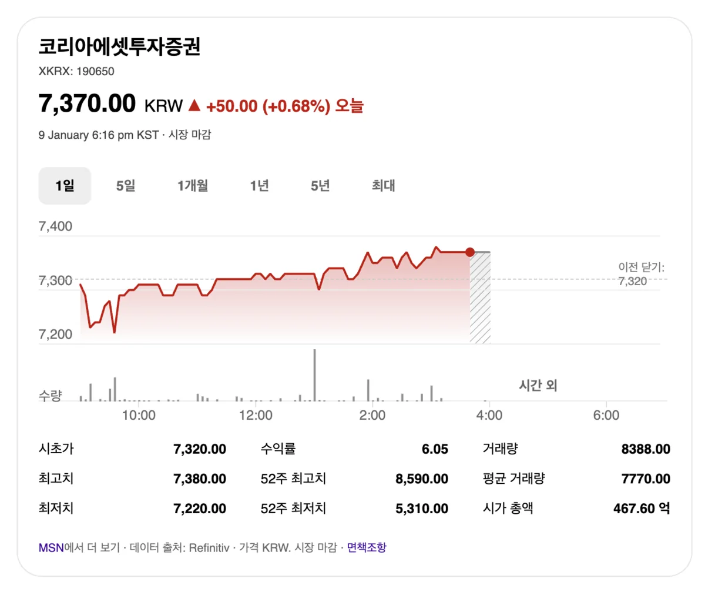

ㅇㄴ
2026년이 밝았습니다. 올해 주식 투자자들 사이에서 가장 핫한 키워드를 꼽자면 단연 '배당'이 아닐까 싶은데요. 그 이유는 바로 올해부터 시행되는 **배당소득 분리과세** 제도 때문입니다. 기존에는 배당소득이 연 2,000만 원을 넘으면 최대 45%까지 종합소득세로 과세됐지만, 이제는 조건을 충족하는 고배당 기업의 배당금에 한해 최대 30%의 분리과세 혜택을 받을 수 있게 됐거든요.

이 글에서는 2026년 달라진 배당 투자 환경을 살펴보고, 초보 투자자도 따라 할 수 있는 실전 배당주 투자 전략을 소개해 드리려고 합니다.
2025 국내 고배당주 순위 TOP 10과 2026 노후 대비 추천 종목 총정리

## 2026년 배당소득 분리과세, 무엇이 달라졌나요?

올해 가장 큰 변화는 역시 배당소득 분리과세 제도의 도입입니다. 그동안 금융소득(이자+배당)이 연 2,000만 원을 초과하면 종합소득세 대상이 되어 최고 45%까지 세금을 내야 했는데요. 이 때문에 배당 투자를 망설이는 분들이 많았습니다.

하지만 2026년부터 2028년까지 3년간 한시적으로 적용되는 분리과세 제도 덕분에 상황이 달라졌습니다. 일정 요건을 충족하는 고배당 상장기업의 배당소득에 대해서는 종합과세 대신 별도의 세율로 분리과세를 선택할 수 있게 된 것이죠.

분리과세 세율 구조를 살펴보면, 배당소득 2,000만 원 이하는 14%, 2,000만 원 초과 3억 원 이하는 20%, 3억 원 초과 50억 원 이하는 25%, 50억 원 초과는 30%가 적용됩니다. 기존 종합소득세 최고세율 45%와 비교하면 상당히 낮아진 수준인데요.

분리과세 혜택을 받으려면 해당 기업이 두 가지 조건 중 하나를 충족해야 합니다. 첫 번째는 배당성향이 40% 이상인 경우이고, 두 번째는 배당성향 25% 이상이면서 전년 대비 배당금을 10% 이상 늘린 경우입니다. 두 조건 모두 2024사업연도 대비 배당이 감소하지 않아야 한다는 전제가 붙습니다.

다만 주의할 점이 있습니다. 리츠(REITs)와 ETF 배당금은 이번 분리과세 대상에서 제외됩니다. 따라서 분리과세 혜택을 최대한 활용하려면 개별 고배당 종목에 직접 투자하는 전략이 필요합니다.

## 고배당주 vs 배당성장주, 어떤 전략이 나에게 맞을까?

배당주 투자를 시작하기 전에 먼저 자신의 투자 성향과 목표를 명확히 해야 합니다. 배당주는 크게 '고배당주'와 '배당성장주' 두 가지로 나눌 수 있는데요, 각각의 특성이 다르기 때문입니다.

고배당주는 말 그대로 현재 시점에서 높은 배당수익률을 제공하는 종목입니다. 보통 배당수익률 4~5% 이상을 고배당으로 분류하는데요. 국내에서는 금융지주사(KB금융, 신한지주 등), 통신사(KT, SK텔레콤), 담배회사(KT&G) 등이 대표적입니다. 미국 시장에서는 알트리아(MO), 버라이즌(VZ), AT&T(T) 같은 종목들이 8~10%대의 높은 배당수익률을 자랑합니다.

고배당주의 장점은 당장 받을 수 있는 현금흐름이 크다는 것입니다. 은퇴 후 생활비가 필요하거나 정기적인 수입원을 원하는 분들께 적합한 전략이죠. 다만 배당수익률이 지나치게 높은 종목은 주가 하락으로 인해 수익률이 높아진 경우가 많으니 주의가 필요합니다. 기업의 실적과 재무 건전성을 꼭 확인해야 합니다.

반면 배당성장주는 현재 배당수익률은 상대적으로 낮지만, 매년 꾸준히 배당금을 늘려가는 기업입니다. 미국에서는 50년 이상 연속 배당을 늘려온 기업을 '배당 킹(Dividend King)'이라고 부르는데요. 코카콜라, 존슨앤드존슨, P&G 같은 기업들이 여기에 해당합니다. 25년 이상 연속 배당 증가 기업은 '배당 귀족(Dividend Aristocrat)'이라고 하고요.

배당성장주 투자의 핵심은 '복리의 마법'입니다. 처음에는 배당금이 적어 보여도 매년 7~10%씩 배당이 늘어나면 10년, 20년 후에는 처음 투자금 대비 엄청난 배당수익률을 거둘 수 있거든요. 젊은 투자자가 노후 준비를 위해 장기 투자한다면 배당성장주가 더 유리할 수 있습니다.

## 2026년 주목할 만한 배당주 섹터

올해 배당 투자에서 특히 주목해야 할 섹터들이 있습니다. 먼저 국내 시장에서는 금융지주가 배당소득 분리과세의 직접적인 수혜 업종으로 꼽힙니다. KB금융, 신한지주, 하나금융지주, 우리금융지주 등은 꾸준히 배당성향을 높여왔고, 분리과세 요건도 충족할 가능성이 높습니다.

통신 섹터도 관심을 가져볼 만합니다. KT, SK텔레콤, LG유플러스는 안정적인 현금흐름을 바탕으로 높은 배당을 지급해왔는데요. 경기 변동에 상대적으로 덜 민감한 방어주 성격까지 갖추고 있어 변동성 장세에서 포트폴리오 안정화 역할도 기대할 수 있습니다.

미국 시장에서는 여전히 배당 귀족주와 배당 킹 종목들이 안정적인 선택지입니다. 다만 최근에는 빅테크 기업들의 배당 투자 매력도 높아지고 있는데요. 마이크로소프트, 애플 같은 기업들은 배당수익률 자체는 1% 미만으로 낮지만, 매년 10% 이상 배당을 늘려오고 있어 장기 투자 시 상당한 배당 성장을 기대할 수 있습니다.

에너지 섹터는 고배당을 원하는 투자자에게 여전히 매력적입니다. 엑슨모빌, 셰브론 같은 전통 에너지 기업들은 40년 이상 배당을 늘려온 배당 귀족이면서도 4% 이상의 배당수익률을 제공합니다. 다만 유가 변동에 실적이 크게 좌우되는 만큼 분산 투자가 중요합니다.

## ISA 계좌, 배당 투자의 필수템

배당 투자를 본격적으로 시작한다면 ISA(개인종합자산관리계좌) 계좌 개설은 필수입니다. ISA는 다양한 금융상품을 하나의 계좌에서 운용하면서 절세 혜택을 받을 수 있는 만능 계좌인데요.

ISA의 가장 큰 장점은 비과세와 저율 분리과세 혜택입니다. 일반형 ISA는 200만 원까지, 서민형은 400만 원까지 수익에 대해 비과세 혜택을 받을 수 있습니다. 비과세 한도를 초과하는 수익에 대해서도 일반 과세(15.4%) 대신 9.9%의 낮은 세율로 분리과세가 적용되고요.

또 하나 중요한 장점은 손익통산 기능입니다. ISA 계좌 내에서 발생한 이익과 손실을 합산해서 순이익에만 세금을 매기기 때문에, 일부 종목에서 손실이 발생하더라도 세금 부담을 줄일 수 있습니다.

ISA에서 배당주 투자를 할 때는 국내 상장 해외 ETF를 활용하는 것도 좋은 방법입니다. 미국 배당주에 직접 투자하면 15%의 원천징수세가 부과되지만, 국내 상장 미국 배당 ETF를 통해 투자하면 ISA의 세제 혜택을 온전히 누릴 수 있거든요.

다만 ISA는 3년의 의무 가입 기간이 있고, 연간 납입 한도가 2,000만 원(총 1억 원)으로 제한되어 있다는 점은 알아두셔야 합니다. 장기 투자 관점에서 꾸준히 활용하면 절세 효과를 극대화할 수 있습니다.

## 월배당 포트폴리오 구성 전략

매달 꾸준히 배당금을 받고 싶은 분들을 위한 월배당 포트폴리오 전략도 소개해 드릴게요. 미국 주식은 대부분 분기 배당을 실시하기 때문에, 배당 지급월이 다른 종목들을 조합하면 매달 배당을 받을 수 있습니다.

예를 들어 1월, 4월, 7월, 10월에 배당하는 종목군과 2월, 5월, 8월, 11월 배당 종목군, 그리고 3월, 6월, 9월, 12월 배당 종목군을 각각 보유하면 매월 배당금이 들어오는 구조가 만들어집니다.

더 간편한 방법은 월배당 ETF를 활용하는 것입니다. 미국 시장에는 JEPI, JEPQ, DIVO 같은 월배당 ETF가 있고, 국내 상장 ETF 중에서도 월배당 상품들이 계속 출시되고 있습니다. 이런 ETF들은 커버드콜 전략이나 고배당주 편입을 통해 매달 분배금을 지급하는데요.

전문가들이 추천하는 월배당 포트폴리오 비중을 보면, 국내 고배당주에 30~40%를 투자해 분리과세 혜택을 받고, 나머지 60~70%는 미국 월배당 ETF 3~4종에 분산 투자하는 구조가 많습니다. 이렇게 하면 세제 혜택도 챙기면서 매월 안정적인 현금흐름을 만들 수 있습니다.

## 배당 투자 시 주의해야 할 점

배당 투자가 매력적인 건 사실이지만, 몇 가지 주의해야 할 점도 있습니다. 첫째, 배당수익률만 보고 투자하면 안 됩니다. 배당수익률이 비정상적으로 높은 종목은 주가가 급락했거나 일회성 특별 배당인 경우가 많습니다. 기업의 실적, 현금흐름, 배당 지속 가능성을 함께 확인해야 합니다.

둘째, 배당락에 대해 이해해야 합니다. 배당 기준일이 지나면 배당금만큼 주가가 조정되는 배당락이 발생합니다. 따라서 배당금을 받았다고 해서 반드시 수익이 나는 건 아니에요. 장기적으로 기업 가치가 성장해야 배당과 시세 차익을 모두 얻을 수 있습니다.

셋째, 분산 투자는 필수입니다. 아무리 좋은 배당주라도 한 종목에 집중 투자하면 위험합니다. 특히 고배당주는 특정 섹터(금융, 에너지, 유틸리티 등)에 몰려 있는 경우가 많아서 섹터 위험에 노출될 수 있습니다. 다양한 업종과 지역에 분산 투자하는 것이 바람직합니다.

넷째, 환율 리스크를 고려해야 합니다. 미국 배당주에 투자하면 달러로 배당금을 받게 되는데요. 원화 강세 시에는 환차손이 발생할 수 있습니다. 물론 장기적으로는 달러 자산을 보유하는 것 자체가 분산 효과가 있지만, 단기적인 환율 변동은 수익률에 영향을 줄 수 있다는 점을 알아두세요.

## 마무리하며

2026년은 배당 투자자들에게 정말 좋은 기회의 해입니다. 배당소득 분리과세 제도 도입으로 세금 부담이 줄어들었고, 기업들도 주주환원에 더욱 적극적으로 나서고 있거든요. 금융지주를 중심으로 배당 확대를 선언하는 기업들이 늘어나고 있고, 배당 투자에 특화된 ETF 상품도 계속 출시되고 있습니다.

배당 투자의 핵심은 '시간'입니다. 당장 큰 수익을 기대하기보다는 꾸준히 좋은 기업의 주식을 모으고, 배당금을 재투자하면서 복리 효과를 누리는 것이 중요합니다. ISA 같은 절세 계좌를 적극 활용하고, 고배당주와 배당성장주를 적절히 섞어 자신만의 포트폴리오를 만들어 보시기 바랍니다.

다음 포스팅에서는 **2025~2026년 국내 고배당주 순위와 구체적인 추천 종목**을 자세히 다뤄볼 예정이니 기대해 주세요!

---

 이 글은 투자 정보 제공 목적으로 작성되었으며, 특정 종목에 대한 매수·매도 추천이 아닙니다. 모든 투자의 책임은 투자자 본인에게 있으며, 투자 전 충분한 조사와 검토를 권장합니다. 주식 투자는 원금 손실의 위험이 있습니다.
