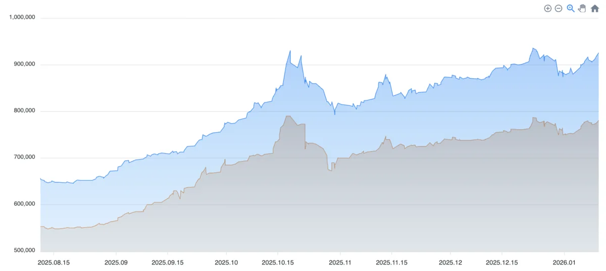
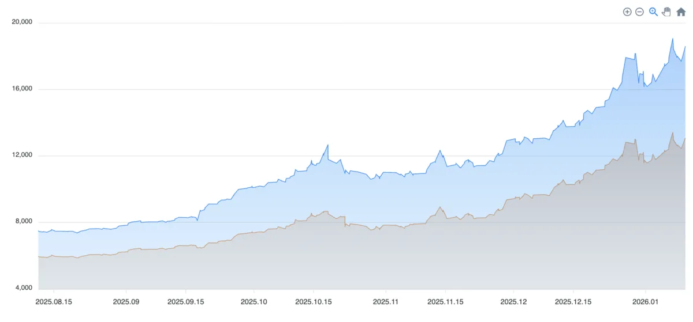
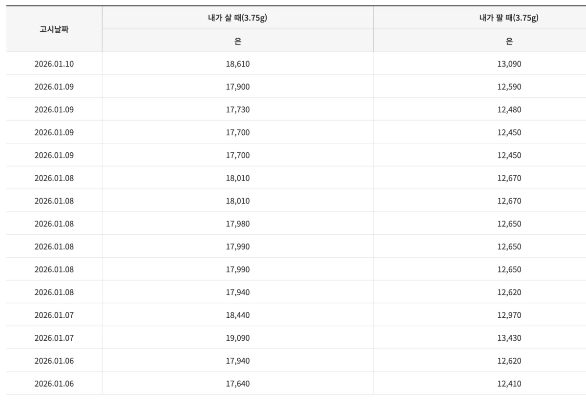
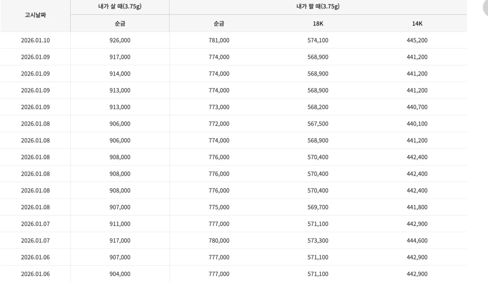

2025년은 금과 은 투자자들에게 역사적인 해였습니다. 금값은 연간 약 65% 급등하며 1979년 석유파동 이후 최고의 성과를 기록했고, 은값은 무려 140% 이상 폭등했습니다. 그렇다면 2026년에도 이 상승세가 이어질까요? 오늘은 주요 금융기관들의 전망과 함께 금·은 투자 방법을 상세히 정리해 드리겠습니다.

## 현재 금시세·은시세 현황 (2026년 1월 기준)

[한국금거래소 금값 은값 실시간확인](https://www.koreagoldx.co.kr/price/gold)

먼저 현재 시세를 확인해볼게요. 2026년 1월 9일 기준으로 국내 금 1돈(3.75g) 시세는 약 78만 7,875원입니다. 전일 대비 약 1.3% 상승한 수치인데요. 국제 금 시세는 온스당 약 4,460달러 수준에서 거래되고 있습니다.

은 시세는 더 극적입니다. 국제 은값은 온스당 약 78달러로, 불과 1년 전 29달러에서 시작해 연간 140% 이상 급등했습니다. 금보다 은의 상승률이 훨씬 높았던 거죠.

2025년 한 해 동안 금 1돈 가격은 약 48만 원에서 78만 원으로 올랐고, 순금 100만 원 시대가 눈앞에 다가왔다는 분석도 나오고 있습니다.

## 2026년 금시세 전망: 주요 기관 예측

금값 변동 그래프

전문가들은 2026년에도 금값 상승이 이어질 것으로 보고 있습니다. 다만 2025년처럼 60~70% 급등은 어렵고, 완만한 상승세를 예상하는 시각이 지배적입니다.

주요 금융기관들의 2026년 금값 전망을 정리하면 이렇습니다. JP모건은 2026년 말 금값을 온스당 5,055달러로 예상하고 있습니다. 골드만삭스는 4,900달러를, 뱅크오브아메리카는 5,000달러 돌파 가능성을 제시했습니다. 영국 파이낸셜타임스가 11개 금융기관 전문가들에게 설문한 결과, 평균 전망치는 온스당 4,610달러였습니다.

대신증권 최진영 연구원은 더 낙관적인 전망을 내놓기도 했는데요. "유동성 정책의 성격 변화에 따라 금값은 온스당 5,000달러까지 오를 여지가 있다"고 분석했습니다.

금값 상승을 전망하는 이유는 크게 세 가지입니다. 첫째, 재정 적자 확대와 글로벌 부채 증가로 안전자산 수요가 계속된다는 점입니다. 둘째, 중앙은행들의 금 매입이 지속되고 있습니다. 셋째, 지정학적 리스크(우크라이나 전쟁, 중동 갈등 등)가 해소되지 않고 있습니다.

다만 변수도 있습니다. 미국 연준의 금리 인하 속도가 예상보다 느려지면 달러 강세로 금값이 조정받을 수 있고, 2026년에는 중앙은행 주도의 강한 매수세가 제한될 가능성도 있습니다.

## 2026년 은시세 전망: 금보다 더 오를까?

은값 변동 그래프

은값 전망은 금보다 더 낙관적입니다. 전문가들 사이에서는 2026년 내내 은값이 강세를 보일 것이라는 예측이 지배적인데요.

2026년 은값 전망 범위는 온스당 64달러에서 최대 240달러까지 다양합니다. 높은 변동성이 예상되지만, 전체적인 방향은 상승 쪽으로 기울어져 있습니다. 일부 전문가는 2026년 중 은값이 온스당 100달러를 돌파할 수 있다고 보기도 합니다.

은값 상승을 전망하는 가장 큰 이유는 공급 부족입니다. 은은 금과 달리 산업용 수요가 전체의 절반 이상을 차지하는데요. 특히 태양광 패널, 전기차, 반도체 등 친환경·첨단 산업에서 은 수요가 급증하고 있습니다. 태양광 PV셀 생산에 은이 대량 사용되면서 구조적인 공급 부족이 예상됩니다.

또한 은값은 역사적으로 금값 상승기 후반부에 더 빠르게 오르는 경향이 있습니다. 금/은 비율(금값 ÷ 은값)이 정상화되면서 은값이 추가 상승할 여지가 있다는 분석입니다.

다만 LS증권 홍성기 연구원은 "미국 은행권 숏포지션(하락 베팅) 루머가 있어 단기적으로 변동성이 클 수 있다"고 경고하기도 했습니다. 실제로 2026년 초 은값은 급등 후 조정을 보이며 높은 변동성을 보여주고 있습니다.

## 금 투자 방법 5가지 비교

금에 투자하는 방법은 크게 다섯 가지가 있습니다. 각각 장단점이 다르니 본인 상황에 맞게 선택하시면 됩니다.

첫 번째는 골드바 구매입니다. 한국금거래소, 은행, 백화점 등에서 실물 금을 구매하는 방식입니다. 장점은 실물을 직접 소유할 수 있고 위기 상황에서 활용 가능하다는 점입니다. 단점은 구매 시 부가세 10%와 마진(5~8%)이 붙어서 15% 이상 올라야 본전이라는 점입니다. 또한 보관 비용과 도난 위험도 있습니다.

두 번째는 금 통장(골드뱅킹)입니다. 은행에서 금 계좌를 개설해 0.01g 단위로 금을 매매하는 방식입니다. 장점은 소액으로 시작 가능하고 실물 보관 부담이 없다는 점입니다. 단점은 매매 차익에 배당소득세 15.4%가 부과되고, 은행 수수료가 있다는 점입니다.

세 번째는 KRX금시장입니다. 한국거래소에서 금을 주식처럼 사고파는 방식인데요. 장점은 매매 차익에 세금이 없고 수수료가 0.3% 수준으로 저렴하다는 점입니다. 또한 1g 단위로 거래 가능합니다. 단점은 증권 계좌가 필요하고, 인출 시 부가세가 붙는다는 점입니다. 세금 혜택 면에서 가장 유리한 방법으로 꼽힙니다.

네 번째는 금 ETF입니다. 금 가격을 추종하는 상장지수펀드에 투자하는 방식입니다. 국내 상장 대표 상품으로는 TIGER KRX금현물, KODEX 골드선물(H) 등이 있고, 해외 상장 상품으로는 GLD, IAU 등이 있습니다. 장점은 주식처럼 편리하게 매매 가능하고 유동성이 우수하다는 점입니다. 단점은 국내 ETF는 배당소득세 15.4%가 부과되고, 해외 ETF는 양도세 22%(250만 원 공제 후)가 붙는다는 점입니다.

다섯 번째는 금 펀드입니다. 금광업 주식이나 금 관련 자산에 투자하는 펀드입니다. 장점은 전문가가 운용해주고 분산 투자 효과가 있다는 점입니다. 단점은 운용 보수가 ETF보다 높고, 금 가격과 수익률이 다를 수 있다는 점입니다.

## 은 투자 방법 4가지 비교

은 투자 방법은 금과 유사하지만 몇 가지 차이가 있습니다.

첫 번째는 실버바 구매입니다. 실물 은을 구매하는 방식인데요. 장점은 실물 소유의 심리적 안정감이 있다는 점입니다. 단점은 골드바와 마찬가지로 부가세 10%와 마진이 붙어 초기 비용이 높고, 은은 금보다 부피가 커서 보관이 불편하다는 점입니다.

두 번째는 은 통장(실버뱅킹)입니다. 은행에서 은 계좌를 개설해 1g 단위로 매매하는 방식입니다. 장점은 소액 투자 가능하고 실물 보관 부담이 없다는 점입니다. 단점은 매매 차익에 배당소득세 15.4%가 부과된다는 점입니다.

세 번째는 KRX 은시장입니다. 금시장과 달리 아직 'KRX 은시장'은 별도로 존재하지 않습니다. 다만 KRX금시장과 유사한 방식으로 은 현물 거래가 가능한 플랫폼들이 있습니다.

네 번째는 은 ETF입니다. 국내 상장 은 ETF로는 KODEX 은선물(H)이 대표적입니다. 장점은 편리한 매매와 환헤지 옵션이 있다는 점입니다. 단점은 국내 은 ETF 상품이 금에 비해 제한적이라는 점입니다. 해외 ETF로는 SLV(iShares Silver Trust) 등이 있습니다.

실버바보다 은 ETF가 효율적인 이유는 비용 차이 때문입니다. 실버바는 부가세와 마진으로 15% 이상 손실이 발생하지만, ETF는 수수료가 1% 미만입니다.

## 금 vs 은, 어디에 투자할까?

둘 다 장단점이 있어서 단정 짓기 어렵지만, 몇 가지 기준으로 비교해볼 수 있습니다.

안정성 측면에서는 금이 유리합니다. 금은 역사적으로 안전자산으로서의 지위가 확고하고, 변동성이 은보다 낮습니다. 위기 상황에서 자산을 지키고 싶다면 금이 적합합니다.

수익률 측면에서는 은이 유리할 수 있습니다. 은은 금보다 변동성이 크지만, 상승기에는 더 높은 수익률을 기대할 수 있습니다. 2025년에도 금(65%)보다 은(140%)의 상승률이 훨씬 높았습니다.

산업 수요 측면에서도 은이 유리합니다. 은은 태양광, 전기차, 반도체 등 친환경·첨단 산업에 필수 소재로 사용되면서 구조적인 수요 증가가 예상됩니다. 금은 주로 장신구와 안전자산 수요에 의존합니다.

투자 접근성 측면에서는 금이 유리합니다. 금은 KRX금시장, 다양한 ETF, 금 통장 등 투자 옵션이 다양합니다. 은은 상대적으로 투자 상품이 제한적입니다.

결론적으로, 안정적인 자산 보존을 원한다면 금, 높은 수익률을 노린다면 은에 더 비중을 두는 전략이 유효합니다. 물론 둘 다 보유하는 분산 투자도 좋은 방법입니다.

## 금·은 투자 시 주의할 점

첫째, 고점 매수를 경계하세요. 2025년 급등 이후 조정 가능성이 있습니다. 분할 매수로 리스크를 줄이는 게 좋습니다.

둘째, 환율 변동을 고려하세요. 국제 금·은값은 달러로 표시되기 때문에 원/달러 환율이 오르면 국내 시세도 함께 오릅니다. 2026년 환율은 1,400원대가 뉴노멀이 될 것으로 전망되는데, 환율 하락 시 금·은값이 조정될 수 있습니다.

셋째, 세금을 고려한 투자 방법을 선택하세요. 같은 금에 투자해도 방법에 따라 세금이 크게 다릅니다. KRX금시장은 매매 차익 비과세로 가장 유리하고, 골드뱅킹이나 금 ETF는 15.4% 배당소득세가 붙습니다.

넷째, 장기 투자 관점으로 접근하세요. 금·은은 단기 투기보다 인플레이션 헤지, 자산 분산 목적의 장기 투자에 적합합니다.

## 마치며

2026년 금·은 시장은 여전히 상승 기조를 유지할 것으로 전망됩니다. 금은 온스당 4,600~5,000달러, 은은 높은 변동성 속에서도 상승 방향이 예상되는데요.

다만 2025년처럼 60~70% 급등은 어렵고, 완만한 상승 또는 횡보 가능성도 열어둬야 합니다. 투자하실 때는 고점 매수를 피하고 분할 매수 전략을 활용하시길 권합니다.

금 투자는 KRX금시장이 세금 면에서 가장 유리하고, 은 투자는 ETF가 비용 면에서 효율적입니다. 본인의 투자 목적과 세금 상황을 고려해서 적합한 방법을 선택하시기 바랍니다.

---

**추천 태그 10개**: #금시세 #은시세 #2026금전망 #2026은전망 #금투자 #은투자 #KRX금시장 #금ETF #골드바 #원자재투자

---

**투자 유의사항**: 본 포스팅은 정보 제공 목적으로 작성되었으며, 특정 투자를 권유하는 것이 아닙니다. 금, 은 등 원자재 투자는 가격 변동 위험이 있으며, 투자 손실이 발생할 수 있습니다. 투자 결정은 본인의 판단과 책임하에 이루어져야 하며, 투자 전 충분한 정보 수집과 전문가 상담을 권장합니다.
