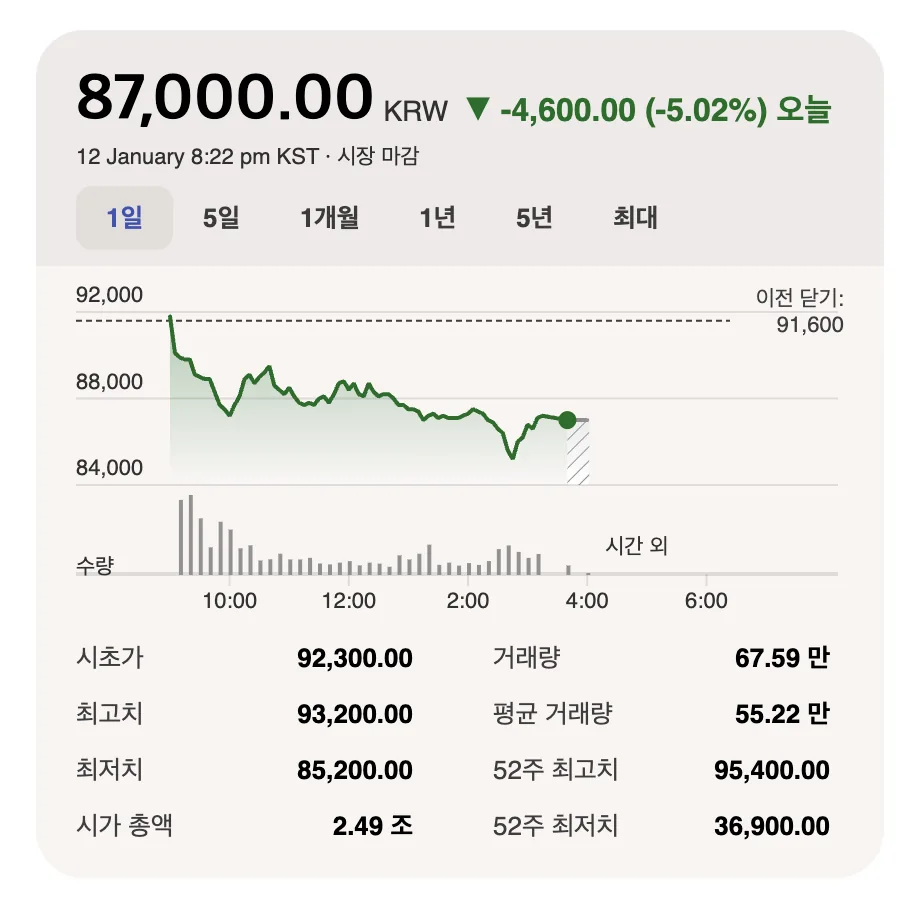

---
categories:
- 주식투자
- 기업분석
- 시장공부
date: 2026-01-12T23:26:19+09:00
description: 현대위아 주가가 오르내리는 이유를 초보 투자자도 이해하기 쉽게 정리했습니다. 실적(마진), 환율, 금리, 자동차 업황, 수주·전기차
  모멘텀까지 5가지 변수로 주가 변동을 해석하는 체크리스트를 제공합니다.
draft: false
slug: hyeondaewia-juga-wae-umjigilkka
tags:
- 현대위아
- 현대위아주가
- 자동차부품주
- 실적분석
- 환율
- 금리
- 자동차업황
- 수주
title: 현대위아 주가, 왜 움직일까? 초보를 위한 5가지 핵심 변수
---
## 현대위아 주가, 왜 움직일까? (핵심 변수 5가지)


현대위아 주가를 보다 보면 “특별한 공시가 없는데도 왜 이렇게 움직이지?” 싶은 날이 꽤 있습니다. 초보 투자자 입장에서는 이게 제일 어렵고요.  
그런데 주가가 움직이는 원리는 의외로 단순한 편입니다. 시장은 매일 “이 회사가 **앞으로 얼마나 안정적으로 돈을 벌까**, 그리고 그 돈의 가치를 **어떤 할인율(금리)로** 평가할까”를 다시 계산하거든요.

현대위아는 자동차 산업과 연결된 부품/제조 기업 특성이 있어서, **실적 + 업황 + 거시(환율·금리) + 모멘텀**이 섞이며 주가가 반응하는 경우가 많습니다. 오늘은 그중에서도 자주 등장하는 5가지 변수를 중심으로, 초보도 따라가기 쉬운 방식으로 정리해보겠습니다.


---

## 1) 실적(매출·영업이익·마진): 주가의 “기본 체력”

주가의 가장 큰 축은 결국 실적입니다. 특히 제조업에서는 “매출이 늘었다”도 중요하지만, 실제로 시장은 **영업이익과 이익률(마진)**을 더 예민하게 봅니다.

### 초보가 꼭 봐야 하는 실적 포인트 3가지

1) **영업이익이 늘었는지**  
2) **영업이익률이 개선되는지**(원가/판가/제품 믹스 영향)  
3) 실적이 좋아도 **시장 기대치(컨센서스) 대비** 상회/하회했는지

뉴스에서 “실적 개선”이라고 나와도 주가가 빠지는 경우가 있는데요. 이런 경우는 대개  

- 이미 시장이 기대를 너무 크게 반영해둔 상태이거나  
- 숫자는 괜찮아 보이지만 **다음 분기 전망이 보수적**이거나  
- 이익률이 생각보다 안 나왔거나  
  같은 이유가 많습니다.

### 실적 시즌에 주가가 흔들릴 때 읽는 순서


- (1) 매출/영업이익 숫자 확인  
- (2) 컨센서스 대비인지 확인  
- (3) 회사 코멘트에서 “원가/수요/가동률/환율” 같은 단어가 어떻게 언급되는지 확인  

이 순서로만 봐도 “왜 올랐는지/왜 빠졌는지”가 훨씬 정리됩니다.

---

## 2) 환율(원/달러): 수익성 기대를 흔드는 대표 거시 변수

자동차 밸류체인은 글로벌로 연결돼 있어서, 환율이 움직이면 관련 기업들 주가가 같이 반응하는 날이 있습니다. 원화가 약세(달러 강세)일 때 수출/해외 매출 비중이 있는 회사는 이익이 개선될 수 있다는 기대가 붙기도 하고요.

다만 여기서 중요한 포인트가 있습니다. **환율이 올랐다고 무조건 좋다**가 아니라, 회사의  

- 매출이 어떤 통화로 발생하는지  
- 원재료/부품을 어떤 통화로 조달하는지  
- 해외 생산 비중이 어떤지  
  에 따라 **순효과**가 달라질 수 있습니다.

### 초보 체크리스트

- 환율 급등/급락이 있었던 날, 현대위아만 움직였는지 **자동차·부품 업종 전체가 같이 움직였는지** 먼저 보세요.  
- 업종 전체가 함께 움직였다면 “개별 이슈”보다 **거시(환율) 영향**일 가능성이 큽니다.

---



## 3) 금리: “평가 방식(밸류에이션)”을 바꾸는 변수

금리는 주가에 간접적으로 큰 영향을 주는데요. 이유는 간단합니다. 금리가 오르면 시장은 미래 이익을 더 높은 할인율로 계산해 **현재 가치**를 낮게 평가하는 경향이 있습니다. 반대로 금리 인하 기대가 커지면 주식시장 전체에 우호적 분위기가 생기기도 하고요.

자동차/부품주에서는 금리가 단순히 “평가”뿐 아니라  

- 소비자의 자동차 구매 부담(할부·리스 등)  
- 경기 둔화 우려  
  와 함께 묶여서 해석되는 일이 많습니다.

### 초보가 기억하면 좋은 문장

금리 하나만으로 현대위아가 움직인다기보다는, **금리 변화가 만들어내는 시장 분위기** 속에서 업종 자금 흐름이 바뀌며 영향을 주는 경우가 많습니다.

---

## 4) 자동차 업황: 완성차 판매·생산이 부품주 체감으로 이어진다

현대위아 주가를 이해하려면 “현대위아만” 보지 말고, 자동차 업황을 한 번 더 같이 봐야 합니다. 완성차 판매가 늘거나 생산 계획이 좋아지면, 부품사에 대한 기대도 자연스럽게 커지거든요.

여기서 업황은 이런 식으로 체감됩니다.  

- 주요 시장 판매 흐름(국내/미국/유럽 등)  
- 완성차 업체의 생산/가동률 변화  
- 재고 증가/감소(경기 둔화 신호로 해석될 수 있음)

### 초보가 자주 하는 오해(중요)

“자동차가 잘 팔리면 부품주도 무조건 오른다”는 단순 연결은 위험합니다.  
부품사는 같은 업황에서도 **원가, 납품 단가, 제품 믹스**에 따라 이익이 크게 달라질 수 있기 때문인데요. 그래서 업황을 보되, 결국 결론은 다시 **실적(마진)**으로 돌아오는 경우가 많습니다.

---

## 5) 수주·전기차/신사업 모멘텀: 단기 변동성을 키우는 촉매

현대위아 주가가 짧은 기간에 크게 출렁일 때는 “실적”이 아니라, 수주/신사업/전기차 관련 기대 같은 **모멘텀 뉴스**가 방아쇠가 되는 경우가 있습니다.

모멘텀은 주가에 빨리 반영되지만, 동시에 “기대가 앞서가면” 되돌림도 빠른 편입니다. 그래서 초보일수록 모멘텀 뉴스를 볼 때는 아래 4가지를 같이 확인하는 습관이 중요합니다.

### 수주 뉴스 4가지 확인법(실전용)

1) **규모**: 계약 금액이 의미 있는 수준인지  
2) **기간**: 몇 년에 걸쳐 반영되는지(단기 vs 중장기)  
3) **수익성**: 마진에 대한 언급이 있는지(없으면 보수적으로)  
4) **시점**: 양산/납품 시작 시점이 언제인지  

이 4가지가 명확하지 않은데도 주가가 크게 움직이면, 그건 “확정된 실적”보다는 “기대”가 주도하는 구간일 수 있습니다.

---

## (초보용) 현대위아 주가 움직임 해석하는 1분 루틴

매일 깊게 분석하기는 부담스럽잖아요. 그래서 아래 루틴만 해도 꽤 도움이 됩니다.

### 1) 오늘은 업종 전체가 움직였나, 현대위아만 움직였나?

- 업종 전체 동반 상승/하락: 환율·금리·업황 같은 **거시/섹터 요인** 가능성  
- 현대위아만 독자적으로 움직임: **실적/수주/기업 뉴스** 가능성  

### 2) 실적 시즌이면 “전년 대비”보다 “예상 대비”를 먼저

- 전년 대비 증감은 뒤에 보고, 먼저 **컨센서스 대비**를 확인하는 게 시장 반응에 더 가깝습니다.

### 3) 환율·금리 급변이 있었는지 확인

- “오늘 시장이 왜 위험자산을 샀는지/팔았는지” 분위기 파악이 됩니다.

### 4) 뉴스를 봤다면, 숫자와 시점을 체크

- 수주든 신사업이든 결국은 **언제, 얼마나, 얼마나 남기나(마진)**로 정리됩니다.

간단히 아래처럼 메모해두면 복기할 때 좋아요.

```text
오늘의 현대위아 주가 변동 체크
- 업종 동행 여부:
- 실적/가이던스 이슈:
- 환율(원/달러) 방향:
- 금리(시장 분위기) 변화:
- 모멘텀(수주/신사업) 유무:
```
