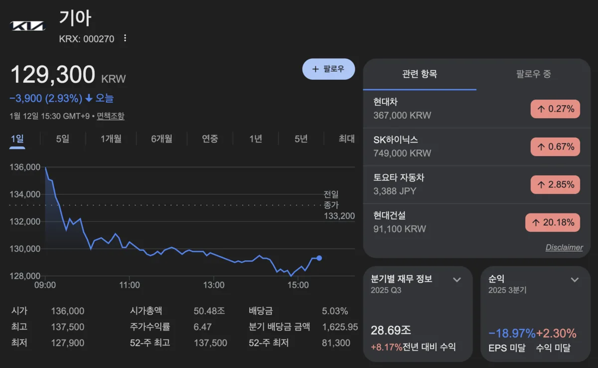
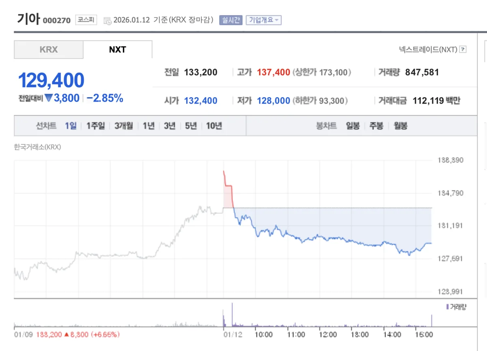

---
categories:
- 주식투자
- 국내주식
date: 2026-01-12T23:26:19+09:00
description: 2026년 현대차와 기아 주가를 비교 분석합니다. 밸류에이션, 배당수익률, 실적 전망, 로봇·전기차 전략까지 두 종목의 투자
  포인트를 종합 비교해 투자 결정에 도움을 드립니다.
draft: false
slug: hyeondaecha-vs-gia-juga
tags:
- 현대차
- 기아
- 자동차주
- 주가비교
- 배당주
- 로봇주
- 전기차
title: '현대차 vs 기아 주가 비교: 2026년 어디에 투자할까?'
---
## 2026년 자동차주, 왜 지금 주목해야 할까?

2026년 1월, 현대차와 기아가 동반 상승세를 보이며 투자자들의 관심이 집중되고 있습니다. 특히 현대차는 CES 2026에서 로봇 사업 청사진을 공개하며 시가총액 100조 원 돌파를 눈앞에 두고 있고, 기아 역시 증권사 목표가 상향이 줄을 잇고 있는데요.

그렇다면 2026년, 현대차와 기아 중 어디에 투자하는 것이 더 유리할까요? 주가, 밸류에이션, 배당, 실적 전망, 미래 성장 동력까지 핵심 지표를 비교 분석해 보겠습니다.

## 주가 현황: 현대차 급등, 기아는 꾸준한 상승

2026년 1월 12일 기준, 현대차 주가는 약 367,000원, 기아 주가는 약 129,300원에서 133,200원 수준에서 거래되고 있습니다.

최근 주가 흐름을 보면, 현대차는 1월 7일 장중 36만 원을 돌파하며 역대 최고가를 경신했습니다. CES 2026에서 공개한 로봇 사업 전략과 피지컬 AI 비전이 주가를 끌어올린 주요 동력입니다. 한 달 전과 비교하면 약 40% 가까이 상승한 것으로, 그야말로 폭발적 상승이라 할 수 있습니다.

반면 기아는 같은 기간 약 17% 상승에 그쳤습니다. 물론 기아도 52주 신고가를 경신하며 상승세를 보이고 있지만, 현대차의 상승폭에는 미치지 못합니다. 매일경제는 이를 두고 피지컬 AI가 가른 주가라는 헤드라인으로 보도하기도 했습니다.

## 밸류에이션 비교: 둘 다 저평가, 하지만 기아가 더 싸다

투자에서 가장 중요한 지표 중 하나인 밸류에이션을 비교해 보겠습니다.

현대차의 경우 PER(주가수익비율)은 약 5배에서 6배, PBR(주가순자산비율)은 약 0.5배 수준입니다. 글로벌 완성차 업체 평균 PER이 8.7배임을 감안하면 여전히 저평가 구간에 있지만, 최근 주가 급등으로 과거 대비 밸류에이션이 상승한 상태입니다. ROE는 약 9%에서 10% 수준입니다.

기아의 경우 PER은 약 6배, PBR은 약 0.8배로 현대차보다 PBR이 약간 높습니다. 하지만 ROE가 약 13%로 현대차보다 높아, ROE 대비 PBR 관점에서는 기아가 더 저평가되어 있다고 볼 수 있습니다. 다올투자증권은 현대차그룹 상장사 중 가장 매력적인 ROE-PBR 밸류에이션을 보유했다며 기아의 저평가 해소를 기대한다고 분석했습니다.

정리하면 절대적 주가 수준은 기아가 훨씬 낮고, 수익성 대비 밸류에이션 매력은 기아가 약간 우위에 있습니다. 다만 현대차는 로봇과 AI 사업이라는 새로운 성장 동력이 주가에 프리미엄을 부여받고 있는 상황입니다.

## 증권사 목표주가 비교: 현대차 최대 50만 원, 기아 18.5만 원

주요 증권사들의 목표주가를 비교해 보면, 현대차에 대한 기대가 더 높은 것을 확인할 수 있습니다.

현대차의 경우 31명의 애널리스트가 제시한 평균 목표주가는 약 36만 원에서 37만 원이며, 최고 목표가는 DS투자증권의 50만 원, 최저는 25만 원입니다. 최근 6개월간 평균 목표가가 28만 원대에서 37만 원대로 약 30% 상승했는데, 이는 로봇과 AI 사업 가치가 반영된 결과입니다.

기아의 경우 29명의 애널리스트가 제시한 평균 목표주가는 약 14.8만 원에서 15만 원이며, 최고 목표가는 다올투자증권의 18.5만 원, 최저는 10.5만 원입니다. 최근 목표가 상향 추세가 이어지고 있지만, 현대차만큼 급격한 상향은 아닙니다.

현재 주가 대비 상승 여력을 계산하면, 현대차는 평균 목표가 기준 약 0%에서 5%, 최고 목표가 기준 약 35% 상승 여력이 있습니다. 기아는 평균 목표가 기준 약 12%에서 15%, 최고 목표가 기준 약 40% 상승 여력이 있어, 상승 여력 측면에서는 기아가 약간 우위입니다.

## 2025년 실적 비교: 매출은 역대 최대, 이익은 관세 충격

2025년 실적을 비교해 보면, 두 회사 모두 매출은 역대 최대를 기록했지만 영업이익은 미국 관세 영향으로 감소했습니다.

현대차의 2025년 연간 실적 전망을 보면, 매출액은 약 185조 원으로 전년 대비 소폭 증가해 역대 최대를 기록할 전망입니다. 영업이익은 약 12.6조 원으로 전년 대비 약 13% 감소가 예상됩니다. 3분기 영업이익은 전년 동기 대비 29.2% 급감해 관세 충격이 컸습니다.

기아의 2025년 연간 실적 전망을 보면, 매출액은 약 114.8조 원으로 전년 대비 6.9% 증가해 2년 연속 최대 매출 경신이 유력합니다. 영업이익은 약 9.3조 원으로 전년 대비 26.8% 감소가 예상됩니다. 3분기 영업이익은 전년 동기 대비 49.2% 급감해 현대차보다 관세 충격이 더 컸습니다.

두 회사를 합산하면 2025년 연매출 약 300조 원 시대를 열게 되지만, 통합 영업이익은 약 21.8조 원으로 전년보다 18.8% 감소할 전망입니다. 그러나 증권가에서는 2026년 이익 반등을 예상하고 있어, 실적 바닥은 2025년 3분기에 형성됐다는 분석이 우세합니다.

## 2026년 실적 전망: 이익 반등 기대

2026년 실적 전망에서는 두 회사 모두 이익 반등이 예상됩니다.

현대차의 2026년 전망을 보면, 중국을 제외한 글로벌 판매량은 약 402만 대로 소폭 증가가 예상됩니다. 증권가에서는 관세 영향 완화, 신차 효과(그랜저, 투싼, 아반떼 완전변경 모델), 로봇과 AI 사업 본격화를 긍정적 요인으로 꼽고 있습니다.

기아의 2026년 전망을 보면, 글로벌 판매 목표 335만 대를 설정했으며 이는 2025년 실적 대비 6.8% 증가한 수치입니다. 매출액 119조 원에서 120조 원(전년 대비 4%에서 5% 증가), 영업이익 10조 원에서 11조 원(전년 대비 13%에서 20% 증가)이 예상되며, 영업이익률은 9%대 초반까지 회복될 전망입니다. EV2, 셀토스 하이브리드 등 신차 효과와 하이브리드 판매 확대가 실적 반등을 이끌 것으로 보입니다.

## 배당수익률 비교: 기아가 더 높다

배당주로서의 매력을 비교해 보면, 기아가 약간 앞서 있습니다.

현대차의 배당 정책을 보면, 2025년부터 2027년까지 TSR(총주주환원율) 35% 목표와 연간 최소 배당금 1만 원 정책을 유지하고 있습니다. 2025년 연간 배당금은 약 12,000원(분기배당 포함)으로, 현재 주가 기준 배당수익률은 약 3.3%에서 3.7% 수준입니다. 분기 배당을 실시하므로 3개월마다 배당을 받을 수 있습니다.

기아의 배당 정책을 보면, 2025년 주당배당금(DPS)은 6,500원으로, 현재 주가 기준 배당수익률은 약 4.9%에서 5.0% 수준입니다. 배당성향은 26.1%이며, 2025년 연내 7천억 원 규모 자사주 매입 및 100% 소각 예정으로 주주환원에 적극적입니다.

배당수익률만 놓고 보면 기아가 현대차보다 약 1.5%p 높습니다. 배당 투자 목적이라면 기아가 더 매력적인 선택지입니다.

## 미래 성장 동력: 현대차는 로봇, 기아는 전기차

두 회사의 미래 성장 전략은 다소 차이가 있습니다.

현대차의 핵심 성장 동력은 로봇과 피지컬 AI 사업입니다. CES 2026에서 보스턴다이내믹스의 휴머노이드 로봇 아틀라스가 CES 최고의 로봇으로 선정되었고, 구글 딥마인드와의 3자 협력을 통해 AI 로보틱스 사업을 본격화한다고 발표했습니다. 증권가에서는 로봇 사업이 현대차의 밸류에이션 리레이팅(재평가)을 이끌 핵심 동력이라고 평가합니다. DS투자증권은 AI 로봇 사업이 본격화되면 시가총액 100조 원을 넘어설 것이라며 업계 최고 목표가인 50만 원을 제시했습니다.

기아의 핵심 성장 동력은 전기차 라인업 확대와 하이브리드 판매 확대입니다. 2026년 1분기 출시 예정인 EV2(예상 가격 약 3,600만 원)는 유럽 시장 공략의 핵심 무기로, 중국 BYD와 직접 경쟁할 수 있는 가격대입니다. 또한 셀토스 하이브리드 출시 등 하이브리드 라인업 강화로 이익률 방어에 나설 계획입니다.

요약하면, 현대차는 자동차와 로봇을 결합한 회사로의 변신을 통해 성장 프리미엄을 추구하고, 기아는 전기차와 하이브리드 라인업 강화를 통한 본업 경쟁력 강화에 집중하고 있습니다.

## 리스크 요인 비교

두 회사 모두 공통적인 리스크 요인이 있습니다.

첫 번째 공통 리스크는 미국 관세입니다. 2025년 실적 악화의 주요 원인으로, 2026년에도 변수로 작용할 수 있습니다. 다만 현대차그룹의 미국 현지 생산 확대(HMGMA 공장)로 영향은 점진적으로 완화될 전망입니다.

두 번째 공통 리스크는 전기차 판매 부진입니다. 글로벌 전기차 시장 성장이 예상보다 더딘 상황에서, EV 판매 확대 여부가 실적에 중요한 변수입니다.

세 번째 공통 리스크는 환율 변동성입니다. 원달러 환율이 1,400원대에서 유지되고 있어 수출 기업에 긍정적이지만, 급격한 환율 변동 시 실적 불확실성이 커질 수 있습니다.

현대차만의 리스크로는 로봇 사업의 불확실성이 있습니다. 로봇과 AI 사업이 주가에 프리미엄을 부여하고 있지만, 실제 수익화까지는 시간이 필요합니다. 기대감이 선반영된 만큼 실망 시 조정 폭이 클 수 있습니다.

기아만의 리스크로는 관세 민감도가 더 높다는 점입니다. 2025년 3분기 기아의 영업이익 감소율이 현대차보다 컸는데, 이는 기아가 관세에 더 민감하다는 것을 보여줍니다.

## 투자 성향별 추천

그렇다면 2026년, 현대차와 기아 중 어디에 투자해야 할까요? 투자 성향에 따라 다르게 접근할 수 있습니다.

성장주 투자자에게는 현대차가 적합합니다. 로봇과 AI 사업이라는 새로운 성장 동력이 밸류에이션 리레이팅을 이끌 가능성이 높습니다. 단기 급등 후 조정 가능성이 있으므로 분할 매수 전략이 유효합니다.

가치주 및 배당 투자자에게는 기아가 적합합니다. 낮은 밸류에이션(PER 6배, PBR 0.8배)과 높은 배당수익률(약 5%)이 매력적입니다. ROE 대비 저평가 구간에서 밸류업 기대감도 있습니다.

분산 투자를 원한다면 두 종목을 함께 보유하는 전략도 좋습니다. 현대차는 성장 프리미엄, 기아는 가치와 배당 매력으로 포트폴리오 균형을 맞출 수 있습니다.

## 핵심 비교표 요약

| 항목                 | 현대차          | 기아          |
| ------------------ | ------------ | ----------- |
| 현재 주가 (2026.01.12) | 약 367,000원   | 약 130,000원  |
| 시가총액               | 약 98조~100조 원 | 약 53조 원     |
| 평균 목표주가            | 36만~37만 원    | 14.8만~15만 원 |
| 상승 여력 (평균)         | 0~5%         | 12~15%      |
| PER                | 5~6배         | 약 6배        |
| PBR                | 약 0.5배       | 약 0.8배      |
| ROE                | 9~10%        | 약 13%       |
| 배당수익률              | 3.3~3.7%     | 4.9~5.0%    |
| 2026년 영업이익 전망      | 증가 전환        | 13~20% 증가   |
| 핵심 성장 동력           | 로봇, 피지컬 AI   | 전기차, 하이브리드  |

## 결론: 성장은 현대차, 가치와 배당은 기아

종합적으로 정리하면 다음과 같습니다.

현대차는 로봇과 AI 사업이라는 새로운 성장 스토리로 밸류에이션 프리미엄을 받고 있습니다. 시가총액 100조 원 시대를 눈앞에 두고 있으며, 장기적으로 자동차와 로봇을 결합한 회사로의 변신이 기대됩니다. 다만 단기 급등 후 조정 가능성이 있으므로 분할 매수가 바람직합니다.

기아는 ROE 대비 저평가 매력이 큰 종목입니다. 현대차보다 높은 배당수익률(약 5%)과 적극적인 주주환원 정책이 강점입니다. EV2, 셀토스 하이브리드 등 신차 효과로 2026년 실적 반등이 기대되며, 밸류업 정책에 따른 저평가 해소 가능성도 있습니다.

2026년 자동차주 투자를 고민 중이라면, 본인의 투자 성향에 맞게 선택하거나 두 종목 분산 투자를 고려해 보시기 바랍니다.

---

**투자 유의사항**: 본 글은 정보 제공 목적으로 작성되었으며, 특정 종목에 대한 매수 또는 매도 추천이 아닙니다. 투자 결정은 본인의 판단과 책임 하에 이루어져야 하며, 투자 전 반드시 최신 공시자료와 전문가 의견을 참고하시기 바랍니다.

---

**추천 태그 10개**: #현대차주가 #기아주가 #자동차주비교 #현대차vs기아 #배당주추천 #로봇주 #전기차주식 #2026투자전략 #저평가주 #현대차로봇
