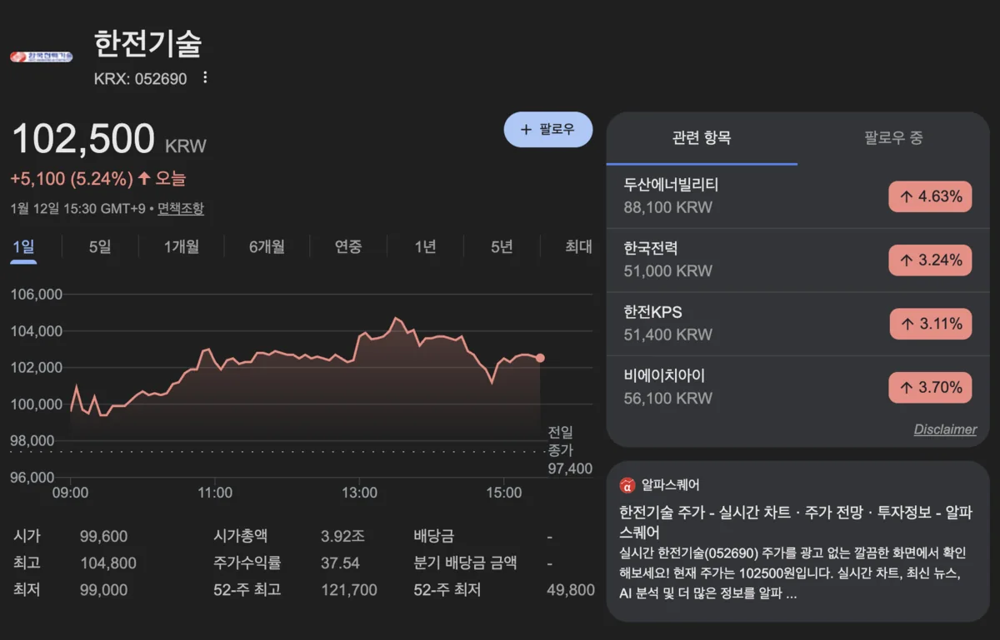

---
categories:
- 증권/주식
- 투자분석
date: 2026-01-12T23:26:19+09:00
description: 한전기술과 두산에너빌리티를 비교 분석합니다. 사업구조, 주가, 실적 전망, 투자 포인트까지 원전 관련주 투자에 필요한 모든
  정보를 정리했습니다.
draft: false
slug: hanjeongisul-vs-dusaneneobilriti-wonjeon
tags:
- 한전기술
- 두산에너빌리티
- 원전관련주
- 원전주비교
- SMR관련주
- 원자력주식
- 에너지주
- 주식비교
title: '한전기술 vs 두산에너빌리티: 원전 관련주 투자한다면 어디가 유리할까?'
---
원전 르네상스 시대가 열리면서 원전 관련주에 대한 관심이 뜨겁습니다. 그중에서도 가장 자주 비교되는 두 종목이 바로 한전기술과 두산에너빌리티인데요. 둘 다 원전 핵심 기업이지만 사업 영역과 투자 포인트가 상당히 다릅니다. 오늘은 이 두 종목을 심층 비교해서 어떤 투자자에게 어떤 종목이 적합한지 분석해드리겠습니다.

## 원전 밸류체인에서의 역할 차이

원전 사업은 크게 설계, 기자재 제조, 건설, 운영으로 나뉘는데요. 한전기술과 두산에너빌리티는 이 중에서 서로 다른 영역을 담당하고 있습니다.

### 한전기술: 원전 설계의 핵심

한전기술은 원전의 두뇌 역할을 합니다. 발전소 전체의 설계와 엔지니어링을 담당하는데요. 쉽게 말해 원전의 설계도를 그리는 회사입니다. 한국형 원전 APR1400, APR1000의 설계 기술을 보유하고 있으며, 이 기술 없이는 한국형 원전 수출이 불가능합니다.

원전 1기를 수출할 때 한전기술이 가져가는 비중은 전체 사업규모의 약 0.6~0.7% 수준으로 알려져 있습니다. 비중은 작아 보이지만 설계 기술이 없으면 원전 수출 자체가 성립되지 않기 때문에 핵심 중의 핵심이라고 할 수 있습니다.

### 두산에너빌리티: 원전 심장부 제조

두산에너빌리티는 원전의 심장인 원자로와 주요 기자재를 만드는 회사입니다. 원자로 용기, 증기발생기, 가압기 등 대형 주기기를 제작하는데요. 전 세계에서 이런 대형 원전 기자재를 만들 수 있는 기업은 손에 꼽을 정도로 적습니다.

원전 1기 수출 시 두산에너빌리티를 포함한 기자재 업체들이 가져가는 비중은 약 20~25% 수준입니다. 설계보다 실제 매출 규모가 훨씬 크다는 의미인데요.

## 주가 및 시가총액 비교

2026년 1월 현재 두 종목의 주요 지표를 비교해보겠습니다.

### 한전기술

현재 주가는 약 97,000~104,000원 수준이며, 시가총액은 약 3조 6,000억원입니다. PER은 약 63~65배로 높은 편이고, PBR은 약 6.3배를 기록하고 있습니다. 최대주주는 한국전력으로 51% 지분을 보유하고 있습니다.

### 두산에너빌리티

현재 주가는 약 84,000~88,000원 수준이며, 시가총액은 약 54조원으로 한전기술의 15배에 달합니다. PER은 약 284배로 매우 높고, PBR은 상대적으로 낮은 편입니다. 최대주주는 두산으로 약 30.7% 지분을 보유하고 있습니다.

시가총액 차이가 큰 이유는 두산에너빌리티가 원전 외에도 가스터빈, 풍력 등 다양한 에너지 사업을 영위하고 있기 때문입니다.

## 2026년 실적 전망 비교

### 한전기술 실적 전망

한전기술은 2025년 상반기 부진한 실적을 기록했지만, 하반기부터 개선되고 있습니다. 3분기 영업이익은 123억원으로 전년 대비 116.2% 증가했는데요.

2026년에는 체코 원전 설계 계약 효과가 본격 반영되면서 실적이 크게 개선될 전망입니다. 증권가에서는 영업이익이 전년 대비 큰 폭으로 증가할 것으로 예상하고 있습니다.

### 두산에너빌리티 실적 전망

두산에너빌리티는 2026년을 실적 퀀텀점프의 원년으로 보는 시각이 많습니다. 신한투자증권에 따르면 2026년 에너빌리티 부문 매출액은 9.7조원(전년 대비 +24.5%), 영업이익은 6,174억원(전년 대비 +88.1%)으로 전망됩니다.

체코 원전 기자재 수주(약 5.6조원)와 SMR 사업 본격화가 실적 개선의 핵심 동력인데요. 일부 증권사는 2026년 전체 매출 23조원, 영업이익 1.4조원까지 전망하기도 합니다.

## 목표주가 비교

### 한전기술 목표주가

증권사별로 목표주가가 다양한데요. KB증권 110,000원, LS증권 130,000원, 대신증권은 매수 의견을 유지하고 있습니다. 평균 목표주가는 약 118,000원 수준으로, 현재 주가 대비 약 15~20% 상승 여력이 있습니다.

### 두산에너빌리티 목표주가

두산에너빌리티는 목표주가가 더 높게 형성되어 있습니다. 평균 목표주가는 약 97,500원~104,000원 수준이며, 최고 125,000원까지 제시한 증권사도 있습니다. 현재 주가 대비 약 15~45% 상승 여력으로 분석됩니다.

## SMR 사업 비교

### 한전기술의 SMR 포지션

한전기술은 한국형 SMR인 i-SMR의 설계를 담당하고 있습니다. 정부 주도 개발 사업의 핵심 참여사로, 2028년까지 진행되는 2단계 기술개발에 참여 중입니다. 설계 기술을 보유하고 있어 향후 SMR 수출 시에도 필수적인 역할을 할 전망입니다.

### 두산에너빌리티의 SMR 포지션

두산에너빌리티는 SMR 기자재 제조 분야에서 글로벌 선두 위치를 확보하고 있습니다. 미국 뉴스케일파워, X-에너지 등 주요 SMR 설계업체들과 독점 제휴를 맺고 있는데요. 2026년 1분기에는 경남 창원에 세계 최초의 SMR 전용 제작 공장을 착공할 예정입니다.

증권가에서는 두산에너빌리티가 SMR 분야에서 더 직접적인 수혜를 받을 것으로 보는 시각이 많습니다. 기자재 제조는 설계보다 매출 규모가 크기 때문입니다.

## 투자 포인트 비교

### 한전기술이 유리한 경우

안정적인 공기업 자회사에 투자하고 싶은 분들에게 적합합니다. 한국전력이 51% 지분을 보유하고 있어 상대적으로 안정성이 높습니다. 시가총액이 작아(약 3.6조원) 큰 모멘텀 발생 시 주가 탄력이 클 수 있고, 원전 설계라는 희소성 높은 기술을 보유하고 있다는 점도 장점입니다.

### 두산에너빌리티가 유리한 경우

대형주 투자를 선호하고 유동성을 중시하는 분들에게 적합합니다. 시가총액 54조원으로 기관과 외국인의 참여가 활발하며, 원전 외에도 가스터빈, 풍력 등으로 사업이 다각화되어 있어 리스크가 분산됩니다. SMR 기자재 분야에서 글로벌 선두 위치를 확보하고 있다는 점도 강점입니다.

## 리스크 요인 비교

### 공통 리스크

두 종목 모두 원전 정책 변화에 민감합니다. 탈원전 정책으로 회귀할 경우 타격이 불가피하며, 원전 프로젝트 특성상 수주부터 매출 인식까지 긴 시간이 소요됩니다. 또한 현재 밸류에이션이 높아 기대에 못 미치는 실적 발표 시 주가 조정 가능성이 있습니다.

### 개별 리스크

한전기술은 한국전력의 재무 상황에 영향을 받을 수 있고 해외 사업 경험이 상대적으로 적습니다. 두산에너빌리티는 과거 구조조정 이력이 있고 시가총액이 커서 주가 상승 탄력이 상대적으로 낮을 수 있습니다.

## 결론: 어떤 종목을 선택할까

원전 설계 기술의 희소성과 중소형주 특성의 높은 주가 탄력을 기대한다면 한전기술이 적합합니다. 반면 대형주의 안정성과 SMR 기자재 사업의 직접적 수혜를 기대한다면 두산에너빌리티가 유리합니다.

사실 두 종목은 경쟁 관계라기보다 상호 보완적인 관계입니다. 한국형 원전이 수출되려면 한전기술의 설계와 두산에너빌리티의 기자재가 모두 필요하기 때문인데요. 원전 테마 전체에 베팅하고 싶다면 두 종목을 적절히 분산 투자하는 것도 좋은 전략이 될 수 있습니다.

---

**투자 유의사항**: 본 글은 투자 참고용 정보 제공 목적으로 작성되었으며, 특정 종목의 매수·매도를 권유하지 않습니다. 투자 결정은 본인의 판단과 책임 하에 이루어져야 하며, 투자 손실에 대한 책임은 투자자 본인에게 있습니다.
