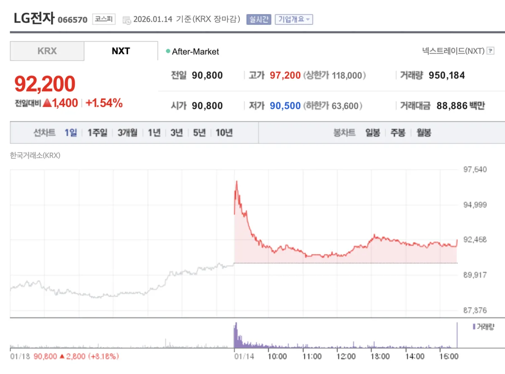

LG전자는 2025년 **영업손실**이라는 9년 만의 악재를 경험했습니다. 하지만 증권가 전문가들은 이를 **일회성 비용**으로 평가하며, 2026년부터의 **본격적인 실적 반등**을 기대하고 있습니다. 과거 부진의 원인은 무엇이고, 앞으로의 성장 동력은 어디에 있을까요? 이 글에서는 **[LG전자 주가](https://finance.naver.com/item/main.naver?code=066570)** 의 현재 상황을 분석하고 2026년 투자 전략을 제시하겠습니다.

---

## 2025년 LG전자의 악재와 원인 분석

**2025년 4분기 충격적 실적**

LG전자의 2025년 4분기 연결기준 영업손실은 **1,094억 원**을 기록했습니다. 매출액은 23조 8,358억 원으로 지난해 같은 기간 대비 증가했지만, 수익성은 바닥까지 떨어진 상태입니다. 이는 **2016년 이후 무려 9년 만의 영업손실**로, 시장에 큰 충격을 주었습니다.

**부진의 핵심 원인**

LG전자의 실적 악화는 단순한 일회성 사건이 아니라 구조적 문제들의 복합 결과입니다. 첫째, **국제 경기 둔화와 소비자 수요 부진**으로 가전 판매량이 감소했습니다. 특히 선진국 시장에서 고가 가전 수요가 정체되면서 마진율까지 압박을 받았습니다. 둘째, **고정비 부담**이 과도했습니다. 인건비, 공장 운영비, 물류비 등 고정 비용이 매출 감소와 맞물리면서 원가율이 급상승했습니다. 셋째, **구조조정 비용**이 수익성을 악화시켰습니다. 인원 감축, 공장 폐쇄 등에 따른 특별손실이 영업이익을 잠식했습니다.

**Mobile Display(모바일 디스플레이) 사업의 부진**

MD 사업 부문의 적자 규모가 특히 심각합니다. 스마트폰 OLED 디스플레이 수요 부진으로 가동률이 저하되면서 **지속적인 손실**을 기록 중입니다. 이는 LG전자 전체 실적에 가장 큰 부담 요인으로 작용하고 있습니다.

---

## 2026년 전망: "강력한 턴어라운드" 시나리오

**증권가의 낙관적 전망**

다수의 증권사들이 2026년 LG전자의 **"강력한 턴어라운드"**를 예측하고 있습니다. 키움증권은 현재 **주가가 '역사적 저점'에 근접**했다고 평가하며, 연간 90조원 이상의 매출 달성이 가능하다고 봅니다. NH증권은 2026년 실적 상승을 이유로 목표주가를 **12만 5,000원**으로 상향했습니다.

**2026년 예상 실적**

여러 애널리스트의 분석에 따르면, 2026년 LG전자의 **연결 기준 매출은 약 91조 원**, **영업이익은 3조원대**가 예상됩니다. 이는 2025년의 손실 상태에서 벗어나 **정상 수익 궤도로 복귀**하는 것을 의미합니다.

**주요 개선 요인**

첫째, **고정비 절감 효과**가 본격적으로 나타납니다. 2025년에 단행된 인건비 절감, MS(마스터 서비스) 부문의 운영 효율화가 올해부터 풀 연도 반영됩니다. 둘째, **원가 구조 개선**으로 마진율이 개선됩니다. 공급망 최적화, 생산 자동화 투자가 효과를 드러낼 것으로 기대됩니다. 셋째, **사업 포트폴리오 재구성**의 긍정적 영향입니다. 저수익 사업의 구조조정이 계속 진행되면서 불필요한 손실이 줄어들 것으로 예상됩니다.

---

## 사업부별 성장 동력 분석

[LGE.COM | LG전자](https://www.lge.co.kr/home)

**Home Entertainment 부문: 안정적 수익원**

TV, 프로젝터, 모니터 등을 담당하는 HE 부문은 **상대적으로 안정적**인 수익을 창출하고 있습니다. OLED TV 수요가 지속적으로 증가하면서 고마진 제품 비중이 높아지고 있습니다. 2026년에는 AI 기능이 강화된 **프리미엄 TV** 라인업이 시장 반응을 얻을 것으로 예상됩니다.

**Climate & Energy Solutions: 차세대 성장 동력**

HVAC(냉난방 공조) 및 에너지솔루션 사업이 **LG전자의 미래 먹거리**로 주목받고 있습니다. 특히 **AI 데이터센터 냉각 솔루션**에 대한 수주 가능성이 2026년 내에 **가시화될 것**으로 기대됩니다. 하이퍼스케일러(Amazon, Google, Meta 등)들이 막대한 AI 인프라 투자를 추진하면서 고성능 냉각 솔루션 수요가 폭증하고 있습니다. 이는 **고마진 B2B 사업**으로 LG전자의 이익 구조를 크게 개선할 수 있는 기회입니다.

**로봇솔루션: 미래 신사업**

가정용 및 산업용 로봇 사업도 **성장 모멘텀**을 구축 중입니다. AI 기술을 접목한 로봇청소기, 이동식 베이스 로봇(MEB) 등이 신규 수익원으로 떠오르고 있습니다.

---

## 주가 투자 포인트와 목표가 분석

**현재 주가 수준의 의미**

대신증권은 LG전자 목표주가를 **13만원**으로 제시했고, NH증권은 **12만 5,000원**, DB증권은 **11만 5,000원**을 제시했습니다. 현재 **[LG전자 주가](https://finance.naver.com/item/main.naver?code=066570)** 가 9만 원대에서 형성되고 있다는 점을 고려하면, **30~40% 상승 여력**이 있다는 평가입니다.

**상승 시나리오**

2026년 상반기 실적 발표 시 **긍정적 어닝 서프라이즈**가 나오면 주가는 가파른 상승을 기록할 것으로 예상됩니다. 특히 **AI 데이터센터 냉각 사업의 구체적 수주 소식**이 나올 경우 주가 재평가가 빠르게 진행될 수 있습니다.

**리스크 요인**

반대로 글로벌 경기 침체가 예상보다 심화되거나, **스마트폰 OLED 수요가 회복되지 않을 경우** 실적 개선 속도가 지연될 수 있습니다. 또한 **원화 약세 반전**은 수출 기업인 LG전자에 부정적 요인이 될 수 있습니다.

---

## 결론: 2026년 LG전자는 "턴어라운드 기업"

2025년의 부진은 **일시적 고통**이 될 가능성이 높습니다. 증권가 전문가들이 일관되게 **2026년 실적 개선과 주가 상승**을 전망하는 것은 구조조정의 효과와 신사업 성장 모멘텀을 반영한 결과입니다.

**중기 투자자 관점**에서는 현재 수준이 **매수 기회**일 수 있습니다. 다만 단기 변동성은 여전하므로, 2026년 상반기 실적 발표와 AI 데이터센터 사업 진전을 지켜보며 **단계적 매수 전략**을 추천합니다.

[LG전자 주가 추이와 실시간 뉴스는 네이버 증권에서 확인하세요](https://finance.naver.com/item/main.naver?code=066570)

---

#LG전자 #주가분석 #2026년전망 #실적개선 #투자포인트 #AI데이터센터 #턴어라운드
