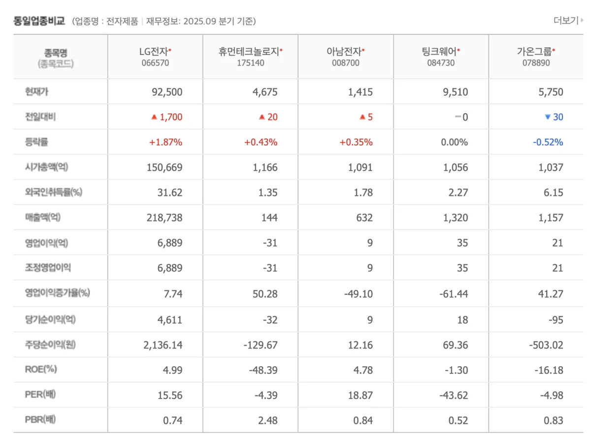

**"실적만큼 중요한 게 배당입니다."** 전자 주가가 회복되면서 배당 투자자들의 관심도 높아지고 있습니다. 2025년 실적 부진에도 불구하고 LG전자가 **배당을 유지한 이유**는 무엇일까요? 2026년에는 **실적 개선과 함께 배당도 증가**할까요? 이전 포스트의 '실적 반등'에 이어, 이번 글에서는 **[LG전자 주가](https://finance.naver.com/item/main.naver?code=066570)** 의 배당 투자 가치를 심층 분석하겠습니다.

---

## LG전자의 배당 정책 개요

**배당정책의 기본 원칙**

LG전자는 **3년간(2024~2026년) 연결기준 당기순이익의 25% 이상**을 배당으로 지급하기로 공식 발표했습니다. 이는 주주 환원 정책을 강화하겠다는 경영진의 의지를 보여주는 결정입니다.

특히 주목할 점은 LG전자가 **2025년부터 중간배당 제도를 도입**했다는 것입니다. 기존에는 연 1회 기말배당만 시행했지만, 이제는 **상반기 중간배당 + 하반기 기말배당** 형식으로 연 2회 배당을 실시합니다.

**자사주 소각과 주주환원 강화**

LG는 2025년부터 **5,000억 원 규모의 자사주를 2026년까지 전량 소각**하기로 결정했습니다. 자사주 소각은 **발행주식수를 줄여 주당 이익(EPS)을 높이는 효과**가 있어, 실질적인 주주 환원 정책으로 작용합니다.

---

## 과거 배당 기록 및 배당수익률 추이

**최근 3년 배당금 현황**

LG전자의 과거 배당 기록을 보면:

2024년 기말배당은 **보통주 800원**을 지급했습니다. 이후 중간배당 정책 도입으로 2025년 상반기에 **500원**, 하반기(기말배당)에도 **500원**을 지급하여 **연간 총 1,000원**의 배당을 주었습니다.

**현재 배당수익률 수준**

**[LG전자 배당수익률](https://finance.naver.com/item/main.naver?code=066570)** 은 현재 **1.1~1.2% 수준**으로 형성되어 있습니다. 이는 일반 은행 정기예금(4~4.5%)이나 국채 수익률보다는 낮지만, 주가 상승 가능성을 고려한 **총 수익률(Capital Gain + Dividend Yield)** 관점에서는 충분히 매력적입니다.

비교 관점에서 보면:

- **배당수익률 1.1%**: 현재 주가 기준 낮은 수준

- **향후 주가 상승 시나리오**: 총 수익률 20~30% 가능 (배당 + 주가차익)
  
  

---

## 2026년 배당금 예측 및 시나리오

**보수적 시나리오: 1,000원 유지**

2026년 실적이 현 예상치대로 영업이익 3조원을 달성한다면, LG전자는 배당정책에 따라 **당기순이익의 25% 이상**을 배당해야 합니다. 보수적으로 보면 2025년 수준인 **연 1,000원(상반기 500원 + 하반기 500원)**을 유지할 가능성이 높습니다.

**기대감 시나리오: 1,200~1,500원**

만약 LG전자가 예상을 초과하는 실적을 올린다면, 배당을 **1,200~1,500원 수준**으로 인상할 수 있습니다. 이는:

- AI 데이터센터 냉각 사업에서 초기 수주 실적
- 가전 부문 마진 개선 가속화
- LG디스플레이 실적 개선(지분법이익 증가)

등이 달성될 경우 충분히 가능한 시나리오입니다.

**약세 시나리오: 배당 동결 또는 감소**

반대로 글로벌 경기 침체가 심화되거나 실적 회복이 지연된다면, 배당을 **현 수준에서 동결**하거나 심한 경우 **감소**할 수도 있습니다. 다만 경영진이 공식 배당정책을 선언한 상태이므로, 극단적 감소는 낮은 확률로 평가됩니다.

---

## 2026년 배당락일 및 지급일 안내

**상반기 중간배당**

- **예상 배당락일**: 2026년 3월 30일
- **예상 지급일**: 2026년 5월 1일
- **예상 배당금**: 500원(보수) ~ 750원(기대감)

**하반기 기말배당**

- **예상 배당락일**: 2026년 9월 중순
- **예상 지급일**: 2026년 10월 중순
- **예상 배당금**: 500원(보수) ~ 750원(기대감)

**배당락일 주의사항**

배당을 받으려면 **배당락일까지 주식을 보유**하고 있어야 합니다. 배당락일 당일 매도해도 배당을 받을 수 있지만, **배당락일 전날까지 반드시 보유**해야 합니다. 배당락일 이후 매도 시 배당은 받을 수 없습니다.

---

## 배당 투자 관점에서의 LG전자 평가

**배당수익률 기준 매력도**

현재 배당수익률 1.1%는 **절대 수익률로는 낮은 편**입니다. 다만 다음 요소들을 고려하면:

- **주가 상승 가능성**: 상반기 실적 발표 후 30% 상승 시나리오
- **배당 증가 가능성**: 2026년 중간~후반에 배당 인상 가능성
- **자사주 소각**: EPS 상승으로 인한 실질 수익률 상승

등을 감안하면, **총 기대수익률은 15~25% 수준**으로 평가될 수 있습니다.

**배당 투자자 입장에서의 매력도**

LG전자 배당의 특징:

장점 ✅

- 연 2회 배당으로 유동성 확보 가능
- 안정적인 배당정책 공식 선언
- 2026년 배당 증가 가능성
- 자사주 소각으로 인한 EPS 상승 효과

단점 ❌

- 현재 배당수익률이 2% 이하로 낮은 편
- 실적 불확실성으로 인한 배당 변동 가능성
- 마이너스 금리 정책 변화 시 상대적 매력 감소

---

## 배당 투자 전략: 언제 사고 언제 팔 것인가

**매수 타이밍**

1. **현재 시점(2026년 1월)**: 상반기 실적 발표 전 저점 매수
   
   - 배당락일 3개월 전 매수로 충분한 배당 수급
   - 상반기 실적 발표 후 상승장 기대

2. **배당락일 전**: 배당 수급을 목표로 매수
   
   - 배당락일 1개월 전부터 매수 검토
   - 배당수익률이 높아지는 시점 활용

**매도 타이밍**

1. **배당락일 직후**: 배당락으로 인한 주가 하락 회피
   
   - 배당락일 이전에 익절 검토
   - 장기 보유 계획 시 무시

2. **목표가 달성 시**: 상승 수익과 배당을 동시에 확보
   
   - 1만 원대 후반 ~ 12만 원 구간에서 익절 고려

**분할 매수·매도 전략**

배당 투자자라면 **월 1회 정기 매수**로 평균단가를 낮추고, 배당락일 전후로 **분할 매도**하는 전략을 추천합니다. 이렇게 하면 배당 수익과 시세 수익을 동시에 확보할 수 있습니다.

---

## LG전자 배당 투자 시 체크리스트

배당 투자를 진행하기 전 다음 사항을 확인하세요:

**필수 확인 사항**

✅ 현재 주가와 배당수익률 확인  
✅ 배당락일 정확한 날짜 확인 (배당락일 전날까지 매수)  
✅ 2026년 예상 배당금 규모 추적  
✅ 실적 발표 일정 미리 공지하기  
✅ 세금 전략 수립 (배당소득세 15.4%)  

**배당소득세 고려**

배당금에는 **15.4%의 배당소득세**가 과세됩니다. 1,000원 배당 시 약 154원이 세금으로 나가므로, **실제 배당은 846원**입니다. 이를 감안하여 목표수익률을 설정해야 합니다.

---

## 결론: 2026년 LG전자 배당 투자는 "기대와 조건부"

이전 포스트에서 분석한 **LG전자의 실적 반등**이 실제로 일어나면, 배당도 자연스럽게 증가할 것으로 예상됩니다. 2026년은 **배당 수익과 주가 상승을 동시에 노릴 수 있는 기회의 해**가 될 수 있습니다.

다만 배당 투자자라면:

1. **안정성**: 2026년 상반기 실적 발표를 거쳐 확인 후 추가 매수
2. **수익성**: 배당락일 활용으로 배당 수익과 시세 차익 동시 확보
3. **세금 전략**: 배당소득세 15.4%를 감안한 목표 수익률 설정

등을 종합적으로 고려하여 투자를 진행하시기 바랍니다.

**[LG전자 배당 정보, 배당락일, 실시간 주가는 네이버 증권에서 확인하세요](https://finance.naver.com/item/main.naver?code=066570)**

---

#LG전자배당 #배당수익률 #배당투자 #2026년배당 #배당락일 #중간배당 #배당주
