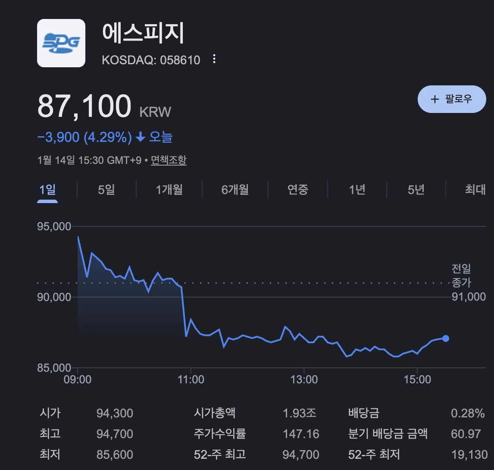

2026년 새해 증시에서 **로봇**과 **전기자전거** 테마가 강한 상승세를 보이고 있습니다. 이 두 테마의 교차점에 위치한 기업이 바로 **에스피지(SPG, 058610)**입니다. 정밀 감속기와 모터 분야에서 33년간 기술력을 축적해 온 에스피지는 최근 휴머노이드 로봇 시대의 핵심 부품 공급사로 급부상하고 있습니다.

CES 2026에서 글로벌 빅테크 기업들이 앞다투어 휴머노이드 로봇을 선보이면서, 로봇의 '관절' 역할을 하는 감속기와 액추에이터에 대한 관심이 폭발적으로 증가했습니다. 에스피지는 삼성전자 자회사 레인보우로보틱스, LG전자 등 국내 대표 기업들과 협력 관계를 구축하며 K-로봇 밸류체인의 핵심 축으로 자리매김하고 있습니다. 이 글에서는 에스피지가 왜 로봇·전기자전거 테마의 대표 수혜주로 꼽히는지, 그 사업 구조와 성장 동력을 상세히 분석해 보겠습니다.

## 에스피지는 어떤 회사인가

[에스피지(SPG)](https://www.google.com/search?q=%EC%97%90%EC%8A%A4%ED%94%BC%EC%A7%80+%EC%A3%BC%EA%B0%80&newwindow=1&sca_esv=2db205cac03e69c1&sxsrf=ANbL-n40fsw9UncZCj7-h0nSRWpH-m1Nhw%3A1768377046361&ei=1kpnacfjFdug1e8PtOnw4Ak&ved=0ahUKEwjHprXtxYqSAxVbUPUHHbQ0HJwQ4dUDCBE&uact=5&oq=%EC%97%90%EC%8A%A4%ED%94%BC%EC%A7%80+%EC%A3%BC%EA%B0%80&gs_lp=Egxnd3Mtd2l6LXNlcnAiE-yXkOyKpO2UvOyngCDso7zqsIAyChAAGIAEGIoFGEMyChAAGIAEGIoFGEMyBRAAGIAEMgYQABgIGB4yBRAAGO8FMggQABiJBRiiBEjVClCGAljiCHACeAGQAQCYAVGgAfoCqgEBNbgBA8gBAPgBAZgCB6ACoQPCAgoQABhHGNYEGLADwgIKECMYgAQYigUYJ8ICBhAAGB4YCsICCBAAGIAEGKIEmAMAiAYBkAYKkgcBN6AH5xayBwE1uAeYA8IHAzItN8gHHIAIAQ&sclient=gws-wiz-serp)**는 1991년 설립된 정밀 제어용 기어드 모터 전문 기업**입니다. 코스닥 상장사로서 30년 넘게 소형 모터와 감속기 분야에서 기술력을 쌓아왔습니다. 현재 국내 AC/DC 모터 시장에서 높은 점유율을 보유하고 있으며, 삼성전자, LG전자, GE(제너럴일렉트릭) 등 글로벌 대기업을 주요 고객사로 확보하고 있습니다.

에스피지의 사업 포트폴리오는 크게 세 가지로 나뉩니다. 첫째는 **가전용 모터** 사업으로, 에어컨, 냉장고, 세탁기 등에 들어가는 고효율 모터를 생산합니다. 둘째는 **산업용 감속기** 사업으로, 공장 자동화 설비와 로봇에 사용되는 정밀 감속기를 제조합니다. 셋째는 **전기이동수단용 모터** 사업으로, 전기자전거와 전동킥보드에 들어가는 BLDC 모터를 공급합니다. 이처럼 다양한 사업 영역을 보유하고 있어 특정 산업의 경기 변동에 대한 리스크를 분산할 수 있는 구조입니다.

## 로봇 테마의 핵심, 정밀 감속기 사업

### 로봇의 '관절'을 만드는 기업

로봇에서 감속기는 인간의 **관절**에 해당하는 핵심 부품입니다. 모터의 빠른 회전 속도를 적절히 줄여주면서 동시에 토크(회전력)를 증가시키는 역할을 합니다. 로봇이 정교하고 부드러운 동작을 수행하려면 고성능 감속기가 필수적입니다. 특히 휴머노이드 로봇은 수십 개의 관절을 가지고 있어 감속기 수요가 폭발적으로 증가하고 있습니다.

에스피지는 **2016년 하모닉 감속기 개발에 성공**하며 로봇 부품 시장에 본격 진출했습니다. 하모닉 감속기는 협동로봇의 핵심 부품으로, 기존에는 일본 기업들이 시장을 독점하고 있었습니다. 에스피지는 국산화에 성공하며 가격 경쟁력과 납기 안정성 측면에서 우위를 확보했습니다.

### 정밀 감속기 매출 폭발적 성장 전망

에스피지의 **정밀 감속기 매출은 가파른 성장세**를 보이고 있습니다. 2024년 정밀 감속기 부문 매출은 100억 원을 돌파했으며, 2025년에는 200억~250억 원 규모로 두 배 이상 성장한 것으로 추정됩니다. 업계에서는 2026년 350억 원, 2027년에는 500억 원 안팎까지 성장할 것으로 전망하고 있습니다. 불과 3년 만에 5배 성장이 예상되는 셈입니다.

이러한 성장의 배경에는 **글로벌 로봇 시장의 급성장**이 있습니다. 협동로봇, 양팔로봇, 이동형 로봇, 휴머노이드 로봇 등 다양한 형태의 로봇이 제조 현장과 서비스 분야에 도입되면서 감속기 수요가 급증하고 있습니다. 에스피지는 SH(스트레인 웨이브), SR(사이클로이드), 유성 감속기 등 다양한 제품 라인업을 갖추고 시장 확대에 대응하고 있습니다.

## 차세대 액추에이터 SDD로 휴머노이드 시장 공략

### 2026년 상반기 양산 돌입

에스피지의 또 다른 성장 동력은 **차세대 로봇 액추에이터 'SDD'**입니다. 액추에이터는 감속기와 모터, 제어기를 하나로 통합한 로봇의 구동 모듈입니다. 에스피지는 2026년 상반기 SDD의 양산 체제를 갖추고 연간 5,000대 판매를 목표로 하고 있습니다.

SDD의 경쟁력은 **중국산 대비 압도적인 성능 차이**에 있습니다. 에스피지가 공개한 시제품은 중국 경쟁사 제품 대비 무게를 90% 줄이고, 정밀도는 2배 이상 높였습니다. 빠른 응답성과 감속기 내장 설계, 토크 증감 기능까지 갖춰 산업용 로봇은 물론 휴머노이드 로봇에도 적용 가능합니다.

### 삼성·LG와의 협력 구조

에스피지의 강점 중 하나는 **국내 대기업들과의 탄탄한 협력 관계**입니다. 삼성전자 자회사인 레인보우로보틱스에 감속기를 공급한 경험이 있으며, LG사이언스파크와는 로봇 액추에이터 및 감속기 기술협력 MOU를 체결했습니다. 삼성과 LG 양대 진영 모두와 협력 구조를 형성하고 있어, 향후 K-로봇 시장 성장의 핵심 수혜가 예상됩니다.

## 전기자전거 테마와의 연결고리

에스피지는 로봇뿐만 아니라 **전기자전거 테마에서도 주목**받고 있습니다. 전기자전거의 핵심 부품인 구동 모터와 감속기를 생산하기 때문입니다. 에스피지는 이미 삼천리자전거, 삼성SDI와 공동으로 전기자전거용 모터를 개발한 바 있으며, 하이브리드 자전거용 모터를 중국에 수출한 경험도 보유하고 있습니다.

국내 전기자전거 시장은 빠르게 성장하고 있습니다. 한국스마트이모빌리티협회(KEMA)에 따르면 국내 전기자전거 시장 판매액은 2018년 231억 원에서 2021년 1,160억 원으로 5배 이상 증가했습니다. 친환경 이동수단에 대한 관심이 높아지면서 전기자전거 시장은 지속 성장할 것으로 전망되며, 에스피지는 모터와 감속기 기술력을 바탕으로 이 시장에서도 수혜가 기대됩니다.

## 결론

에스피지는 **로봇과 전기자전거라는 두 가지 메가트렌드의 교차점**에 위치한 기업입니다. 33년간 축적한 정밀 모터와 감속기 기술력을 바탕으로 휴머노이드 로봇 시대의 핵심 부품 공급사로 부상하고 있습니다. 삼성전자, LG전자 등 대기업과의 협력 관계, 차세대 액추에이터 SDD의 양산 계획, 정밀 감속기 매출의 폭발적 성장 전망 등 긍정적인 모멘텀이 풍부합니다.

다만 테마주 특성상 **주가 변동성이 클 수 있으므로** 투자 시에는 기업의 펀더멘털과 실적 추이를 꼼꼼히 확인할 필요가 있습니다. 다음 글에서는 에스피지의 재무 상황과 목표주가, 투자 판단 포인트를 더 상세히 분석해 보겠습니다.

#에스피지 #로봇관련주 #감속기 #휴머노이드 #전기자전거 #테마주 #레인보우로보틱스
