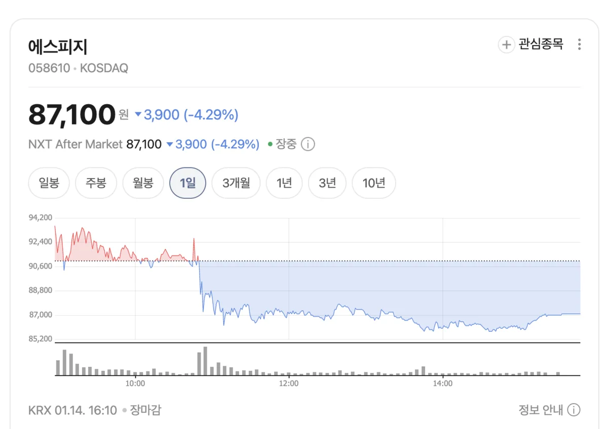
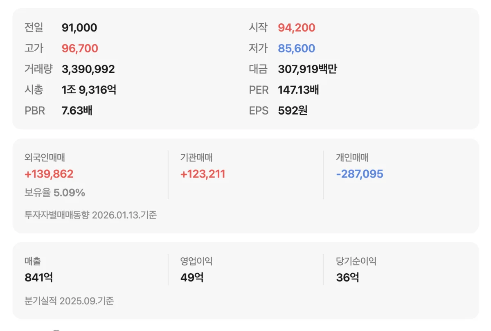

앞선 글에서 에스피지가 로봇과 전기자전거 테마의 핵심 수혜주로 주목받는 이유를 살펴보았습니다. 그렇다면 실제 투자 관점에서 에스피지는 어떻게 평가해야 할까요? 주가가 이미 많이 오른 상황에서 **지금 매수해도 괜찮을지**, 아니면 **조정을 기다려야 할지** 고민하는 투자자들이 많습니다.

이 글에서는 에스피지의 **최근 실적과 재무 상태**, **증권가 목표주가**, 그리고 **투자 시 고려해야 할 리스크 요인**을 종합적으로 분석합니다. 객관적인 데이터를 바탕으로 투자 판단에 필요한 정보를 제공해 드리겠습니다.

## 에스피지 최근 실적 분석

### 2024년 연간 실적

에스피지의 **2024년 연간 실적**을 살펴보면, 매출액 3,885억 원, 영업이익 123억 원, 당기순이익 131억 원을 기록했습니다. 전년 대비 매출액은 약 22.8% 감소했으나, 이는 전방 산업의 경기 둔화와 재고 조정 영향으로 분석됩니다.

주목할 점은 **매출은 줄었지만 수익성은 개선**되었다는 것입니다. 영업이익률은 전년 대비 소폭 상승했으며, 이는 고마진 제품인 정밀 감속기의 비중이 높아졌기 때문으로 해석됩니다. 가전용 모터 등 범용 제품보다 로봇용 정밀 감속기의 수익성이 훨씬 높기 때문에, 제품 믹스 개선이 실적에 긍정적으로 작용하고 있습니다.

### 2025년 3분기 실적

**2025년 3분기 실적**에서도 유사한 흐름이 나타났습니다. 분기 매출액은 804억 원으로 전년 동기 대비 약 20% 감소했으나, 영업이익은 39억 원으로 전년 동기 대비 13% 이상 증가했습니다. 매출 감소에도 불구하고 영업이익이 늘어난 것은 **사업 포트폴리오의 질적 개선**이 진행되고 있음을 보여줍니다.

증권가에서는 2025년 연간 매출액 3,530억 원, 2026년 4,426억 원을 전망하고 있습니다. 2026년에는 전년 대비 약 25% 이상의 매출 성장이 예상되며, 이는 로봇용 정밀 감속기와 액추에이터 사업의 본격적인 성장에 기인합니다.

## 밸류에이션과 목표주가

### 현재 주가 수준

2026년 1월 14일 기준 에스피지 주가는 **87,000~94,000원대**에서 거래되고 있습니다. 52주 신고가를 연일 경신하며 강한 상승세를 보이고 있습니다. 시가총액은 약 2,300억 원 수준입니다.

현재 주가 기준 **PER(주가수익비율)은 약 680배** 수준으로 매우 높은 편입니다. 이는 현재 실적 대비 주가가 상당히 고평가되어 있음을 의미합니다. 다만 성장주의 경우 미래 실적 성장을 선반영하는 경향이 있어, 단순히 현재 PER만으로 고평가 여부를 판단하기는 어렵습니다.

### 증권가 목표주가

증권가에서 제시한 에스피지의 **12개월 목표주가는 34,000~40,000원** 수준입니다. 현재 주가가 목표주가를 크게 상회하고 있어, 증권사 리포트 기준으로는 **고평가 영역**에 진입했다고 볼 수 있습니다.

다만 주의할 점은 증권사 목표주가가 **최근의 급등세를 충분히 반영하지 못했을 가능성**이 있다는 것입니다. 로봇 테마에 대한 시장의 관심이 급격히 높아지면서 밸류에이션 기준 자체가 변화하고 있기 때문입니다. 향후 증권사들이 목표주가를 상향 조정할 가능성도 열어두어야 합니다.

## 투자 판단 시 고려할 포인트

### 긍정적 요인

첫째, **정밀 감속기 매출의 폭발적 성장**이 예상됩니다. 2024년 100억 원에서 2027년 500억 원까지 5배 성장이 전망되며, 이는 회사 전체 실적에 큰 영향을 미칠 것입니다. 둘째, **차세대 액추에이터 SDD의 양산**이 2026년 상반기로 예정되어 있습니다. 휴머노이드 로봇 시장이 본격화되면 SDD 매출이 새로운 성장 동력이 될 수 있습니다. 셋째, **대기업과의 협력 관계**가 탄탄합니다. 삼성전자(레인보우로보틱스), LG전자 등과의 협력으로 안정적인 매출처를 확보하고 있습니다.

### 리스크 요인

첫째, **현재 주가가 실적 대비 고평가** 영역에 있습니다. PER 680배는 향후 실적이 기대에 미치지 못할 경우 주가 조정의 원인이 될 수 있습니다. 둘째, **테마주 특성상 변동성이 큽니다**. 로봇 테마에 대한 시장 관심이 식으면 주가가 급락할 수 있습니다. 셋째, **경쟁 심화 가능성**이 있습니다. 중국 기업들의 감속기 기술력이 빠르게 향상되고 있어 가격 경쟁이 심화될 수 있습니다.

## 투자 전략 제안

에스피지에 대한 투자는 **투자자의 성향과 투자 기간**에 따라 다르게 접근해야 합니다.

**단기 투자자**의 경우, 현재 주가가 52주 신고가를 경신하며 과열 양상을 보이고 있어 신규 진입에 주의가 필요합니다. 단기 차익 실현 매물이 나올 경우 급락 가능성이 있으므로, 조정 시 분할 매수 전략이 유효할 수 있습니다.

**중장기 투자자**의 경우, 로봇 산업의 구조적 성장과 에스피지의 기술 경쟁력을 감안하면 긍정적인 시각을 유지할 수 있습니다. 다만 현재 주가 수준에서 일시에 전량 매수하기보다는, 조정 구간에서 분할 매수하며 평균 매입 단가를 낮추는 전략이 바람직합니다.

어떤 경우든 **자신의 투자 원칙을 지키고, 감당 가능한 범위 내에서 투자**하는 것이 중요합니다. 테마주는 기대감으로 오르지만, 기대가 실적으로 증명되지 않으면 급락할 수 있다는 점을 명심해야 합니다.

## 결론

에스피지는 **로봇 산업의 핵심 부품인 정밀 감속기와 액추에이터를 생산하는 기업**으로, 휴머노이드 로봇 시대의 수혜가 기대됩니다. 정밀 감속기 매출의 폭발적 성장, 차세대 액추에이터 SDD 양산, 대기업과의 협력 관계 등 긍정적인 모멘텀이 풍부합니다.

다만 현재 주가는 실적 대비 고평가 영역에 있으며, 테마주 특성상 변동성이 클 수 있습니다. 투자 시에는 **자신의 투자 성향과 기간을 고려하여 분할 매수 전략**을 활용하고, 리스크 관리에 유의할 필요가 있습니다. 다음 글에서는 최근 에스피지 주가가 52주 신고가를 경신하게 된 구체적인 배경과 수급 동향을 분석해 보겠습니다.

#에스피지 #주가전망 #목표주가 #투자분석 #로봇관련주 #감속기 #실적분석
