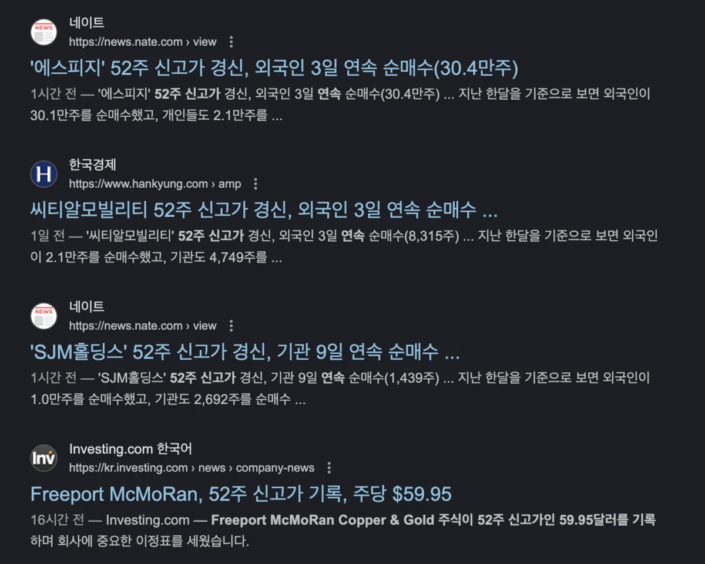
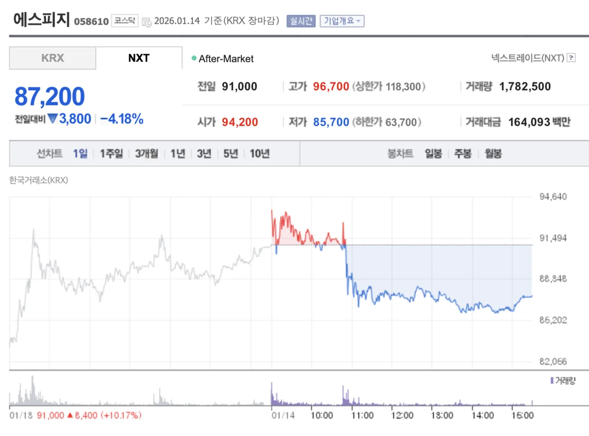

2026년 1월, **에스피지(058610)가 연일 52주 신고가를 경신**하며 투자자들의 이목을 집중시키고 있습니다. 1월 14일 기준 주가는 94,400원까지 상승하며 3.74%의 상승률을 기록했습니다. 불과 한 달 전 70,000원대였던 주가가 90,000원대를 돌파한 것입니다.

앞선 두 글에서 에스피지의 사업 구조와 투자 판단 포인트를 분석했습니다. 이번 글에서는 **최근 주가 급등의 직접적인 원인**을 파헤쳐 봅니다. 외국인과 기관의 수급 동향, CES 2026의 영향, 그리고 회사의 최신 뉴스를 종합하여 왜 에스피지가 지금 이 시점에 강하게 오르고 있는지 분석하겠습니다.

## 외국인·기관 동반 순매수의 의미

### 외국인 3일 연속 순매수

에스피지 주가 상승의 가장 직접적인 원인은 **외국인과 기관의 동반 순매수**입니다. 2026년 1월 14일 기준, 외국인은 3일 연속 순매수를 기록하며 누적 약 30만 주를 사들였습니다. 최근 1개월간 외국인 순매수 규모는 약 37만 주에 달합니다.

외국인의 매수세가 이어지는 것은 **글로벌 투자자들이 에스피지의 성장성을 인정**하고 있다는 신호로 해석됩니다. 특히 CES 2026 이후 글로벌 로봇 시장에 대한 관심이 높아지면서, 로봇 부품 핵심 기업인 에스피지에 대한 투자 수요가 증가하고 있습니다.

### 기관도 적극 매수

기관 투자자들도 에스피지 매수에 적극적입니다. 최근 5거래일 기관 순매수는 약 33만 주로, 외국인과 함께 주가 상승을 견인하고 있습니다. 지난 한 달간 기관은 한때 94만 주 이상을 순매수하기도 했습니다. 외국인과 기관이 동시에 매수에 나선다는 것은 **수급 측면에서 매우 긍정적인 신호**입니다.

반면 개인 투자자들은 차익 실현에 나서며 순매도하는 경향을 보이고 있습니다. 이는 전형적인 **'스마트머니(외국인·기관) 유입, 개인 차익 실현'** 패턴으로, 주가 상승 초기에 흔히 나타나는 현상입니다.

## CES 2026이 촉발한 로봇 테마 랠리

### 글로벌 빅테크의 휴머노이드 경쟁

에스피지 주가 급등의 또 다른 배경은 **CES 2026**입니다. 올해 CES에서는 테슬라, 보스턴다이내믹스, 현대차그룹 등 글로벌 기업들이 휴머노이드 로봇을 대거 선보이며 '로봇 시대의 개막'을 알렸습니다.

특히 현대차그룹의 보스턴다이내믹스는 아틀라스 로봇의 양산 계획을 발표하며 시장에 충격을 주었습니다. 삼성전자 역시 자회사 레인보우로보틱스를 통해 AI 로봇 사업을 본격화하겠다고 선언했습니다. 이러한 빅테크들의 움직임은 **로봇 부품 공급사인 에스피지의 가치를 재조명**하는 계기가 되었습니다.

### K-로봇 밸류체인의 핵심

에스피지는 삼성전자 자회사 레인보우로보틱스에 감속기를 공급한 경험이 있으며, LG사이언스파크와 로봇 액추에이터 기술협력 MOU를 체결했습니다. 삼성과 LG 양대 진영 모두와 협력 관계를 구축한 것은 **K-로봇 시대에 에스피지가 핵심 역할을 할 것**이라는 기대감을 높이고 있습니다.

## 최신 호재: 차세대 액추에이터 양산 발표

### SDD 연간 5,000대 판매 목표

에스피지는 최근 **차세대 로봇 액추에이터 'SDD'의 양산 계획**을 발표하며 주가 상승에 불을 지폈습니다. SDD는 감속기, 모터, 제어기를 일체화한 로봇 구동 모듈로, 2026년 상반기 양산 체제를 갖추고 연간 5,000대 판매를 목표로 하고 있습니다.

SDD의 핵심 경쟁력은 **중국산 대비 압도적인 성능**입니다. 무게는 90% 경량화하고, 정밀도는 2배 이상 높였습니다. 빠른 응답성과 토크 증감 기능까지 갖춰 산업용 로봇뿐 아니라 휴머노이드 로봇에도 적용 가능합니다. 글로벌 빅테크 기업들의 관심을 받을 수 있는 제품 경쟁력을 확보한 것입니다.

### IR 발표와 시장 반응

에스피지는 1월 14일 IR(기업설명회)을 개최하여 휴머노이드 로봇 구동기 전략을 발표했습니다. IR 당일 주가는 일시적으로 조정을 받기도 했으나, 이는 **'뉴스에 팔아라(Sell on news)'** 현상으로 단기 차익 실현 매물이 출회된 것으로 분석됩니다. 중장기적으로는 회사의 성장 전략이 구체화되면서 주가에 긍정적으로 작용할 것으로 예상됩니다.

## 향후 주가 전망과 주의점

### 추가 상승 가능성

에스피지의 주가가 추가 상승할 수 있는 요인은 여전히 존재합니다. 첫째, **2026년 상반기 SDD 양산 본격화**로 실적 가시성이 높아질 수 있습니다. 둘째, **정밀 감속기 매출이 예상대로 성장**한다면 실적 서프라이즈가 가능합니다. 셋째, **글로벌 로봇 시장의 성장세**가 지속된다면 밸류에이션 프리미엄이 유지될 수 있습니다.

### 주의해야 할 리스크

다만 **주의해야 할 점**도 있습니다. 현재 주가는 단기간에 급등하여 기술적 과열 신호가 나타나고 있습니다. 단기 차익 실현 매물이 출회되면 급락할 가능성이 있습니다. 또한 로봇 테마에 대한 시장 관심이 식으면 주가 조정이 불가피합니다. 실적이 기대에 미치지 못할 경우에도 주가에 부정적인 영향을 미칠 수 있습니다.

## 결론

에스피지의 52주 신고가 경신은 **외국인·기관의 동반 순매수**, **CES 2026으로 촉발된 로봇 테마 랠리**, **차세대 액추에이터 SDD 양산 발표** 등 복합적인 요인이 작용한 결과입니다. K-로봇 밸류체인의 핵심 기업으로서 삼성, LG 양대 진영과 협력 관계를 구축한 점도 투자자들의 신뢰를 높이고 있습니다.

다만 단기간 급등에 따른 조정 가능성과 테마주 특유의 변동성은 항상 염두에 두어야 합니다. 에스피지에 대한 투자는 **로봇 산업의 장기 성장성에 대한 확신**과 **단기 변동성을 견딜 수 있는 인내심**이 모두 필요합니다. 앞선 연작 글들에서 분석한 내용을 종합하여, 자신의 투자 원칙에 맞는 판단을 내리시길 바랍니다.

#에스피지 #52주신고가 #외국인순매수 #로봇관련주 #CES2026 #휴머노이드 #주가분석
