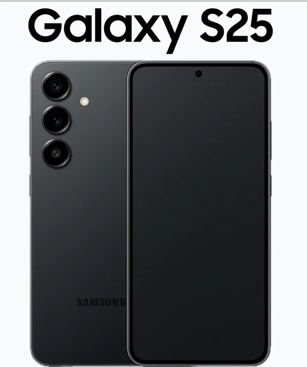

갤럭시 S26 출시일 루머 완벽 정리 - 2026년 삼성의 가장 기대되는 플래그십 스마트폰 갤럭시 S26 시리즈의 출시일과 각종 루머들이 계속 나오고 있습니다. 현재까지 수집된 정보를 토대로 예상되는 일정, 스펙, 가격에 대해 총정리했습니다.

---

## **갤럭시 S26 예상 출시 일정**

### **공개(언팩 이벤트): 2월 25일**

대부분의 신뢰도 높은 리커들이 2월 25일(미국 샌프란시스코)에서 갤럭시 S26 시리즈가 공개될 것으로 예상하고 있습니다. 이는 지난해 S25 시리즈의 공개 시기와 유사한 시점입니다.

**공개 일정 관련 루머:**

- 신뢰도 높은 리커 **Ice Universe**가 2월 25일 확정
- 장소는 **샌프란시스코** 유력
- 삼성 언팩 이벤트의 전형적인 패턴 따를 예정

### **사전예약: 2월 26일~3월 초**

공개 직후 즉시 사전예약이 시작될 것으로 예상됩니다.

**사전예약 예상 일정:**

- 언팩 다음날인 **2월 26일** 사전예약 시작
- 약 **7~10일간** 진행
- 사전예약자에게 각종 혜택 제공 예상

### **정식 출시: 3월 11일**

가장 많은 루머 소스들이 **3월 11일**을 정식 출시일로 지목하고 있습니다.

**출시 일정 확정 근거:**

- Dealabs 등 신뢰도 높은 유출처에서 3월 11일 확정
- 2월 25일 공개로부터 약 2주 뒤 일정
- 다만 3월 11일은 수요일로, 삼성이 보통 금요일에 출시하는 관례와 다름
- 13일의 금요일(프라이데이 13)을 피하려는 가능성도 제기됨

### **한국 출시 일정 예상**

**글로벌 출시 이후 한국 시장 반영:**

- 미국 출시 이후 **1~3일 뒤** 한국 정식 출시 예상
- 따라서 **3월 12일~14일** 사이 한국 출시 가능성 높음

---

## **갤럭시 S26 시리즈 라인업**

### **출시 예정 모델**

**기본형: Galaxy S26**

- 디스플레이: 6.3인치 FHD+
- 화면 밝기: 2,600 니트 이상
- 리프레시율: 1-120Hz

**플러스형: Galaxy S26 Plus**

- 디스플레이: 6.7인치 (S25와 동일)
- 배터리: 4,900mAh (예상)
- 충전: 45W 유선충전 (변화 없음)

**울트라형: Galaxy S26 Ultra**

- 프리미엄 사양
- 고급 카메라 시스템
- 최고 성능 프로세서

**팬 에디션: Galaxy S26 FE(추정)**

- 2026년 말 또는 2027년 초 출시 예상
- 대중 시장 공략용 저가 모델

---

## **갤럭시 S26 주요 스펙 루머**

### **프로세서**

**Snapdragon 8 Elite Gen 5**

- 갤럭시 S26 전 모델 탑재 예상
- Geekbench에서 확인된 정보
- 일부 CPU 언더클럭 가능성 (배터리 최적화)

**Exynos 버전**

- 일부 지역(특히 한국)에서 Exynos 2600 탑재 가능성

### **디스플레이**

**S26:**

- 6.3인치 FHD+ 해상도
- 2,600 니트 이상의 밝기
- 1-120Hz 가변 리프레시율

**S26 Plus:**

- 6.7인치 (S25와 동일 유지)
- 고주사율 디스플레이
- 향상된 밝기 기술 적용

**S26 Ultra:**

- 6.8인치 대형 디스플레이
- 최고의 디스플레이 기술 탑재

### **카메라 시스템**

**갤럭시 S26 카메라 루머:**

- 새로운 이미지센서 테스트 중
- S26 Plus에는 특별한 신형 센서 탑재 가능

**갤럭시 S26 Ultra 카메라:**

- 200MP 메인 카메라 루머
- 50MP 3배 망원 렌즈
- 324MP 센서 가능성도 제기
- 전반적인 카메라 개선 예상

### **배터리 및 충전**

**무선 충전:**

- Qi2 호환성 개선
- 충전 속도 향상 예상

**유선 충전:**

- **S26 Ultra**: 60W 충전 (0-75% 약 30분)
- **S26 Plus**: 45W (변화 없음)
- **S26**: 45W 이상 업그레이드 가능성

### **디자인 변화**

**두께 감소:**

- 역대급 두께 감소 루머
- 더욱 가벼워진 무게 예상

**엣지 모델 변화:**

- S26 Edge 모델 중단 가능성
- 기존 3가지(기본형, 플러스, 울트라)로 라인업 재편성

---

## **갤럭시 S26 AI 및 기능 개선**

### **AI 강화**

**Perplexity AI 통합**

- 검색 기능 개선
- 더욱 스마트한 AI 어시스턴트

**One UI 기능 확대**

- AI 기반 영상 처리 기능 강화
- 스마트 필터 및 편집 기능 개선

### **소프트웨어**

**Android 16 탑재**

- 2026년 공개 시점에 최신 안드로이드 탑재
- 새로운 기능 및 최적화 포함

---

## **갤럭시 S26 예상 가격**

### **한국 출고가 예상(단위: 원)**

| 모델      | S25 가격    | S26 예상 출고가          | 예상 인상   |
| ------- | --------- | ------------------- | ------- |
| **기본형** | 1,155,000 | 1,200,000~1,250,000 | 40~95만원 |
| **플러스** | 1,353,000 | 1,400,000~1,450,000 | 47~97만원 |
| **울트라** | 1,698,000 | 1,700,000~1,750,000 | 2~52만원  |

### **가격 인상 가능성**

- 모든 모델에서 소폭의 가격 인상 예상
- 하지만 S25 대비 혁신적인 업그레이드 아닐 가능성 제기
- 따라서 구매 검토 필요

---

## **갤럭시 S26 루머의 신뢰도 평가**

### **높은 신뢰도 정보**

- ✅ 2월 25일 공개 (Ice Universe 등 주요 리커)
- ✅ 3월 11일 출시 (Dealabs, 다수 소스)
- ✅ Snapdragon 8 Elite Gen 5 탑재 (Geekbench)
- ✅ 60W 초고속 충전 (S26 Ultra)

### **중간 신뢰도 정보**

- ⚠️ 새로운 카메라 센서 (테스트 중 확인)
- ⚠️ Perplexity AI 통합
- ⚠️ 가격 인상폭

### **낮은 신뢰도/추측**

- ❌ S26 FE 모델 (2027년 초 출시 가능성)
- ❌ 정확한 카메라 사양 (루머 엇갈림)
- ❌ 정확한 배터리 용량

---

## **구입 전 체크리스트**

### **S26로 업그레이드해야 할까?**

**업그레이드 추천:**

- S23 이하 사용 중이라면 큰 성능 향상 가능
- AI 기능 중심으로 활용하려면 긍정적
- 카메라 성능 중시한다면 검토 가치

**업그레이드 미추천:**

- S25 최근 구입했다면 큰 변화 없음
- 소폭 업그레이드만 예상
- 내년 S27을 기다리는 것도 선택지

### **사전예약 팁**

- 2월 26일 사전예약 시 혜택 확인
- 색상 다양성 미리 확인
- 출고 시기 및 배송 일정 파악
- 기존 폰 판매 가격 사전 조회

---

## **자주 묻는 질문 (FAQ)**

**Q: 갤럭시 S26은 정말 2월 25일에 공개되나요?**
A: 현재 가장 신뢰도 높은 루머로 2월 25일 공개가 유력합니다. 다만 공식 발표 전까지는 확정할 수 없으므로, 삼성의 공식 공지를 기다리는 것이 좋습니다.

**Q: 3월 11일은 수요일인데 정말 그 날 출시되나요?**
A: 과거와 달리 이번에는 수요일 출시 가능성이 있습니다. 13일의 금요일을 피하려는 의도도 있는 것으로 분석됩니다.

**Q: 한국에서 언제 구입할 수 있나요?**
A: 미국 글로벌 출시 후 1~3일 뒤인 3월 12일~14일 사이 한국 정식 출시가 예상됩니다.

**Q: S25와 비교해서 큰 변화가 있나요?**
A: 카메라, 충전 기술, 두께 감소 등 부분적 개선이 있지만, 혁신적 변화는 아닐 것으로 예상됩니다. S25 사용 중이라면 업그레이드 필요성은 낮을 수 있습니다.

**Q: 가격은 얼마 정도일까요?**
A: 모든 모델에서 소폭 인상(약 4~10만원)이 예상됩니다. 기본형 120만원대, 플러스 140만원대, 울트라 170만원대로 추정됩니다.

**Q: 카메라는 정말 200MP가 되나요?**
A: S26 Ultra의 경우 200MP 메인 카메라 가능성이 제기되지만, 아직 확정되지 않았습니다. 공식 발표를 기다려야 합니다.

**Q: 한국에도 Snapdragon이 들어가나요?**
A: 일부 지역에는 Exynos 2600이 탑재될 가능성이 있습니다. 확정은 공식 발표 후 알 수 있습니다.

---

## **최종 결론**

현재까지의 루머를 종합하면, 갤럭시 S26 시리즈는 **2월 25일 공개**, **3월 초 사전예약**, **3월 11일 정식 출시**로 예상됩니다. 카메라, 충전 기술, 디자인 등에서 부분적 개선이 있을 것으로 보이지만, S25 대비 혁신적인 변화는 없을 가능성이 높습니다.

가격 인상도 예상되는 만큼, **기존 S25 사용 중이라면 업그레이드 필요성 검토**, **S23 이하 사용 중이라면 충분한 업그레이드 가치** 있을 것으로 판단됩니다.

2월 25일 공식 언팩 이벤트에서 모든 루머가 확인될 것이므로, 그때까지 최신 정보를 계속 주목하시길 바랍니다.

---

**참고 출처**

- Forbes, PCMag, TechRadar, GSMArena 등 주요 테크 매체
- 신뢰도 높은 리커: Ice Universe, Evan Blass, Dealabs
- Reddit, 나무위키 등 커뮤니티 정보

#갤럭시S26 #삼성 #스마트폰 #출시일 #언팩이벤트 #루머 #예상가격 #S26울트라 #신제품 #IT #기술 #스마트폰추천 #2026년
