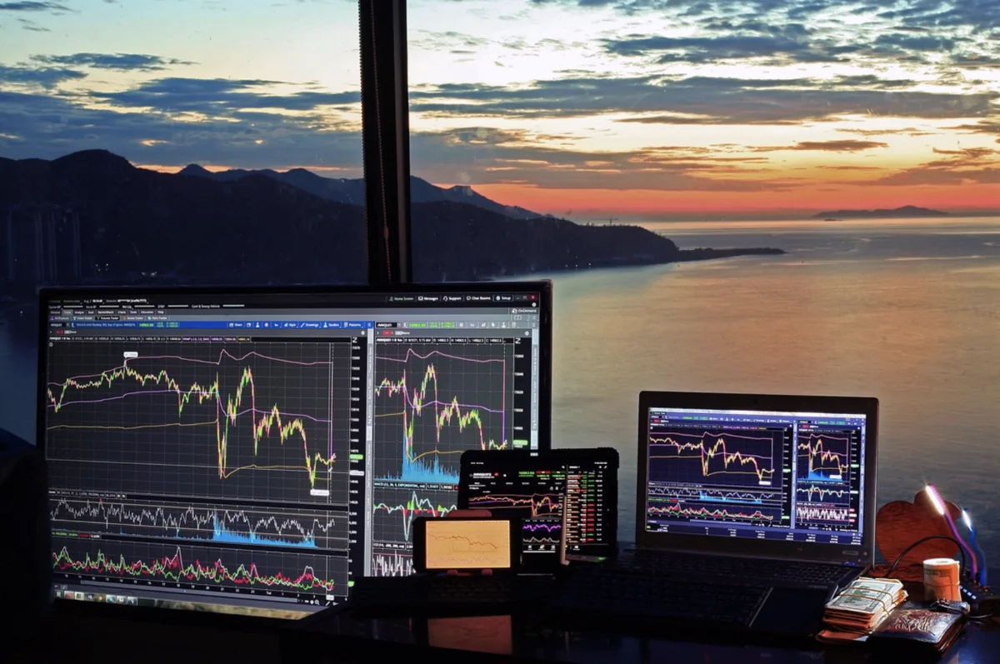
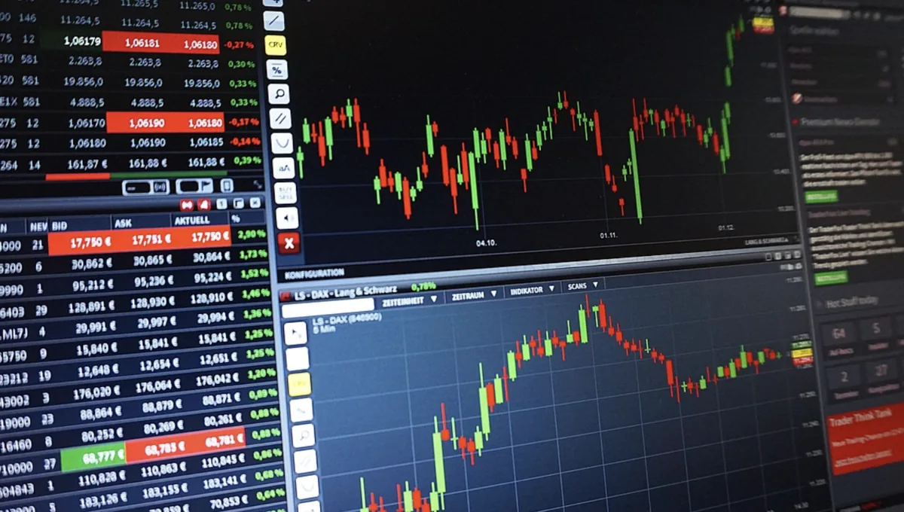

실제로 돈을 투자할 때 어떤 ETF를 몇 개 사야 하고, 자금을 어떻게 배분할지는 많은 초보 투자자들이 고민하는 부분입니다. 단순히 한두 개의 ETF를 사는 것이 아니라, **여러 종목을 조합하여 포트폴리오를 구성**하는 것이 장기 수익을 극대화하는 핵심입니다.

본 가이드에서는 자신의 투자 목표와 성향에 맞춰 **최적의 포트폴리오를 설계하는 방법**을 단계별로 설명합니다. 나이별, 성향별 자산배분부터 실제 종목 선택, 그리고 시간이 지나면서 포트폴리오를 조정하는 **리밸런싱 전략**까지 모두 담았습니다.

## 자산배분의 기본 개념

자산배분(Asset Allocation)**은 투자의 성패를 좌우하는 가장 중요한 결정 중 하나입니다. 한 연구에 따르면, 투자 수익의 90% 이상이 자산배분 비율에 의해 결정**된다고 합니다. 따라서 어떤 주식을 고를지보다 **자산군을 어떤 비율로 구성할지**가 더 중요합니다.

자산배분은 크게 **주식, 채권, 원자재, 현금** 네 가지 자산군을 어떤 비율로 포함시킬지 결정하는 것입니다. 각 자산군은 시장 환경에 따라 다르게 반응하기 때문에, 여러 자산군을 조합하면 시장의 변동성을 낮추면서도 안정적인 수익을 추구할 수 있습니다.

예를 들어 **주식만 100% 투자**한다면 시장이 급락할 때 큰 손실을 입을 수 있습니다. 하지만 주식 60%, 채권 40%로 구성하면 주식 시장이 하락해도 채권이 안정적인 수익을 제공하면서 전체 포트폴리오의 변동성을 줄일 수 있습니다.

## 나이별 자산배분 전략

**나이는 투자 포트폴리오를 결정하는 가장 객관적인 기준이다.** 일반적으로 젊을수록 공격적으로 투자할 수 있고, 나이가 들수록 보수적으로 구성해야 합니다. 이는 **회복 기간의 차이** 때문입니다. 젊은 사람이 손실을 입으면 몇 년 뒤 다시 벌어들일 시간이 있지만, 나이가 든 사람에게는 그럴 시간이 없기 때문입니다.

**20대-30대 투자자**: 이 시기에는 **주식 80-90%, 채권 10-20%** 정도의 공격적 포트폴리오를 구성해도 좋습니다. 장기간 투자할 수 있고, 시장 하락 시에도 회복할 시간이 충분하기 때문입니다. 특히 미국 대형주 ETF(SPY, VTI), 성장주 ETF(QQQ) 등에 집중 투자해도 괜찮습니다.

**40대-50대 투자자**: 이 시기에는 **주식 60-70%, 채권 30-40%** 정도의 균형잡힌 포트폴리오를 추천합니다. 이는 가장 기본적인 **60/40 포트폴리오**로, 역사적으로 수십 년을 검증받은 전략입니다. 주식의 성장성과 채권의 안정성을 모두 누릴 수 있습니다.

**60대 이상 투자자**: 이 시기에는 **주식 40-50%, 채권 50-60%** 정도의 보수적 포트폴리오를 구성합니다. 원금 보존과 안정적인 배당 수익이 중요하기 때문입니다. 고배당 ETF나 채권 ETF, 리츠 ETF 등을 조합하는 것이 좋습니다.

## 포트폴리오 구성 실전 예시

이제 구체적인 포트폴리오를 구성해보겠습니다. 초기 자금 **1,000만 원**이 있다고 가정해봅시다.

**30대 투자자의 공격적 포트폴리오 (주식 80%, 채본 20%)**:

- 미국 대형주 ETF(SPY): 400만 원 (40%)
- 미국 전체 시장 ETF(VTI): 300만 원 (30%)
- 한국 주식 ETF(KOSPI 200): 100만 원 (10%)
- 미국 채권 ETF(BND): 150만 원 (15%)
- 현금: 50만 원 (5%)

이 구성의 장점은 **미국 시장의 성장성**을 최대한 활용하면서도, **한국 시장에 대한 노출**도 유지합니다. 채권(BND)은 시장 변동성을 완충하고, **5%의 현금**은 시장이 급락했을 때 추가 투자 기회에 대비합니다.

**50대 투자자의 균형 포트폴리오 (주식 60%, 채권 40%)**:

- 미국 대형주 ETF(SPY): 300만 원 (30%)
- 한국 주식 ETF(KOSPI 200): 100만 원 (10%)
- 배당 ETF(VYM): 100만 원 (10%)
- 미국 채권 ETF(BND): 300만 원 (30%)
- 장기채권 ETF(TLT): 100만 원 (10%)
- 현금: 100만 원 (10%)

이 구성은 주식의 성장성과 채권의 안정성을 균형있게 제공합니다. **배당 ETF(VYM)**가 추가되어 정기적인 배당 수익을 기대할 수 있고, 채권을 **단기물(BND)과 장기물(TLT)**로 분리하여 금리 변동에 대한 완충력을 높입니다.

## 섹터 분산 전략

단순히 주식과 채본으로만 나누는 것이 아니라, **주식 내에서도 섹터를 분산**하는 것이 중요합니다. 같은 주식 ETF라도 추적하는 지수나 포함하는 기업이 다르기 때문입니다.

**기술주 비중 관리**: 2024-2025년 AI 열풍으로 기술주 ETF(QQQ)**의 비중이 과도하게 높아진 포트폴리오가 많습니다. 기술주는 성장성이 높지만 변동성도 크므로, 전체 포트폴리오의 20-30% 이상**을 차지하지 않도록 주의해야 합니다.

**가치주 균형**: 배당 주가 높은 전통 산업 주(VYM, SCHD 등)를 일정 비중 포함하면 포트폴리오의 변동성을 낮출 수 있습니다. 기술주의 공격성과 가치주의 안정성이 결합되어 균형잡힌 포트폴리오가 완성됩니다.

**국제 분산**: **미국 ETF만으로는 부족합니다.** 유럽, 일본, 신흥국 등 다양한 지역의 ETF를 소량씩 포함하면 지역 위기에 대비할 수 있습니다. 다만 초보 투자자는 **미국 70%, 한국 20%, 기타 10%** 정도의 지역 배분으로 시작하는 것을 추천합니다.

## 리밸런싱 전략과 중요성

포트폴리오 구성은 한 번으로 끝이 아닙니다. **시간이 지나면서 자산군의 비중이 변하기 때문**입니다. 예를 들어 초기에는 주식 60%, 채권 40%로 구성했지만, 주식이 빠르게 성장해 1년 뒤 주식 70%, 채권 30%가 되었을 수 있습니다. 이렇게 되면 원래 의도한 위험 수준이 높아지기 때문에 리밸런싱(Rebalancing)을 통해 원래의 비중으로 되돌려야 합니다.

**리밸런싱 방법**: 가장 간단한 방법은 **6개월 또는 1년마다 정기적으로 점검**하고, 원래 비중과 맞지 않는 부분을 조정하는 것입니다. 비중이 높아진 자산은 일부 매도하고, 비중이 낮아진 자산은 추가 매수합니다.

**리밸런싱의 심리적 이점**: 리밸런싱은 단순한 기계적 조정이 아닙니다. 이 과정에서 **수익이 난 자산을 매도하고 손실이 난 자산을 매수**하는 경험을 하게 됩니다. 이는 **"저평가된 것을 사고 고평가된 것을 판다"는 투자의 기본 원칙**을 자동으로 실행하게 하며, 감정적 투자를 방지합니다.

## 초보자를 위한 포트폴리오 구성 체크리스트

포트폴리오를 구성할 때 반드시 확인해야 할 항목들입니다.

**1단계 투자 목표 수립**: 언제까지 투자할 것인가(5년, 10년, 20년?), 얼마의 수익률을 목표로 하는가(5%, 10%, 15%?), 최대 손실은 얼마까지 감수할 수 있는가?

**2단계 자산배분 결정**: 자신의 나이, 투자 기간, 위험 성향에 맞춰 주식/채권/원자재/현금의 비중을 정합니다.

**3단계 ETF 종목 선택**: 정해진 비중에 맞춰 구체적인 ETF를 선택합니다. 총보수가 낮고, 유동성이 좋은 종목을 우선순위로 합니다.

**4단계 분할 매수 계획**: 한 번에 모든 자금을 투자하지 말고, **3-6개월에 걸쳐 분할 매수**하면 시간에 따른 평균 매수가를 낮출 수 있습니다.

**5단계 정기 점검**: 최소 분기별(3개월)로 포트폴리오를 점검하고, 년 1회는 리밸런싱을 실행합니다.

## 결론 및 다음 단계

**자산배분의 중요성은 아무리 강조해도 부족합니다.** ETF 투자에서 성공하려면 종목 선택보다는 **올바른 자산배분**이 훨씬 더 중요합니다. 나이, 투자 기간, 위험 성향에 맞춰 체계적으로 포트폴리오를 구성하면, 시장 변동성 속에서도 안정적인 수익을 추구할 수 있습니다.

다음 포스트에서는 **ETF 배당금을 활용한 수익 전략**을 알아봅니다. 포트폴리오를 구성했다면, 이제 배당금으로 추가 수익을 창출하는 방법을 배워보세요!

#ETF포트폴리오 #자산배분 #분산투자 #장기투자 #리밸런싱 #60대40전략 #ETF투자법
