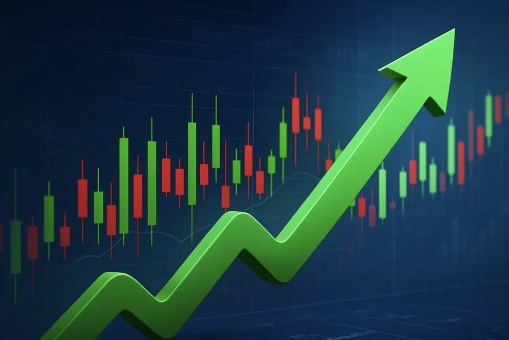

**대부분의 투자자가 ETF에서 실패하는 이유는 ETF 자체의 문제가 아니다.** ETF는 훌륭한 투자 도구이지만, 투자자가 **잘못된 방식으로 활용**하기 때문에 손실이 발생합니다. 한 통계에 따르면 개인 투자자의 **90% 이상이 투자에서 손실**을 입습니다. 하지만 이 손실은 대부분 **반복 가능한 실수**이기 때문에 미리 알아두고 피할 수 있습니다.

본 포스트에서는 실제 투자자들이 자주 저지르는 **5가지 주요 실수**와 각각의 **해결 방법**을 사례를 통해 설명합니다. 이 글을 읽고 실천하면, 많은 초보 투자자가 겪는 고통을 피할 수 있을 것입니다.

## 실수 1 과도한 빈번 매매

**실패 사례**: 30대 직장인 A씨는 ETF에 1,000만 원을 투자했습니다. 첫 한 달은 괜찮았지만, 시장이 조금 내려가자 불안해져서 일부를 매도했습니다. 다시 올라가자 사서 내려가자 팔고... 이 과정을 반복하다가 거래 수수료와 세금만 내고 원금보다 5% 손실을 입었습니다.

**왜 이런 일이 생기나**: **단기 투자자들의 가장 흔한 실수**입니다. 매매할 때마다 수수료가 빠져나가고(통상 0.1-0.2%), 세금도 부과됩니다(양도세). 하루에 여러 번 매매하면 이 비용들이 누적되어 순수익을 갉아먹습니다.

**통계적 증거**: 연구 결과에 따르면 자주 매매하는 투자자의 수익률은 **적게 매매하는 투자자보다 2-3% 낮습니다.** 즉, 수수료와 세금 때문에 손실을 입는 것입니다.

**해결법**: **ETF는 사고 잊어버린다는 느낌으로 투자합니다.** 처음 포트폴리오를 구성한 후에는 **최소 3-6개월에 한 번만 점검**하는 것이 좋습니다. 단기 변동성에 흔들리지 않고, **오직 자산배분 비율만 체크해서 필요할 때만 리밸런싱**합니다.

**실천 팁**: 핸드폰 증권앱을 삭제하거나 자주 들어가지 않는 방법도 좋습니다. 자주 들어갈수록 불안감을 느껴 매매 욕구가 생기기 때문입니다.

## 실수 2 높은 수수료 상품 선택

**실패 사례**: 40대 회사원 B씨는 은행원의 추천으로 **총보수 0.8%인 펀드형 ETF**에 투자했습니다. 한편 같은 지수를 추적하는 **총보수 0.03%인 일반 ETF**도 있었는데 말입니다. 10년 투자하면서 B씨는 **수수료로만 80만 원**을 낸 반면, 저비용 ETF 투자자는 **3만 원만 냈습니다.**

**왜 이런 일이 생기나**: **투자자의 무지**를 이용하는 금융사들의 전략입니다. 높은 수수료 상품을 먼저 추천하는 이유는 그들의 수익이 크기 때문입니다. 하지만 그 비용은 전부 투자자가 부담합니다.

**총보수(Expense Ratio) 비교**:

- 일반 ETF(VOO, VTI): 0.03-0.05%
- 저비용 ETF: 0.1-0.2%
- 고비용 ETF: 0.5-1.5%
- 고비용 펀드: 1.5-3.0%

연간 1,000만 원을 투자했을 때, 총보수가 0.1% 높으면 **매년 1만 원씩 더 내는 것**입니다. 30년 투자하면 복리까지 포함해서 **100만 원 이상의 손실**이 됩니다.

**해결법**: **항상 총보수(Expense Ratio)를 확인하고 비교**하세요. 같은 지수를 추적하는 ETF라면, **총보수가 가장 낮은 것을 선택**하는 것이 기본 원칙입니다.

**추천하는 저비용 ETF**:

- 미국 전체 시장: VTI(0.03%)
- 미국 대형주: VOO(0.03%)
- 미국 배당: VYM(0.06%)
- 한국: TIGER 200(0.09%)

## 실수 3 감정적 투자와 손실 회피

**실패 사례**: 50대 투자자 C씨는 주식 시장이 10% 하락했을 때 **극심한 불안감**을 느꼈습니다. "앞으로 더 떨어질 것 같다"는 생각에 **모든 ETF를 매도**했습니다. 그 다음 달 시장이 반등해서 다시 올라갔는데, C씨는 다시 사기가 꺼렸습니다. 결국 C씨는 **가장 저가에서 팔고 가장 고가에서 다시 샀습니다.**

**왜 이런 일이 생기나**: 인간의 **감정적 바이어스** 때문입니다. 손실을 입으면 더욱 큰 손실을 피하려고 서두르고, 이익을 보면 더 많은 이익을 얻으려고 욕심을 냅니다. 이를 **손실 회피 성향**이라고 합니다.

**통계적 증거**: 시장 하락 시 매도한 투자자와 계속 보유한 투자자를 비교하면, **계속 보유한 투자자의 수익률이 5-10배 이상 높습니다.** 특히 장기 투자에서는 **시간이 최고의 약**입니다.

**해결법**: **투자 계획을 수립할 때 이미 손실 시나리오를 고려**합니다. "최악의 경우 30% 손실이 나올 수 있다"는 것을 미리 받아들이면, 실제 손실이 나도 **감정적으로 흔들리지 않습니다.**

**실천 팁**:

- 투자 계획서를 종이에 적어서 책상에 붙여두기
- 시장 하락 시 증권앱을 보지 않기
- "시장 하락은 저가 매수 기회"라고 생각하기
- 매달 자동 적립 투자 계속하기(더 저가에서 매수하게 됨)

## 실수 4 분산 부족과 테마주 집중 투자

**실패 사례**: 30대 직장인 D씨는 AI 열풍을 보고 **AI 관련 ETF에만 모든 자금을 투자**했습니다. 처음 1년은 50% 이상의 수익을 얻었습니다. 하지만 2년째 AI 시장이 조정받자 자산이 40% 하락했습니다. 만약 D씨가 **60% 일반 ETF + 40% AI ETF**로 나누었다면, 손실이 24% 정도로 훨씬 적었을 것입니다.

**왜 이런 일이 생기나**: **높은 수익에 눈이 멀어서 위험을 무시**하기 때문입니다. 한두 해의 높은 수익보다는 **장기간의 안정적인 수익**이 훨씬 중요합니다.

**분산의 힘**: 연구 결과에 따르면, 여러 자산에 분산 투자한 포트폴리오의 **변동성은 집중 투자의 1/3 이하**입니다. 즉, 분산은 수익을 약간 포기하는 대신 **손실을 크게 줄이는 전략**입니다.

**해결법**: **30% 이상의 자금을 한 종목이나 한 테마에 투자하지 마세요.** 절대적인 룰:

- 한 종목(또는 테마 ETF): 최대 20%
- 한 섹터: 최대 30%
- 국내 자산: 최대 40%

## 실수 5 배당금 재투자 미흡

**실패 사례**: 50대 투자자 E씨는 **고배당 ETF에 5,000만 원을 투자**했습니다. 매년 약 200만 원의 배당금을 받았지만, 그것을 **통장에만 모아뒀습니다.** 10년 후 배당금만 해서 2,000만 원이 모였지만, 복리 투자했다면 배당금 자체도 배당을 만들어내면서 **2,500만 원 이상 모였을 것입니다.**

**왜 이런 일이 생기나**: **배당금의 가치를 과소평가**하기 때문입니다. 배당금도 투자금의 일부이고, **같은 방식으로 복리를 통해 불어날 수 있습니다.**

**복리의 놀라운 효과**:

- 연 3% 배당금 재투자(30년): 초기 자산 × 2.4배
- 배당금 미재투자(30년): 초기 자산 + (배당금 × 30년)
- **재투자가 약 20% 더 높은 수익**을 제공합니다.

**해결법**: **배당금은 자동으로 재투자하도록 설정**하세요. 많은 증권사에서 DRIP(Dividend Reinvestment Plan) 서비스를 제공합니다. 이를 활성화하면 **손 없이 자동으로 복리가 누적됩니다.**

## ETF 투자자를 위한 최종 체크리스트

투자를 시작하기 전에 반드시 확인하세요.

✓ 명확한 투자 목표와 기간을 정했는가 (5년? 10년? 20년?)
✓ 손실을 감수할 수 있는 최대 범위를 정했는가 (최대 30% 하락을 받아들일 수 있는가?)
✓ 총보수 0.1% 이하의 저비용 ETF를 선택했는가
✓ 자산배분을 분산했는가 (주식/채권/국내/해외)
✓ 한 종목에 30% 이상을 투자하지 않았는가
✓ 배당금 재투자 설정을 했는가
✓ 분기별 정도의 느슨한 점검만 하겠다고 다짐했는가

## 결론 및 마무리

**ETF 투자의 성공은 선택이 아닌 습관이다.** 올바른 포트폴리오를 구성하고, 배당금을 효율적으로 활용하면서, 이 5가지 실수를 피한다면 **누구나 시간이 지남에 따라 자산이 불어나는 경험**을 할 수 있습니다.

특히 기억해야 할 것은 "최고의 투자 전략은 아무것도 하지 않는 것"**이라는 말입니다. 좋은 포트폴리오를 구성하고, 그것을 오래 보유하며, 정기적으로 리밸런싱하는 단순하지만 강력한 전략**이 가장 좋은 수익을 만들어냅니다.

이 3부작 연작 글을 통해 ETF 투자의 기초부터 고급 전략까지 배웠습니다. 이제 이론에서 벗어나 **실제 포트폴리오를 구성해보세요.** 작은 금액부터 시작해도 좋습니다. 중요한 것은 **지금 시작**하는 것입니다!

#ETF투자 #투자실수 #초보자 #장기투자 #분산투자 #감정적투자 #투자교훈
