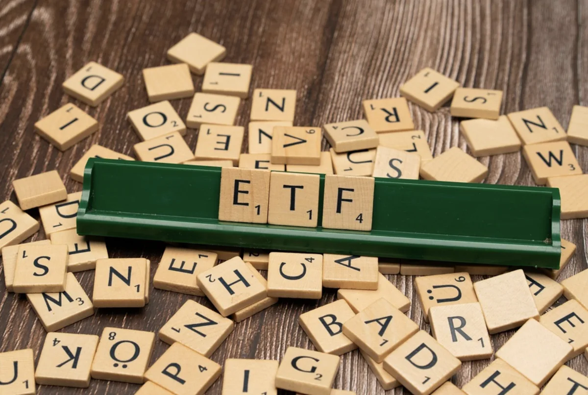

**포트폴리오를 구성했다면 이제는 그것으로부터의 수익을 최대화할 차례다.** ETF의 가장 큰 매력 중 하나는 정기적인 배당금(분배금)입니다. 단순히 주가 상승으로만 수익을 노리는 것이 아니라, ETF가 보유한 주식과 채권에서 나오는 배당과 이자를 투자자에게 돌려주는 방식입니다.

많은 초보 투자자들은 배당금의 개념을 잘 모르거나, 배당락일(ex-dividend date)**을 무시하고 투자했다가 손실을 입습니다. 본 가이드에서는 배당금의 구조**, **배당락일의 의미**, **배당금 재투자 전략** 등을 상세히 설명하여 배당으로 효율적으로 수익을 창출하는 방법을 알려드립니다.

## 배당금과 배당락일의 기본 개념

**배당금이란 무엇인가?** ETF가 보유하고 있는 주식에서 발생한 배당금과 채권의 이자 수익을 ETF 투자자에게 분배하는 것을 분배금(또는 배당금)이라고 합니다. 예를 들어 ETF가 애플, 마이크로소프트 등 100개 기업의 주식을 보유하고 있을 때, 이들 기업이 배당금을 지급하면 ETF는 그 배당금을 받아서 투자자들에게 분배합니다.

**배당락일의 개념**: 배당금을 받기 위해서는 **배당락일(ex-dividend date) 전에 주식을 매수**해야 합니다. 배당락일은 **배당금을 받을 자격이 생기는 마지막 날**입니다. 만약 배당락일에 또는 배당락일 이후에 매수한다면, 그 배당금을 받지 못합니다.

**배당락일의 메커니즘**: 배당기준일(record date)에 주주명부에 등재된 사람이 배당금을 받습니다. 배당락일은 배당기준일 하루 전인데, 이는 거래 정산 시간(2영업일)을 고려하기 위함입니다. 즉, 배당락일 이전에 매수하면 배당기준일에 주주명부에 등재되어 배당금을 받을 수 있습니다.

**중요한 포인트**: 배당금을 받기 위해 배당락일 이전에 매수해야 하지만, **배당락일 이후에 매도해도 배당금을 받습니다.** 왜냐하면 정산이 2영업일 뒤에 이루어지므로, 배당락일에 매도한 주식이 배당기준일에 여전히 당신의 명의로 등재되기 때문입니다.

## 배당락일 투자 전략

**배당락일 전후의 주가 변동**: 배당락일에는 일반적으로 **주가가 배당금 크기만큼 하락**합니다. 예를 들어 주가 100달러에 1달러 배당금이 나온다면, 배당락일 다음 날 주가는 99달러 근처에서 시작합니다. 이는 **배당금이 회사 가치에서 빠져나가기 때문**입니다.

**배당락일 노림수의 함정**: 일부 투자자들은 배당락일을 이용해 단기 수익을 노립니다. 배당락일 직전에 매수해서 배당금을 받고 직후에 매도하는 전략입니다. 하지만 이 전략은 **거래 수수료와 세금**을 고려하면 수익성이 떨어집니다. 특히 개인 투자자에게는 추천하지 않습니다.

**현명한 배당 전략**: 오히려 **배당락일 이후에 저가 매수**하는 것이 더 현명합니다. 주가가 배당금만큼 하락했을 때 매수하면, 배당금을 받지는 못하지만 더 저가에 매수할 수 있습니다. 장기 투자자에게는 배당금 여부보다 **저가 매수의 기회**가 더 중요합니다.

**정기 배당 일정 확인**: 배당금은 ETF마다 다른 일정에 분배됩니다. 월배당, 분기배당(3개월), 연배당 등이 있습니다. 자신이 투자한 ETF의 배당 일정을 미리 파악해두면, **배당금 수령 시점을 예측**할 수 있습니다.

## 주요 배당 ETF 소개 및 비교

**고배당 ETF(VYM, SCHD)**: 미국 고배당 기업들에 투자하는 ETF로, 연 3-4%의 배당수익률을 제공합니다. VYM(Vanguard High Dividend Yield)은 배당 수익이 높은 대형주 500개에, SCHD(Schwab U.S. Dividend Equity ETF)는 배당 성장 기업들에 투자합니다.

**한국 배당 ETF(TIGER 배당성장, KBRO)**: 한국의 고배당 기업들에 투자하는 ETF입니다. 연 4-5%의 높은 배당수익률을 제공하지만, 변동성도 크다는 점을 고려해야 합니다.

**월배당 ETF**: 매달 배당금을 받을 수 있도록 설계된 ETF입니다. 정기적인 현금흐름이 필요한 리타이어 투자자들에게 인기가 있습니다. 다만 총보수가 0.4-0.5% 정도로 다소 높은 편입니다.

**균형형 배당 ETF(VTI, VOO)**: 전체 시장 또는 대형주에 투자하되, 배당도 함께 제공하는 ETF입니다. 배당수익률은 1-2% 정도로 낮지만, **주가 상승 수익과 배당 수익을 모두 누릴 수 있습니다.** 초보 투자자에게는 이런 균형형이 더 현명한 선택입니다.

## 배당금 재투자 전략

**배당금 재투자의 복리 효과**: 배당금을 받은 후 그것을 다시 같은 ETF나 다른 ETF에 투자하면, 복리 효과가 발생합니다. 처음 투자금에서 나온 배당금이 다시 투자되어 새로운 수익을 만들기 때문입니다. **50년 장기 투자에서 복리 효과는 수익을 2배 이상 증가**시킬 수 있습니다.

**자동 재투자 설정**: 많은 증권사에서는 **배당금을 자동으로 재투자**하는 서비스(DRIP, Dividend Reinvestment Plan)를 제공합니다. 이를 설정해두면 수동적으로 매번 재투자를 진행할 필요가 없습니다.

**선택적 재투자 전략**: 초기에는 배당금을 재투자해 복리 효과를 누리다가, 나중에는 배당금을 현금으로 받아 생활비로 사용하는 방식도 가능합니다. 예를 들어 30-40대에는 재투자하고, 은퇴 후에는 배당금을 수익으로 활용할 수 있습니다.

## 배당 투자 vs 성장 투자 비교

**배당 투자의 장점**: 정기적인 현금 수익이 있어 심리적 안정감이 높습니다. 배당금은 시장 변동과 관계없이 꾸준히 들어오기 때문입니다. 또한 배당을 많이 지급하는 기업들은 일반적으로 **경기 변동에 강한 우량 기업**들입니다.

**배당 투자의 단점**: 배당금을 지급하는 기업들은 대부분 **성숙 기업**이어서 주가 상승이 제한적입니다. 또한 배당금에 대한 세금을 별도로 내야 합니다(배당소득세 15-20%).

**성장 투자의 장점**: 기술주나 신흥 기업들에 투자해 높은 주가 상승률을 추구합니다. 배당금이 없어 세금 부담이 적습니다.

**성장 투자의 단점**: 시장 변동성이 크고, 기업이 실패할 위험도 있습니다. 주가가 하락할 때 심리적 불안감이 높습니다.

**최적의 전략**: **배당 ETF 40-50% + 성장 ETF 50-60%**의 조합이 가장 현명합니다. 정기적인 배당 수익으로 안정성을 확보하면서도, 성장 ETF로 자산 증식을 추구할 수 있습니다.

## 배당 투자 시 주의사항

**배당 함정**: 배당수익률이 매우 높은 ETF는 주의해야 합니다. **배당수익률이 높다는 것은 주가가 급락했다는 의미**일 수 있기 때문입니다. 배당금은 변하지 않지만 주가가 떨어졌으므로 배당수익률이 올라간 것입니다.

**배당 연속성 확인**: 장기간 배당을 계속 지급해온 기업에 투자하는 것이 중요합니다. 배당금을 갑자기 중단하는 기업도 있기 때문입니다.

**세금 계획**: 배당금에 대한 세금을 고려해야 합니다. 특히 한국 투자자의 경우 배당소득에 대해 세금을 내야 합니다. 세금 효율적인 투자를 위해 **장기 보유 시 세제 혜택**을 최대한 활용해야 합니다.

## 결론 및 다음 단계

**배당금은 투자의 나머지 절반이다.** 주가 상승만 추구하다가 배당금의 가치를 무시하면 장기 수익을 놓칩니다. 포트폴리오의 일정 비중을 고배당 ETF로 구성하고, 배당금은 꾸준히 재투자하면 시간이 지나면서 **눈덩이처럼 자산이 불어날 것**입니다.

다음 포스트에서는 **ETF 투자 시 초보자가 흔히 하는 실수 5가지**를 다룹니다. 배당금까지 활용하고 있다면, 이제는 **실패를 피하는 방법**을 배워보세요!

#ETF배당금 #배당락일 #배당전략 #고배당ETF #배당재투자 #수익투자 #ETF수익률
