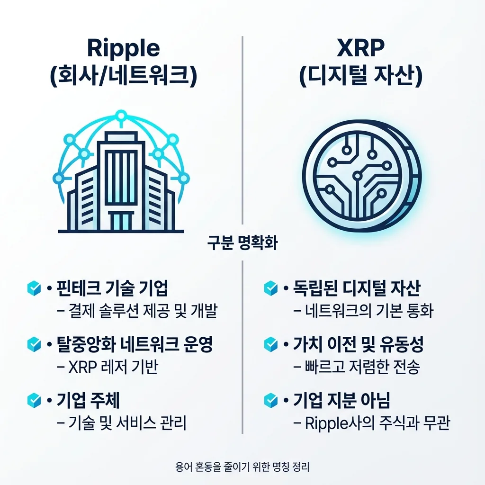
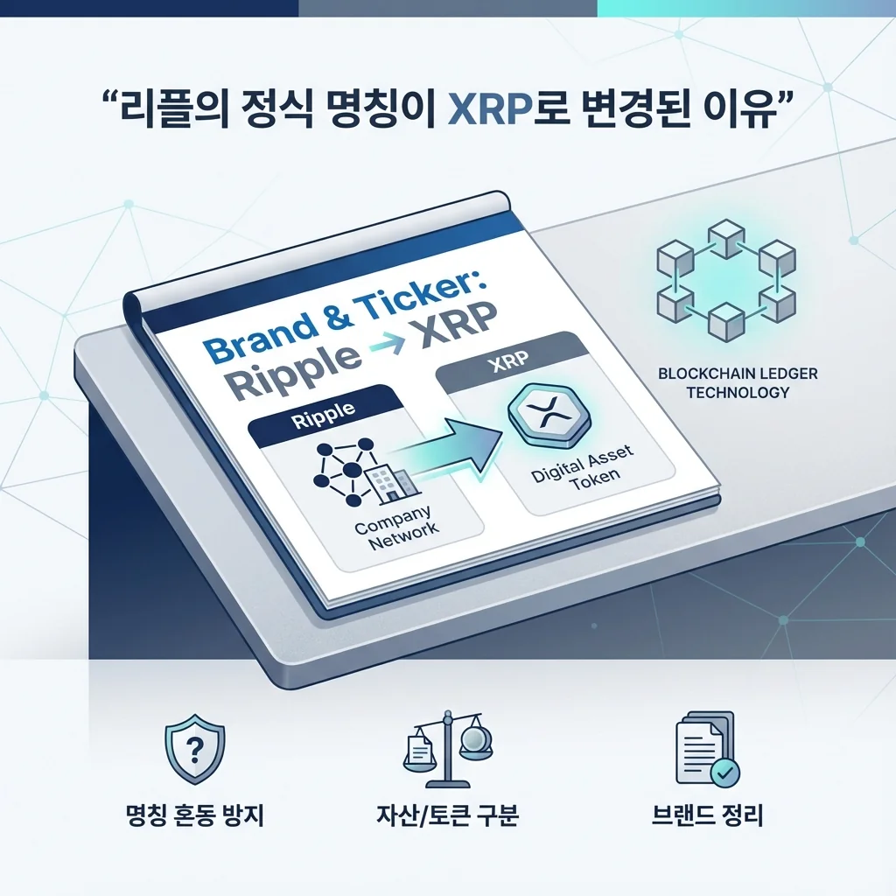

## 리플의 정식 명칭이 XRP로 변경된 이유

**2025년 2월 7일**, 국내 주요 거래소인 업비트, 빗썸, 코인원 등이 일제히 공식 공지를 올렸습니다. 암호화폐 "리플"의 명칭을 "**엑스알피(XRP)**"로 변경한다는 내용이었습니다. 단순한 이름 바꾸기처럼 보이지만, 이는 암호화폐 시장에서 매우 의미 있는 결정입니다. 혼용으로 인한 혼란을 해결하고, XRP의 정체성을 명확히 하려는 의도가 담겨 있습니다.

많은 투자자들이 "리플"과 "XRP"를 같은 의미로 사용해왔지만, 엄밀히 구분하면 전혀 다른 개념입니다. 리플(Ripple)은 **송금 네트워크와 기업의 이름**이고, XRP는 그 네트워크 위에서 거래되는 **암호화폐 토큰**입니다. 이번 명칭 변경은 이러한 혼동을 명확히 하고, XRP 자체의 가치와 독립성을 강조하기 위한 전략이라 볼 수 있습니다.

## XRP(엑스알피)란 정확히 무엇인가

**XRP는 XRP Ledger 위에서 작동하는 디지털 자산**입니다. 2013년 Chris Larsen과 Jed McCaleb이 공동 개발했으며, 초기에는 "리플코인"이라 불렸습니다. 하지만 XRP 자체는 단순한 결제 수단을 넘어, **금융기관의 국제 송금과 결제를 위해 설계된 토큰**입니다.

**XRP의 핵심 특징**

첫째, XRP는 **비트코인이나 이더리움과 다르게 사전에 채굴된 1,000억 개의 XRP로 시작**했습니다. 채굴이 아닌 발행 방식이며, 현재는 점진적으로 소각되고 있습니다. 둘째, **거래 속도가 빠르고 비용이 저렴**합니다. XRP Ledger의 블록 생성 시간은 약 3~5초로, 비트코인의 10분 대비 매우 신속합니다. 셋째, **기관 친화적 설계**로 은행과 금융기관의 채택이 높습니다.

더 자세한 정보는 [Ripple 공식 홈페이지](https://ripple.com/)와 [XRP Ledger 공식 사이트](https://xrpl.org/)에서 확인할 수 있습니다.

## 리플(Ripple)과 XRP는 무엇이 다른가

**리플(Ripple)**은 브래드 갈링하우스(Brad Garlinghouse) CEO가 이끄는 **금융기술 회사**입니다. 국제 송금 네트워크 구축, 결제 솔루션 개발, 스테이블코인 발행 등 다양한 금융 서비스를 제공합니다. 반면 **XRP는 이 리플 네트워크 내에서 사용되는 암호화폐 토큰**일 뿐입니다.

쉽게 비유하면, 비트코인 네트워크와 BTC 토큰의 관계와 유사합니다. 네트워크와 토큰이 기술적으로 연관되어 있지만, 개념적으로는 구분됩니다. 이제 거래소에서 "리플"이 아닌 "엑스알피"로 표기하는 것은 이러한 개념 구분을 강화하고, XRP의 독립적 가치를 인정한다는 의미입니다.

더 자세한 내용은 [Wikipedia의 리플 암호화폐 설명](https://ko.wikipedia.org/wiki/%EB%A6%AC%ED%94%8C_(%EC%95%94%ED%98%B8%ED%99%94%ED%8F%90))을 참고하세요.

## 2020년 SEC 소송에서 2025년 승리까지

XRP가 명칭을 변경한 배경에는 **미국 증권거래위원회(SEC)와의 5년 소송**이 있습니다. 2020년 12월, SEC는 리플을 상대로 "XRP를 미등록 증권으로 불법 판매했다"는 소장을 제출했습니다. 이는 XRP 투자자들에게 큰 불안감을 주었고, 리플의 신뢰도를 크게 손상시켰습니다.

**전환점은 2024년 8월**이었습니다. 연방항소법원은 부분 승리 판결을 내렸으며, 2025년 8월 8일 **SEC와 리플이 공식적으로 항소를 철회하기로 합의**했습니다. 이는 사실상 **리플의 완전한 승리**를 의미합니다. XRP 가격은 소송 종결 직후 **3.3달러대로 폭등**했으며, 시장의 신뢰가 회복되었음을 보여주었습니다.

SEC 소송 관련 최신 정보는 [Digital Today의 보도](https://www.digitaltoday.co.kr/news/articleView.html?idxno=621273)에서 확인할 수 있습니다.

## 2026년 XRP 가격 전망

현재 XRP 가격(2026년 1월 기준)은 약 $2.06~$2.14 수준입니다. 그러나 여러 전문가 기관들은 2026년 내 상당한 가격 상승을 예측하고 있습니다.

**주요 전망 분석**

크립토뉴스의 전문가팀은 **2026년 XRP가 $2.21~$2.50 사이에서 거래될 것**으로 예측했습니다. 보수적 시각에서는 현재 가격 대비 10~20% 상승을 전망합니다. 반면 LiteFinance 분석가들은 **2026년 말 목표 레벨을 $3.50으로 설정**했으며, 4월부터는 점진적 회복으로 2.00~2.50 사이에서 움직일 가능성을 제시했습니다.

**가장 강세 전망**은 국제 금융기관인 **스탠다드차타드**에서 나왔습니다. 2026년 말까지 **최대 $8.00에 도달할 수 있다**는 분석을 내놓았으며, 이는 현재 가격 대비 **약 330% 상승**을 의미합니다. 다만 이는 우호적 규제 환경과 기관 채택 확대가 동시에 진행될 경우의 시나리오입니다.

더 자세한 가격 분석은 [Crypto News의 XRP 가격 예측](https://cryptonews.com/kr/cryptocurrency/xrp-price-prediction/)에서 확인할 수 있습니다.

## 2026년 XRP를 주목해야 할 이유

**첫째, 글로벌 송금 수요의 증가**

국제 송금 시장은 연 5~7% 성장하고 있으며, 특히 개발도상국과 선진국 간 송금 수요가 폭발적으로 증가하고 있습니다. XRP는 이러한 수요를 충족하기 위한 **가장 빠르고 저렴한 솔루션**으로 평가받고 있습니다. Ripple은 이미 100개 이상의 은행과 금융기관과 제휴 중입니다.

**둘째, 스테이블코인 생태계 확대**

리플은 **RLUSD(Ripple USD) 스테이블코인**을 출시했으며, 이는 뉴욕 금융서비스국의 승인을 받았습니다. 매월 외부 회계 감사를 받으며 달러 현금과 미국 단기 국채로 담보됩니다. RLUSD는 XRP Ledger 위에서 작동하며, 실물자산 토큰화(RWA) 분야에서 XRP의 가치를 높일 것으로 예상됩니다.

더 자세한 정보는 [Ripple 공식 XRP 정보 페이지](https://ripple.com/xrp/)를 참고하세요.

**셋째, 기관 투자자 진입**

2026년 초, XRP ETF(상장지수펀드) 자산이 급증했으며 현재 **171억 달러 규모**에 달합니다. SEC 소송 종결 이후 기관 투자자들의 진입이 본격화되고 있으며, 이는 XRP 가격 안정성을 높이는 요인으로 작용합니다.

**넷째, 명칭 변경으로 인한 심리 효과**

엑스알피로의 공식 명칭 변경은 단순한 이름 바꾸기를 넘어, **XRP의 브랜드 재평가와 신뢰도 복구의 신호**입니다. 특히 한국 투자자들 사이에서는 "한국인의 코인" 별칭으로 불릴 정도로 강한 커뮤니티가 있으며, 이들의 재진입이 예상됩니다.

## 2026년과 그 이후 장기 전망

**2030년 이상 초장기 전망**

코인코덱스는 2030년까지 XRP가 **$5.40~$5.83** 사이에서 거래될 것으로 예측했습니다. 체인질리의 분석은 더 강세로, **$13.95~$16.97** 범위를 제시했습니다. 블랙록의 한 임원이 발표한 보고서는 가장 주목할 만한데, **$6.37~$32.91의 적정가치 범위**를 제시했습니다. 이는 XRP의 일일 거래량이 2030년까지 1,900억 달러에서 5,560억 달러에 이를 것으로 전망한 바탕 위에 계산된 수치입니다.

**투자 시 고려사항**

XRP의 강세 시나리오는 다음과 같은 조건이 충족될 때 실현됩니다. 첫째, 글로벌 금융기관의 지속적 채택 확대, 둘째, 암호화폐 규제 환경의 개선, 셋째, 국제 송금 수요의 급증, 넷째, RLUSD 등 리플의 스테이블코인 생태계 성장입니다. 반면 규제 악화, 기술 경쟁 심화, 글로벌 경기 둔화 등의 리스크도 있습니다.

더 자세한 장기 전망은 [LiteFinance의 리플 가격 예측](https://www.litefinance.org/ko/blog/analysts-opinions/lipeul-gagyeog-jeonmang-yecheug/)에서 확인하세요.

## XRP 정보 조회 및 거래 방법

**XRP 시세 확인 및 거래**

실시간 XRP 시세는 [Investing.com의 XRP 페이지](https://kr.investing.com/crypto/xrp)에서 확인할 수 있습니다. 국내에서는 업비트, 빗썸, 코인원 등 주요 거래소에서 "엑스알피" 명칭으로 거래 가능합니다.

**XRP 관련 데이터 조회**

- **Ripple 공식 홈페이지**: https://ripple.com/
- **XRP Ledger 공식 사이트**: https://xrpl.org/
- **XRP Charts (리플 데이터)**: https://xrpcharts.ripple.com/
- **CoinGecko XRP 시세**: https://www.coingecko.com/ko/%EC%BD%94%EC%9D%B8/%EB%A6%AC%ED%94%8C%EC%BD%94%EC%9D%B8

**소셜 미디어 및 커뮤니티**

- **Ripple 공식 Twitter**: [@Ripple](https://x.com/Ripple)
- **XRP 커뮤니티**: Reddit, Discord, Telegram 등에서 활발한 토론 진행 중

## 결론 및 투자 체크리스트

**XRP 엑스알피는 단순한 투자 자산이 아닌, 글로벌 금융 인프라를 재구성하려는 프로젝트**입니다. 명칭 변경은 이러한 정체성을 명확히 하고, 투자자들의 신뢰를 회복하기 위한 전략적 결정입니다. 2026년은 SEC 소송 종결 이후 XRP의 **첫 번째 본격적 성장의 해**가 될 가능성이 높습니다.

**2026년 XRP 투자 전 체크리스트**

- [ ] 공식 명칭 변경의 의미 이해 (리플 vs XRP 개념 구분)
- [ ] SEC 소송 종결의 영향 범위 파악
- [ ] 2026년 목표가별 투자 시나리오 설정 ($2.50 보수, $3.50 중기, $8.00 강세)
- [ ] 기관 투자자 진입 동향 모니터링
- [ ] 글로벌 송금 수요 및 RLUSD 채택 추이 확인
- [ ] 암호화폐 규제 환경 변화 지속 관찰
- [ ] 개인의 위험 성향에 맞는 포지션 결정
- [ ] 장기 보유 전략 수립 (2년 이상)
- [ ] 정기적인 포트폴리오 리밸런싱 계획
- [ ] 공식 채널을 통한 최신 뉴스 구독

XRP의 미래는 금융 기술의 발전과 글로벌 송금 시장의 디지털화에 달려 있습니다. 2026년 명칭 변경으로 시작된 새로운 장에서 XRP가 어떤 성과를 이룰지 주목할 가치가 충분합니다.

---

#XRP #엑스알피 #리플 #명칭변경 #SEC #가격전망 #암호화폐 #블록체인 #2026 #투자 #비트코인 #디지털자산 #국제송금 #스테이블코인 #금융혁신
