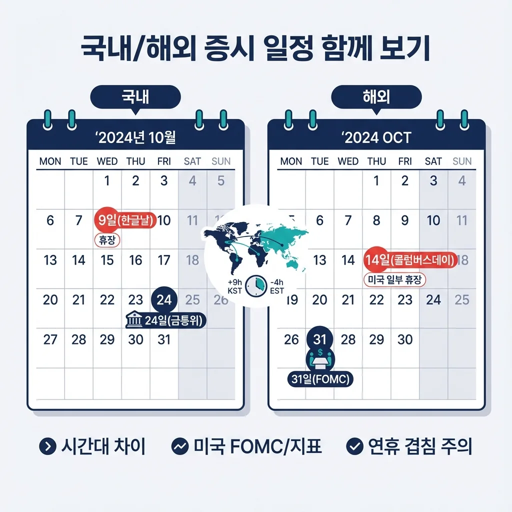
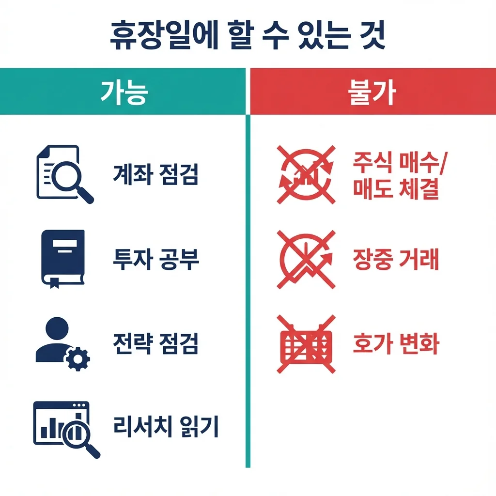
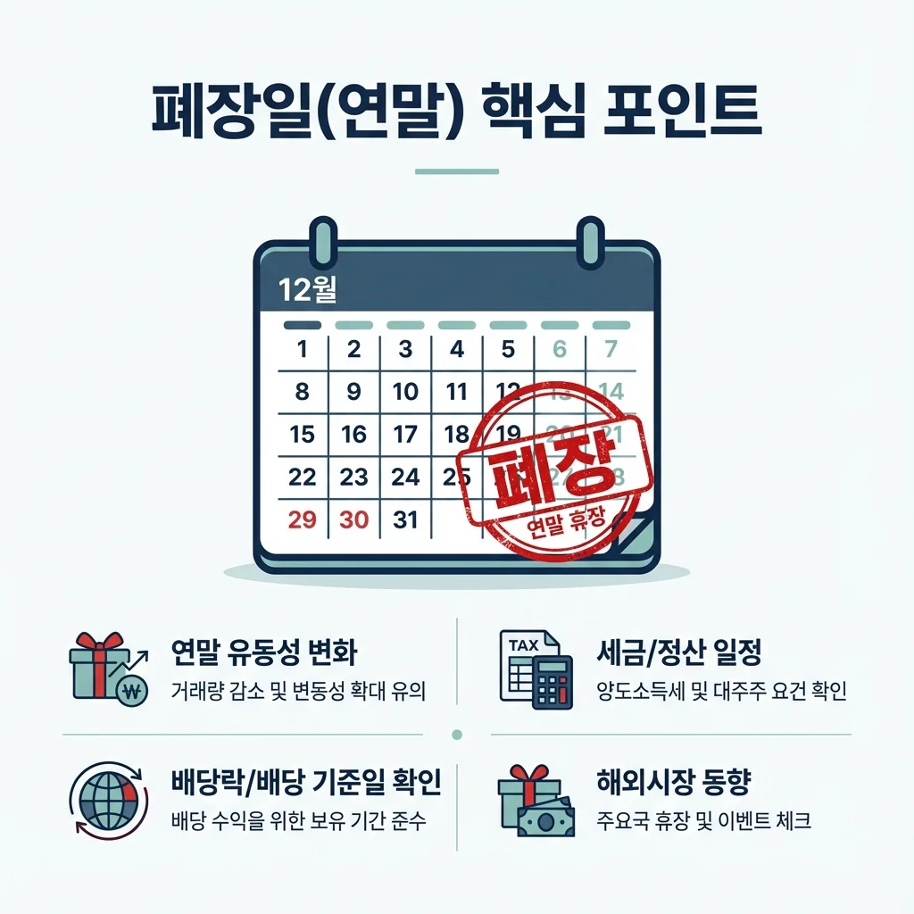
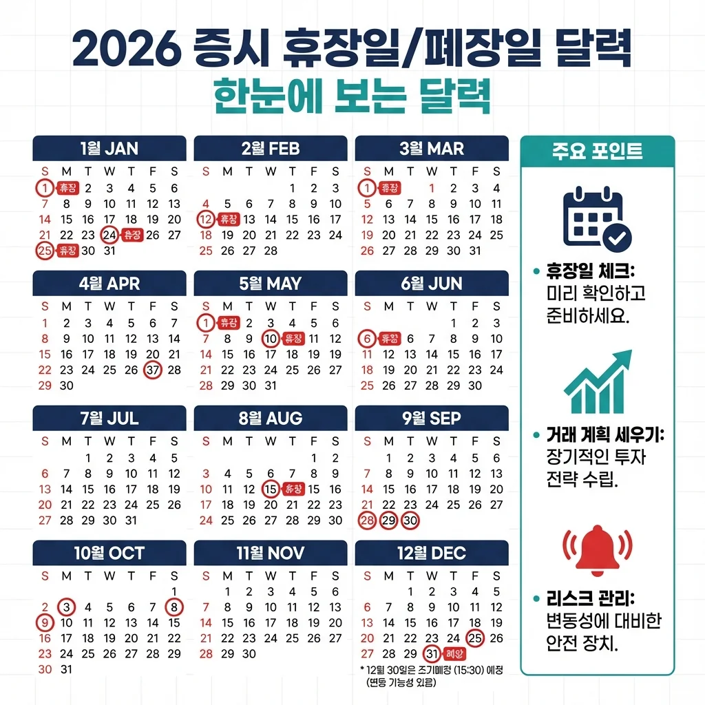

## 2026년 증시 휴장일 미리 체크해야 하는 이유

주식 투자자라면 휴장일을 미리 파악해두는 것이 필수입니다. 휴장일을 모르고 있다가 급하게 매도해야 할 상황에서 거래가 안 되거나, 배당락일과 휴장일이 겹쳐 예상치 못한 손실을 볼 수 있기 때문입니다. 특히 연휴 전후로는 시장 변동성이 커지는 경향이 있어 미리 대비하는 것이 좋습니다.

2026년 한국 증시 휴장일은 토요일과 일요일을 제외하고 **총 16일**입니다. 여기에는 기존 공휴일뿐 아니라 **6월 3일 전국동시지방선거일**이 임시공휴일로 추가되었습니다. 지금부터 월별로 상세히 정리해 드리겠습니다.

## 2026년 상반기 증시 휴장일 (1월~6월)

**1월**에는 **1일(목) 신정**이 휴장일입니다. 2026년 증시 개장일은 1월 2일(금)이며, 이 날은 개장식 관계로 평소보다 1시간 늦은 **오전 10시에 장이 시작**됩니다. 폐장 시간은 평소와 동일하게 오후 3시 30분입니다.

**2월**에는 설날 연휴로 인해 **16일(월)~18일(수)**, 총 3일간 휴장합니다. 2026년 설날은 2월 17일(화)이며, 전날과 다음날까지 연휴가 이어집니다. 15일(일)부터 18일(수)까지 4일 연속 쉬는 황금연휴가 되니 연휴 전 포지션 정리를 고려해보시기 바랍니다.

**3월**에는 삼일절 대체공휴일인 **2일(월)**이 휴장일입니다. 삼일절이 3월 1일 일요일이라 다음 날인 월요일이 대체휴일로 지정되었습니다. 2월 28일(토)부터 3월 2일(월)까지 3일 연속 휴무입니다.

**4월**에는 휴장일이 없습니다. 한 달 내내 정상 거래가 가능합니다.

**5월**에는 휴장일이 3일로 가장 많습니다. **1일(금) 근로자의 날**, **5일(화) 어린이날**, 그리고 석가탄신일 대체휴일인 **25일(월)**이 휴장일입니다. 석가탄신일이 5월 24일(일)이라 다음 날 월요일이 대체휴일이 됩니다.

**6월**에는 **3일(수) 전국동시지방선거일**이 임시공휴일로 지정되어 휴장합니다. 현충일은 6월 6일(토)로 주말과 겹쳐 별도 휴장일이 없습니다.

## 2026년 하반기 증시 휴장일 (7월~12월)

**7월**에는 휴장일이 없습니다. 제헌절(7월 17일)은 현재 공휴일이 아니므로 정상 거래됩니다.

**8월**에는 광복절 대체휴일인 **17일(월)**이 휴장일입니다. 광복절이 8월 15일(토)로 주말과 겹쳐 다음 주 월요일이 대체휴일로 지정되었습니다. 15일(토)부터 17일(월)까지 3일 연속 쉴 수 있습니다.

**9월**에는 추석 연휴로 **24일(목)~25일(금)**, 2일간 휴장합니다. 2026년 추석은 9월 26일(토)이며, 연휴가 24일(목)부터 27일(일)까지 이어져 4일 연속 휴무가 됩니다. 23일(수)까지만 거래가 가능하니 추석 전 매매 계획을 세워두시기 바랍니다.

**10월**에는 개천절 대체휴일인 **5일(월)**과 **9일(금) 한글날**, 총 2일이 휴장일입니다. 개천절이 10월 3일(토)로 주말과 겹쳐 월요일이 대체휴일이 됩니다. 3일(토)부터 5일(월)까지 3일 연휴이며, 한글날까지 포함하면 10월 초는 쉬는 날이 많습니다.

**11월**에는 휴장일이 없습니다. 정상 거래가 진행됩니다.

**12월**에는 **25일(금) 성탄절**과 **31일(목) 연말 휴장일**, 총 2일이 휴장일입니다. 12월 30일(수)이 2026년 마지막 거래일인 **폐장일**이 됩니다.

## 2026년 증시 휴장일 한눈에 보기

- **1월** 1일(목) 신정
- **2월** 16일(월)~18일(수) 설날 연휴
- **3월** 2일(월) 삼일절 대체휴일
- **5월** 1일(금) 근로자의 날, 5일(화) 어린이날, 25일(월) 석가탄신일 대체휴일
- **6월** 3일(수) 전국동시지방선거일
- **8월** 17일(월) 광복절 대체휴일
- **9월** 24일(목)~25일(금) 추석 연휴
- **10월** 5일(월) 개천절 대체휴일, 9일(금) 한글날
- **12월** 25일(금) 성탄절, 31일(목) 연말 휴장일

## 폐장일과 휴장일의 차이점

**폐장일**은 한 해의 마지막 거래일을 의미합니다. 2026년 폐장일은 **12월 30일(수)**입니다. 이 날까지는 정상적으로 주식 매매가 가능하며, 연말 배당을 받으려면 이 날 장 마감 전까지 주식을 보유하고 있어야 합니다.

**휴장일**은 주식시장이 아예 열리지 않는 날입니다. 공휴일, 근로자의 날, 토요일, 12월 31일, 그리고 거래소가 시장 관리상 필요하다고 인정하는 날이 휴장일에 해당합니다. 휴장일에는 어떤 거래도 할 수 없으므로 급하게 매도해야 할 상황이라면 휴장일 전에 미리 처리해야 합니다.

참고로 이 휴장일 정보는 유가증권시장, 코스닥시장, 코넥스시장 등 **국내 주식시장에만 해당**됩니다. 미국, 일본, 홍콩 등 해외 주식시장은 휴장일이 다르니 해외 주식 투자자는 별도로 확인하시기 바랍니다.

## 투자자를 위한 휴장일 활용 팁

장기 연휴 전에는 시장 변동성이 커질 수 있습니다. 특히 설날과 추석처럼 여러 날 연속으로 쉬는 경우, 연휴 기간 중 해외 시장의 변동이 국내 시장 개장 후 한꺼번에 반영되기 때문입니다. 리스크 관리 차원에서 연휴 전 포지션을 점검하는 것이 좋습니다.

배당주 투자자는 폐장일을 특히 주의해야 합니다. 연말 배당을 받으려면 12월 30일 폐장일까지 해당 주식을 보유하고 있어야 합니다. 배당락일은 보통 폐장일 다음 거래일이므로 2027년 첫 거래일에 배당락이 적용됩니다.

2026년에는 대체공휴일이 4일(삼일절, 석가탄신일, 광복절, 개천절)이나 되고, 지방선거일까지 임시공휴일로 추가되어 휴장일이 예년보다 많은 편입니다. 투자 계획을 세울 때 이 점을 고려하시기 바랍니다.

#2026년휴장일 #증시휴장일 #폐장일 #주식투자 #한국증시 #투자달력 #개장일
