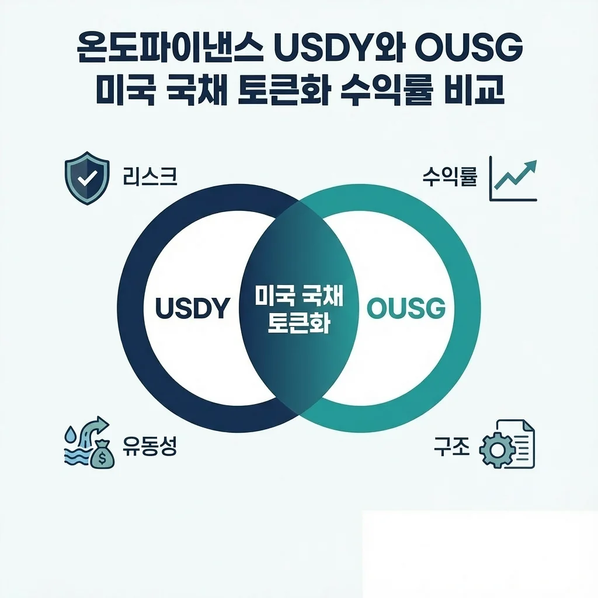
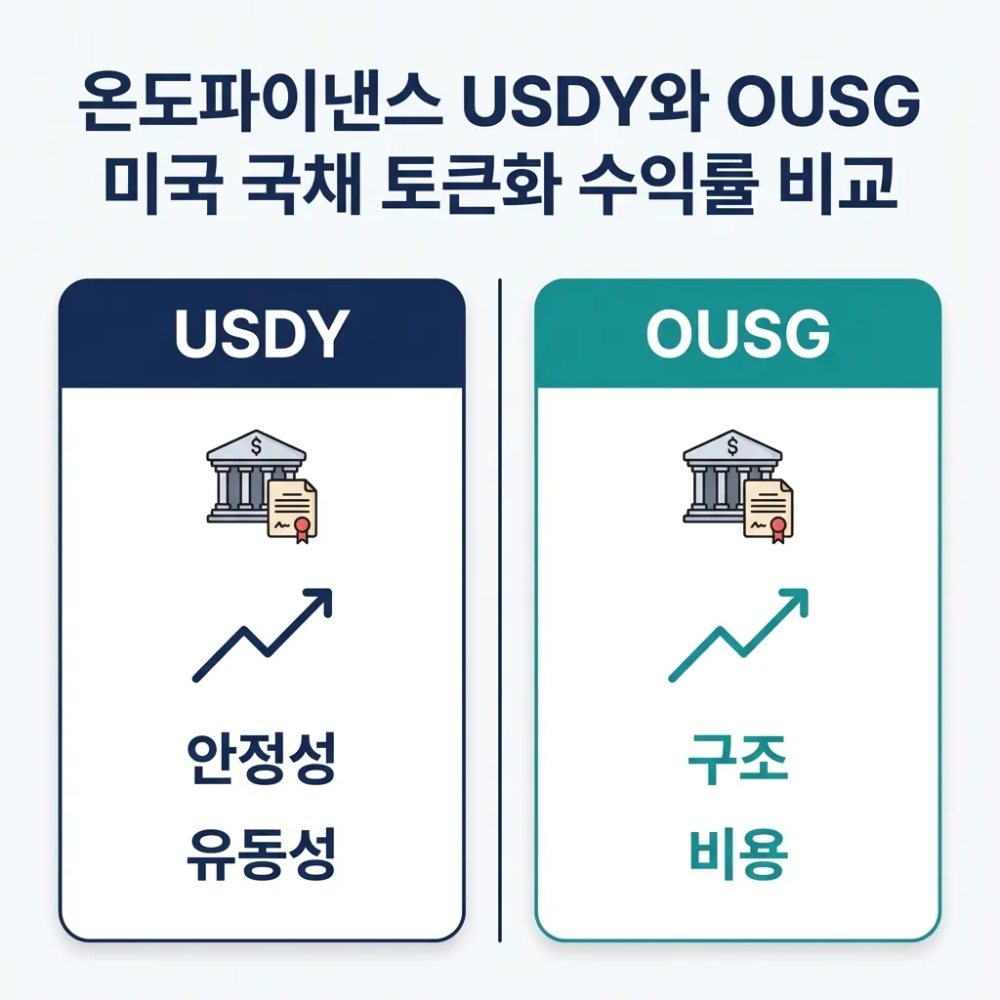
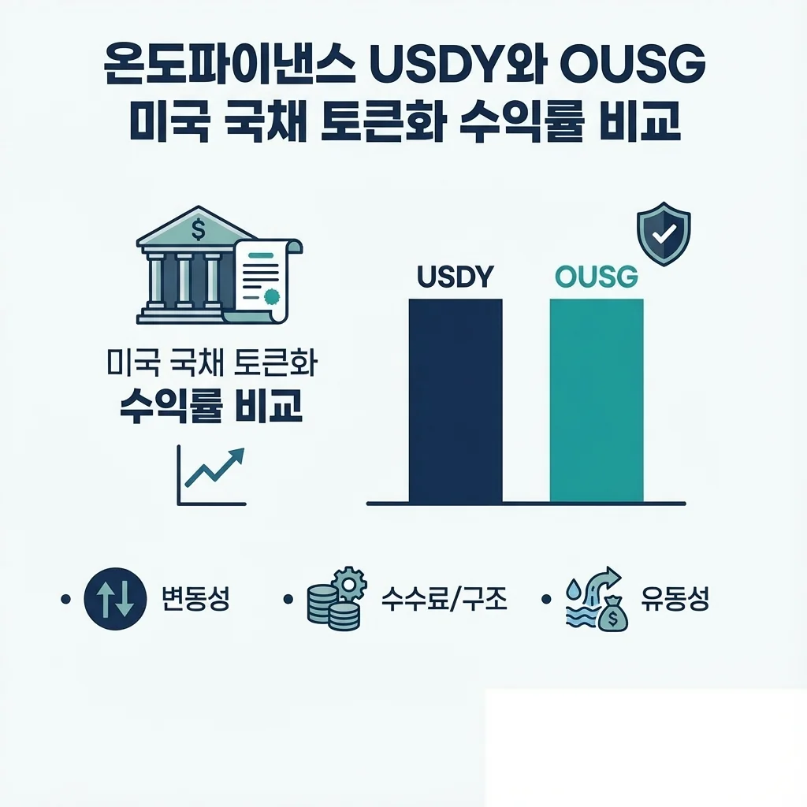

온도파이낸스(Ondo Finance)는 미국 국채, 채권, ETF 등 실물자산을 블록체인에 올려 누구나 접근 가능하게 만드는 RWA(Real World Asset) 플랫폼입니다. 전통 금융의 높은 진입장벽을 낮추고, 기관급 수익을 개인 투자자도 누릴 수 있는 혁신적 솔루션을 제시합니다. 2021년 골드만삭스 출신 직원들이 설립한 이 프로젝트는 현재 1조 6천억 원 규모의 자산을 토큰화하며 RWA 시장의 선두주자로 자리잡고 있습니다.

온도파이낸스의 대표 상품은 **USDY**와 **OUSG**입니다. 두 토큰 모두 미국 국채를 기반으로 하지만, 대상 투자자, 구조, 수익 방식에서 중요한 차이를 보입니다. 이 글에서는 두 상품을 심층 비교하여 당신의 투자 전략에 맞는 선택을 돕겠습니다.

## USDY란 무엇인가

**USDY(Ondo Short-Term US Treasury Yield)**는 온도파이낸스가 제공하는 리테일 친화형 토큰화 상품입니다. 미국 단기 국채(Treasury Bills)와 은행 예금을 기초자산으로 하며, 매달 수익을 지급하는 구조입니다.

### USDY의 핵심 특징

USDY는 **1:1 교환 가능한 스테이블코인 성질**을 가집니다. USDC 등 스테이블코인을 보유한 누구나 USDY로 교환할 수 있으며, KYC(Know Your Customer) 인증 후 접근이 가능합니다. 기초자산은 연 4~5% 수준의 제로 리스크 이자율을 제공하는 미국 단기채이므로, 변동성이 극히 낮습니다. 수익은 매월 첫 영업일에 공식적으로 설정되며, 이자가 매일 복리로 계산되어 토큰 가격에 자동으로 반영됩니다.

### USDY의 대상 투자자 및 용도

USDY는 **개인 투자자와 소규모 기관**을 주 대상으로 합니다. 진입 장벽이 낮고, USDT나 USDC처럼 일상적으로 사용하면서 동시에 수익을 얻을 수 있다는 장점이 있습니다. 현재 TVL(Total Value Locked)은 약 3억 9,500만 달러에 달하며, DeFi 생태계 내 유동성 풀의 담보자산으로도 활발히 활용됩니다.

## OUSG란 무엇인가

OUSG(Ondo US Government Obligations)는 온도파이낸스의 기관 투자자 맞춤형 상품입니다. 미국 국채를 직접 보유하며, SEC 등록 투자자문사 Ondo Capital Management가 운영합니다.

### OUSG의 핵심 특징

OUSG는 **기관급 투명성과 법적 보호**를 제공합니다. 기초자산인 미국 국채는 월별로 공시되며, 독립 감사인에 의해 정기적으로 검증됩니다. 투자자는 환매권을 보장받아, 필요 시 OUSG를 현금으로 환매할 수 있습니다. 수익률은 지난 30일 가격 변동을 연환산하여 계산되므로, 금리 변동에 더 민감하게 반응합니다. 단기채뿐 아니라 중기채도 포함할 수 있어, USDY보다 높은 수익률 가능성을 제공합니다.

### OUSG의 대상 투자자 및 용도

OUSG는 **기관 투자자, 고액 순자산 투자자, 적격 구매자**를 주로 대상으로 합니다. 최소 투자액이 높고, KYC 절차가 엄격하지만, 그 대신 법적 안정성과 높은 수익 가능성을 보장받습니다. 리플(Ripple)의 XRP Ledger 등 다양한 블록체인으로 확장되고 있으며, 기관 자금의 온체인 진출을 가속화하고 있습니다.

## USDY와 OUSG 수익률 비교

### 수익률 수준

두 상품의 수익률은 기본적으로 **연 4~5% 수준의 제로 리스크 이자율**을 따릅니다. 미국 단기국채 금리가 기준이므로, 시장 금리가 변동하면 수익률도 함께 변합니다. 예를 들어 미국 중앙은행(Fed)이 기준금리를 인상하면 양쪽 수익률 모두 상승하고, 인하하면 하락합니다.

그러나 세부적으로 보면 차이가 있습니다. **USDY는 단기채 중심으로 안정적인 4~5% 수준**을 유지하는 반면, **OUSG는 중기채 포함으로 5~6% 수준의 약간 높은 수익을 제공**할 수 있습니다. 이는 OUSG 기초자산의 만기 구성이 더 길기 때문입니다.

### 수익 지급 방식의 차이

USDY는 매월 첫 영업일에 수익률을 공식 설정하고, 매일 복리로 계산됩니다. 투자자 입장에서는 **예측 가능하고 일정한 수익**을 기대할 수 있습니다. 반면 OUSG는 30일 가격 변동을 기반으로 수익률을 계산하므로, 금리 변동이나 시장 상황에 따라 **단기적 수익률 변동성이 다소 큽니다**. 다만 이는 시장 금리를 더 정확히 반영한다는 의미이기도 합니다.

### 복합 수익률 시뮬레이션

연 5% 수익률로 1,000 USDC를 1년간 투자했다고 가정하면:

- **USDY 방식** (월 1회, 매일 복리): 1년 후 약 1,051 USDT 획득
- **OUSG 방식** (30일 기준, 시장연동): 1년 후 약 1,050~1,055 USDT 획득 (금리 변동 반영)

USDY는 더 예측 가능하고, OUSG는 시장 금리 변동을 더 민첩하게 따릅니다.

## 리스크 분석 및 비교

### 신용 리스크

두 상품 모두 **기초자산이 미국 국채**이므로 신용 리스크는 거의 동일합니다. 미국 정부 채무 불이행 가능성은 극히 낮고, 역사적으로 거의 발생하지 않았습니다. 따라서 이 면에서는 실질적인 차이가 없습니다.

### 토큰 관련 리스크

USDY는 리테일 투자자를 대상으로 하므로 접근성은 높지만, 스마트 계약 리스크에 노출될 가능성이 있습니다. OUSG는 SEC 등록 투자자문사가 운영하고 정기 감사를 받으므로, 기관급 리스크 관리 체계를 갖추고 있습니다. 규제 리스크 면에서 **OUSG가 더 안전**합니다.

### 유동성 리스크

USDY는 DeFi 생태계에 광범위하게 분포되어 있어 상대적으로 높은 유동성을 제공합니다. 반면 OUSG는 기관 투자자 중심이고, 환매 절차가 필요해 즉각적인 현금화가 어려울 수 있습니다. **USDY가 더 높은 유동성**을 제공합니다.

### 환율 리스크

한국 투자자의 경우, 두 상품 모두 **달러 표시 자산**이므로 환율 변동 리스크가 있습니다. 원달러 환율이 상승하면 수익률에 환차익이 추가되고, 하락하면 손실이 발생할 수 있습니다.

## 실제 활용 시나리오 비교

### 시나리오 1: 개인 투자자, 장기 안정 수익 추구

개인 투자자가 3년 장기 보유를 목표로 한다면 **USDY가 적합**합니다. 낮은 진입장벽, 높은 유동성, 예측 가능한 수익이 장점입니다. USDC를 USDY로 교환하고, DeFi 렌딩 프로토콜에 예치하면 추가 수익도 얻을 수 있습니다.

### 시나리오 2: 기관 투자자, 법적 안정성 중심

대규모 자금을 운용하는 기관이라면 **OUSG가 정답**입니다. SEC 등록 자산운용사의 관리, 정기 감사, 명확한 법적 지위가 기관의 신뢰를 확보합니다. 특히 펀드나 신탁 구조로 자산을 관리하는 기관에 적합합니다.

### 시나리오 3: 포트폴리오 다각화

USDY와 OUSG를 혼합 구성하는 전략도 가능합니다. 예를 들어 **60% USDY + 40% OUSG** 구성으로, 유동성과 안정성의 균형을 맞출 수 있습니다. 변동성 자산(암호화폐) 투자 시 안정적인 수익 기반이 되어줍니다.

## 2026년 온도파이낸스의 성장 전망

온도파이낸스는 2026년 초 **솔라나 블록체인 통합**을 계획하고 있습니다. 이는 USDY와 OUSG 접근성을 크게 확대할 것으로 예상됩니다. 또한 **토큰화 주식 및 ETF 상품 확장**도 추진 중이며, 이는 RWA 시장의 폭발적 성장을 의미합니다.

현재 TVL은 1억 6천만 달러 수준이지만, 2030년까지 **16조 달러 규모의 RWA 시장**으로 성장할 것이라는 업계 분석도 있습니다. 온도파이낸스가 시장 선도자로서 몫을 한다면, USDY와 OUSG의 가치도 함께 상승할 가능성이 높습니다.

## 결론 및 투자 체크리스트

**USDY와 OUSG는 모두 우수한 RWA 상품**이지만, 투자 목표와 상황에 따라 선택 기준이 달라집니다. USDY는 **개인 투자자, 높은 유동성, 낮은 진입장벽**을 원할 때, OUSG는 **기관 투자자, 법적 안정성, 중기 이상의 금리**를 원할 때 추천됩니다.

### 투자 전 체크리스트

- [ ] KYC 인증 완료 여부 확인 (USDY는 기본, OUSG는 필수)
- [ ] 기초자산 구성 최신 정보 확인 (공식 홈페이지 https://ondo.finance/)
- [ ] 현재 APY(연이율) 비교 분석
- [ ] 기초자산인 미국 국채 금리 추이 모니터링
- [ ] 개인의 위험 성향 및 투자 기간 검토
- [ ] 포트폴리오 내 비중 적절성 판단
- [ ] 환율 리스크 헤징 전략 수립 여부
- [ ] SEC 규제 변화 및 프로토콜 업데이트 지속 모니터링

온도파이낸스의 USDY와 OUSG는 블록체인이 기존 금융을 어떻게 혁신할 수 있는지 보여주는 사례입니다. 기관급 금융 상품의 민주화와 개인 투자자의 수익 기회 확대는 2026년 금융 시장의 중요한 메가트렌드가 될 것입니다. 당신의 투자 목표에 맞는 상품을 신중히 선택하길 바랍니다.

---

#온도파이낸스 #USDY #OUSG #RWA #토큰화 #국채 #수익률 #DeFi #블록체인 #투자 #기관투자 #개인투자 #암호자산 #금융혁신 #스테이블코인 #미국국채
